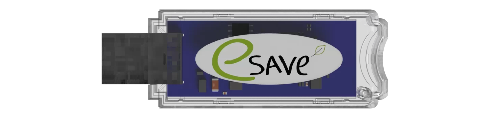
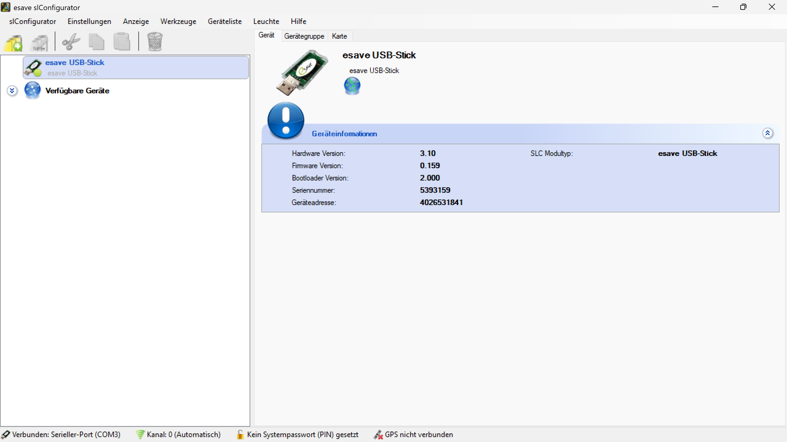

# Einleitung
># ℹ
>Die SL-Configurator Software ist eine benutzerfreundliche Windows-Anwendung zur Anzeige, Konfiguration und Verwaltung von Leuchten, die mit esave SL-Controllern ausgestattet sind.

># ⚠
> Der SL-Configurator kann nur in Kombination mit einem esave SLC-USB Stick verwendet werden.
>  
>Der SLC-USB Stick hat ein eingebautes Funkmodul, mit dem eine sichere Verbindung mit eSave SL-Controller hergestellt wird.
 
  

*Die Software ist ein leistungsstarkes Werkzeug, das den Nutzern ermöglicht, das Netzwerk in einer einfachen grafischen Oberfläche zu visualisieren. Dadurch können Anpassungen schnell und unkompliziert vor Ort vorgenommen werden, ohne dass eine Internetverbindung erforderlich ist.*
