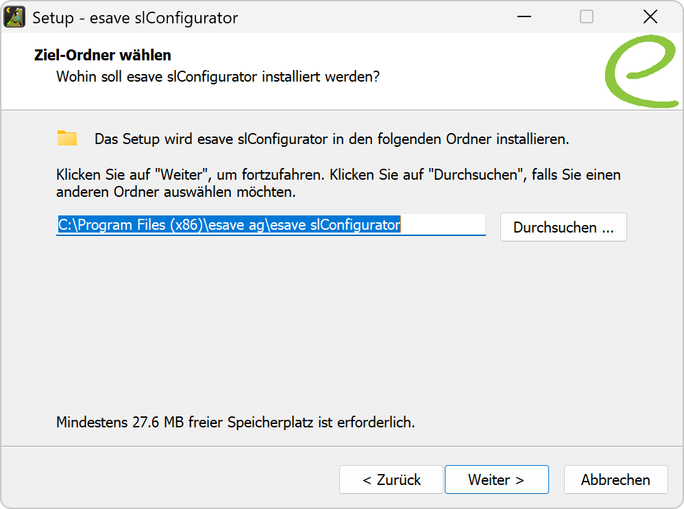

# Installation
> ℹ️ **Info**  
>  **Die Software benötigt einen Computer oder ein Tablet mit Windows-Betriebssystem.**
>  **Für die Konfiguration von Gen 2 SL-Controller (20x) wird die SL-Configurator Version 2.5 (Build 8441) oder höher benötigt. Die aktuelle Softwareversion kann auf Hilfe > Info Über … eingesehen werden.**

> ⚠️ **WARNUNG**  
> **Der esave-SLC-USB Stick darf erst nach der Installation der Software und des Treibers an den Computer angeschlossen werden**

Die aktuelle SL-Configurator Software kann kostenlos von der esave Website heruntergeladen werden:  
[⬇️ SL-Configurator herunterladen](https://www.esaveag.com/iLightConfigurator/esave/esave_slConfiguratorSetup.exe)

*Führen Sie die heruntergeladene Datei <strong>esave_slConfiguratorSetup.exe</strong> aus, um die Installation zu starten.*

*Der Windows Smartscreen warnt vor unbekannten Anwendungen. Klicken Sie auf <strong>Weitere Informationen</strong>, um fortzufahren.*

*Klicken Sie auf <strong>Trotzdem ausführen</strong>, um die Installation fortzusetzen.*

*Wählen Sie die gewünschte Sprache der Software.*

*Klicken Sie auf <strong>Weiter</strong>, um die Software in der gewünschten Sprache zu installieren.*

*Wählen Sie den Ordner, in welchem Sie die Software installieren möchten.*

*Klicken Sie auf <strong>Fertigstellen</strong>, um die Installation abzuschließen.* 