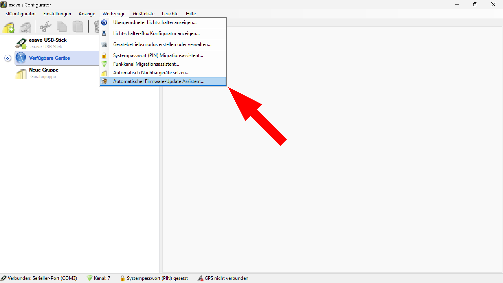
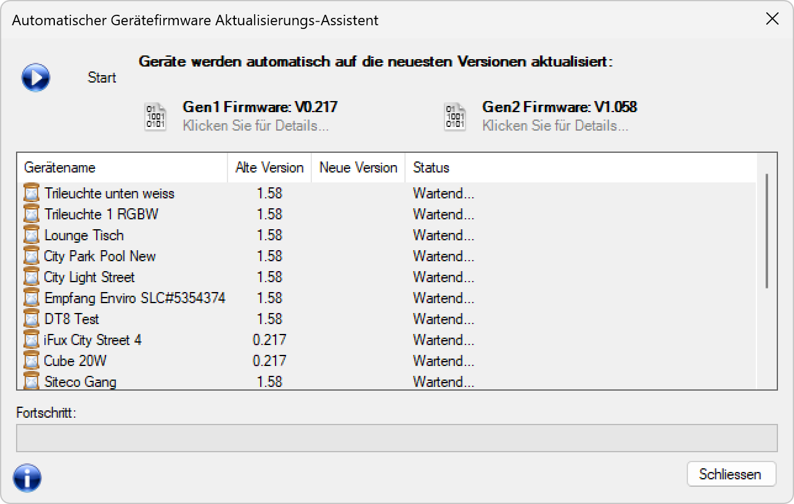

# Firmware-Update-Assistent

**Firmware-Update-Assistent - esave Configurator Automatische Systemaktualisierung**

Verwalten Sie Firmware-Updates für mehrere esave Lighting Controller gleichzeitig mit dem professionellen Batch-Update-Assistenten. Diese fortschrittliche Funktion ermöglicht die simultane Aktualisierung aller Geräte in Ihrer Installation auf die neuesten Firmware-Versionen mit automatischer Versionserkennung und intelligentem Update-Management.

## Hauptbereiche

### 1. Werkzeuge-Menü Navigation

Das Werkzeuge-Menü bietet Zugang zu allen Administrationstools:
- **Übergeordneter Lichtschalter anzeigen**: Master-Control für Gesamtanlage
- **Lichtschalter-Box Konfigurator anzeigen**: Hardware-spezifische Konfiguration
- **Gerätebetriebsmodus erstellen oder verwalten**: Betriebsmodus-Management
- **Systempasswort (PIN) Migrationsassistent**: Sicherheits-Migration
- **Funkkanal Migrationsassistent**: Kommunikationskanal-Optimierung
- **Automatisch Nachbargeräte setzen**: Mesh-Netzwerk-Konfiguration
- **Automatischer Firmware-Update Assistent**: Batch-Firmware-Management (hervorgehoben)

### 2. Assistent-Aufruf und Integration

**Menüintegration:**
- **Position**: Werkzeuge > Automatischer Firmware-Update Assistent
- **Icon**: Firmware-Update Symbol mit automatischer Kennzeichnung
- **Zugriff**: Direkte Integration in die Hauptnavigation
- **Kontext**: Verfügbar bei aktiver Geräteverbindung

### 3. Update-Assistent Interface

Der Hauptdialog zeigt eine übersichtliche Update-Management-Oberfläche:
- **Firmware-Versionsübersicht**: Verfügbare Gen1 und Gen2 Firmware-Versionen
- **Geräteliste**: Vollständige Auflistung aller Update-fähigen Devices
- **Status-Monitoring**: Live-Update-Status für jedes Gerät
- **Fortschrittsanzeige**: Detaillierte Protokollierung des Update-Prozesses

## Firmware-Versionsverwaltung

### Verfügbare Firmware-Generationen

**Gen1 Firmware: V0.217**
- **Zielgeräte**: esave Controller der ersten Generation
- **Icon**: QR-Code-Symbol für Gen1-Hardware-Identifikation
- **Details**: "Klicken Sie für Details..." für erweiterte Versionsinformationen
- **Kompatibilität**: Vollständig kompatibel mit Legacy-esave-Controllern

**Gen2 Firmware: V1.058**
- **Zielgeräte**: esave Controller der zweiten Generation
- **Icon**: QR-Code-Symbol für Gen2-Hardware-Identifikation
- **Details**: "Klicken Sie für Details..." für Changelog und Verbesserungen
- **Features**: Erweiterte Funktionalität und Performance-Optimierungen

### Automatische Versionserkennung

**Intelligente Hardware-Erkennung:**
- **Hardware-Generation**: Automatische Identifikation der Controller-Generation
- **Kompatibilitätsprüfung**: Validierung der Firmware-Kompatibilität vor Update
- **Versionsvergleich**: Automatischer Vergleich zwischen aktueller und verfügbarer Version
- **Update-Notwendigkeit**: Intelligente Entscheidung über Update-Erfordernis

## Geräteliste und Update-Status

### Update-fähige Geräte

Die zentrale Gerätetabelle zeigt alle für Updates verfügbaren esave Devices:

**Geräteinformationen:**
- **Gerätename**: Eindeutige Bezeichnung jedes esave Controllers
- **Alte Version**: Aktuell installierte Firmware-Version
- **Neue Version**: Verfügbare Update-Version (wird automatisch ermittelt)
- **Status**: Live-Update-Status ("Wartend..." vor Update-Start)

**Beispiel-Geräte in der Liste:**
- **Trileuchte unten weiss**: Version 1.58 → Update verfügbar
- **Trileuchte 1 RGBW**: Version 1.58 → Update verfügbar
- **Lounge Tisch**: Version 1.58 → Update verfügbar
- **City Park Pool New**: Version 1.58 → Update verfügbar
- **City Light Street**: Version 1.58 → Update verfügbar
- **Empfang Enviro SLC#5354374**: Version 1.58 → Update verfügbar
- **DT8 Test**: Version 1.58 → Update verfügbar
- **iFux City Street 4**: Version 0.217 → Update auf Gen2 erforderlich
- **Cube 20W**: Version 0.217 → Update auf Gen2 erforderlich
- **Siteco Gang**: Version 1.58 → Update verfügbar

### Update-Status-Management

**Status-Kategorien:**
- **"Wartend..."**: Gerät steht für Update bereit, wartet auf Ausführung
- **"Wird aktualisiert..."**: Update-Prozess läuft gerade für dieses Gerät
- **"Erfolgreich"**: Update wurde erfolgreich abgeschlossen
- **"Fehler"**: Update-Fehler, manuelle Intervention erforderlich
- **"Übersprungen"**: Gerät bereits auf aktueller Version oder nicht kompatibel

## Update-Prozess und Ausführung

### Start-Mechanismus

**Update-Initiierung:**
- **Start-Button**: Großer blauer "Start"-Button oben links für Batch-Update
- **Automatische Erkennung**: Alle Geräte werden automatisch erfasst und analysiert
- **Versionsprüfung**: Aktuelle Firmware-Versionen werden abgefragt
- **Intelligente Filterung**: Nur Geräte mit veralteten Versionen werden aktualisiert

### Update-Sequenz

**Automatisierter Update-Ablauf:**
1. **Geräte-Discovery**: Automatische Erkennung aller verbundenen esave Controller
2. **Versions-Audit**: Abfrage der aktuellen Firmware-Version jedes Geräts
3. **Kompatibilitätsprüfung**: Validierung der Hardware-Generation und Firmware-Kompatibilität
4. **Update-Planung**: Erstellung einer optimalen Update-Reihenfolge
5. **Batch-Execution**: Simultane oder sequenzielle Updates je nach Netzwerkkapazität
6. **Validierung**: Überprüfung erfolgreicher Updates und Funktionalitätstests

### Fortschrittsüberwachung

**Live-Monitoring:**
- **Echtzeit-Status**: Kontinuierliche Statusaktualisierung für jedes Gerät
- **Fortschrittsprotokoll**: Detailliertes Log im unteren "Fortschritt"-Bereich
- **Fehlerprotokollierung**: Automatische Erfassung und Dokumentation von Update-Problemen
- **Erfolgsvalidierung**: Bestätigung erfolgreicher Updates mit Funktionsprüfung

## Technische Update-Details

### Datenübertragung und Performance

**Update-Datenmengen:**
- **Gen1 zu Gen2 Update**: ~2-4 MB Firmware-Daten pro Gerät
- **Incremental Updates**: ~500KB-1MB für Patch-Updates
- **Übertragungsgeschwindigkeit**: Abhängig von Netzwerkqualität und -konfiguration
- **Zeitschätzung**: 2-10 Minuten pro Gerät je nach Update-Umfang

**Netzwerk-Optimierung:**
- **Parallele Updates**: Bis zu 5 simultane Updates (abhängig von Netzwerkbandbreite)
- **Adaptive Geschwindigkeit**: Automatische Anpassung an Netzwerkqualität
- **Retry-Mechanismen**: Automatische Wiederholung bei Übertragungsfehlern
- **Bandbreiten-Management**: Intelligente Verteilung der verfügbaren Netzwerkressourcen

### Sicherheitsfeatures

**Update-Integrität:**
- **Firmware-Validierung**: Kryptographische Überprüfung der Firmware-Integrität
- **Rollback-Capability**: Automatisches Rollback bei fehlgeschlagenen Updates
- **Backup-Erstellung**: Automatische Sicherung der aktuellen Firmware vor Update
- **Checksummen-Validierung**: Überprüfung der korrekten Datenübertragung

**Fehlerbehandlung:**
- **Atomic Updates**: Unteilbare Update-Operationen (ganz oder gar nicht)
- **Error Recovery**: Automatische Wiederherstellung bei Update-Fehlern
- **Safe Mode**: Notfall-Modus bei kritischen Update-Problemen
- **Manual Intervention**: Möglichkeit manueller Eingriffe bei komplexen Problemen

## Anwendungsszenarien

### Planmäßige Wartungsupdates

**Routine-Maintenance:**
- **Quarterly Updates**: Regelmäßige Firmware-Aktualisierung alle 3 Monate
- **Security Patches**: Sofortige Installation sicherheitskritischer Updates
- **Feature-Updates**: Deployment neuer Funktionalitäten auf alle Geräte
- **Performance-Optimierung**: Updates zur Verbesserung der Systemleistung

### Großinstallations-Management

**Enterprise-Deployment:**
- **Bulk-Updates**: Simultane Aktualisierung von 100+ Geräten
- **Staged Rollouts**: Stufenweise Updates zur Risikominimierung
- **Critical Infrastructure**: Updates für geschäftskritische Beleuchtungsanlagen
- **Campus-Management**: Koordinierte Updates für Universitäten, Krankenhäuser, Industrieanlagen

### Migration und Modernisierung

**System-Upgrades:**
- **Gen1 zu Gen2 Migration**: Upgrade von Legacy-Controllern auf aktuelle Hardware
- **Protocol Updates**: Aktualisierung der Kommunikationsprotokolle
- **Compatibility Updates**: Sicherstellung der Kompatibilität mit neuen Geräten
- **Standard-Compliance**: Updates für neue Industriestandards und Zertifizierungen

### Notfall-Updates

**Emergency Patches:**
- **Critical Bug Fixes**: Sofortige Behebung kritischer Software-Probleme
- **Security Vulnerabilities**: Schnelle Schließung von Sicherheitslücken
- **Hardware-Compatibility**: Updates für Kompatibilität mit neuer Hardware
- **Regulatory Compliance**: Updates zur Erfüllung neuer Vorschriften

## Technische Spezifikationen

### Hardware-Anforderungen

**Netzwerk-Infrastruktur:**
- **Bandbreite**: Minimum 1 Mbps pro gleichzeitig aktualisiertem Gerät
- **Latenz**: <100ms für optimale Update-Performance
- **Stabilität**: Stabile Verbindung für die gesamte Update-Dauer
- **Konnektivität**: DALI-2, MQTT, HTTP/HTTPS je nach Gerätetyp

**System-Ressourcen:**
- **RAM**: 512MB für Update-Pufferung und Zwischenspeicherung
- **Storage**: 100MB freier Speicher für Firmware-Download und -Caching
- **CPU**: Moderne Multi-Core-Architektur für parallele Update-Verarbeitung
- **Betriebssystem**: Windows 10+, macOS 10.14+, Ubuntu 18.04+

### Kompatibilität und Support

**Unterstützte Geräte:**
- **esave Gen1 Controller**: Alle Modelle mit Firmware v0.100+
- **esave Gen2 Controller**: Alle aktuellen Modelle mit v1.000+
- **iFux-Serie**: Vollständige Kompatibilität mit allen iFux-Controllern
- **Legacy-Devices**: Begrenzte Unterstützung für ältere Controller-Generationen

**Firmware-Versionen:**
- **Minimum-Version**: Gen1 v0.100, Gen2 v1.000
- **Maximum-Updates**: Bis zu 5 Major-Versionen Sprung möglich
- **LTS-Support**: Long-Term-Support für kritische Infrastrukturen
- **Beta-Versions**: Optional verfügbar für Test-Installationen

## Erweiterte Features

### Intelligente Update-Strategien

**Smart Deployment:**
- **Dependency-Aware**: Berücksichtigung von Geräte-Abhängigkeiten
- **Risk-Assessment**: Automatische Risikobewertung für Update-Reihenfolge
- **Load-Balancing**: Optimale Verteilung der Update-Last über das Netzwerk
- **Priority-Management**: Bevorzugung kritischer Geräte bei Updates

**Adaptive Algorithms:**
- **Network-Aware**: Anpassung an verfügbare Netzwerkbandbreite
- **Device-Specific**: Gerätespezifische Update-Optimierungen
- **Time-Optimized**: Minimierung der Gesamtupdate-Zeit
- **Error-Resilient**: Robuste Behandlung von Update-Fehlern

### Monitoring und Reporting

**Comprehensive Logging:**
- **Detailed Progress**: Minutiöse Protokollierung jedes Update-Schritts
- **Error Analysis**: Detaillierte Fehleranalyse mit Lösungsvorschlägen
- **Performance Metrics**: Überwachung von Übertragungsgeschwindigkeiten und -zeiten
- **Success Rates**: Statistische Auswertung von Update-Erfolgsraten

**Professional Reporting:**
- **Update-Summary**: Zusammenfassende Berichte über durchgeführte Updates
- **Compliance-Documentation**: Dokumentation für Audit- und Compliance-Zwecke
- **Trend-Analysis**: Langzeit-Analyse von Update-Patterns und -Performance
- **Executive Dashboard**: Management-Reports über Firmware-Update-Status

## Vorteile des Firmware-Update-Assistenten

### Effizienz und Zeitersparnis

- **Batch-Processing**: Simultane Updates für Dutzende von Geräten
- **Automatisierte Workflows**: Minimierung manueller Eingriffe und Fehlerquellen
- **Intelligente Planung**: Optimierte Update-Reihenfolge für maximale Effizienz
- **Zeit-Optimierung**: Drastische Reduzierung der Update-Zeit gegenüber einzelnen Updates

### Zuverlässigkeit und Sicherheit

- **Robuste Ausführung**: Sichere Update-Prozesse mit umfassender Fehlerbehandlung
- **Rollback-Funktionalität**: Automatische Wiederherstellung bei Update-Problemen
- **Integritätsprüfung**: Kryptographische Validierung aller Firmware-Updates
- **Dokumentierte Prozesse**: Vollständige Nachverfolgbarkeit aller Update-Aktivitäten

### Professionelles System-Management

- **Enterprise-Ready**: Skalierbare Lösung für große Installationen
- **Compliance-Support**: Unterstützung für Audit- und Regulierungsanforderungen
- **Zentrale Verwaltung**: Einheitliche Update-Verwaltung für komplexe Installationen
- **Wartungsoptimierung**: Integrierte Wartungsplanung mit Firmware-Update-Zyklen

Diese Firmware-Update-Assistent-Funktionalität bietet eine professionelle und effiziente Lösung für die systematische Aktualisierung von esave Lighting Controller Installationen mit automatisierter Batch-Verarbeitung und umfassender Update-Verwaltung. 