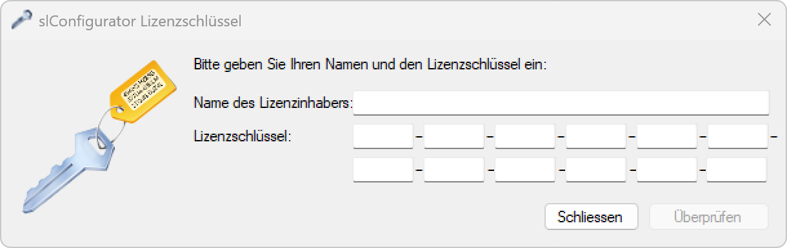

# Aktivierung
> ℹ *information:*  
> Nach der Installation kann der SLC-USB Stick angeschlossen und der SL-Configurator gestartet werden.

  
*Beim ersten Start der Software muss diese mit einem <strong>gültigen Lizenzschlüssel</strong> freigeschaltet werden.*

> ⚠ *warnung:*  
> Für die Konfiguration von Gen 2 SL-Controller (20x) wird die SL-Configurator Version 2.5 (Build 8441) oder höher benötigt. Die aktuelle Softwareversion kann auf Hilfe > Info Über … eingesehen werden.