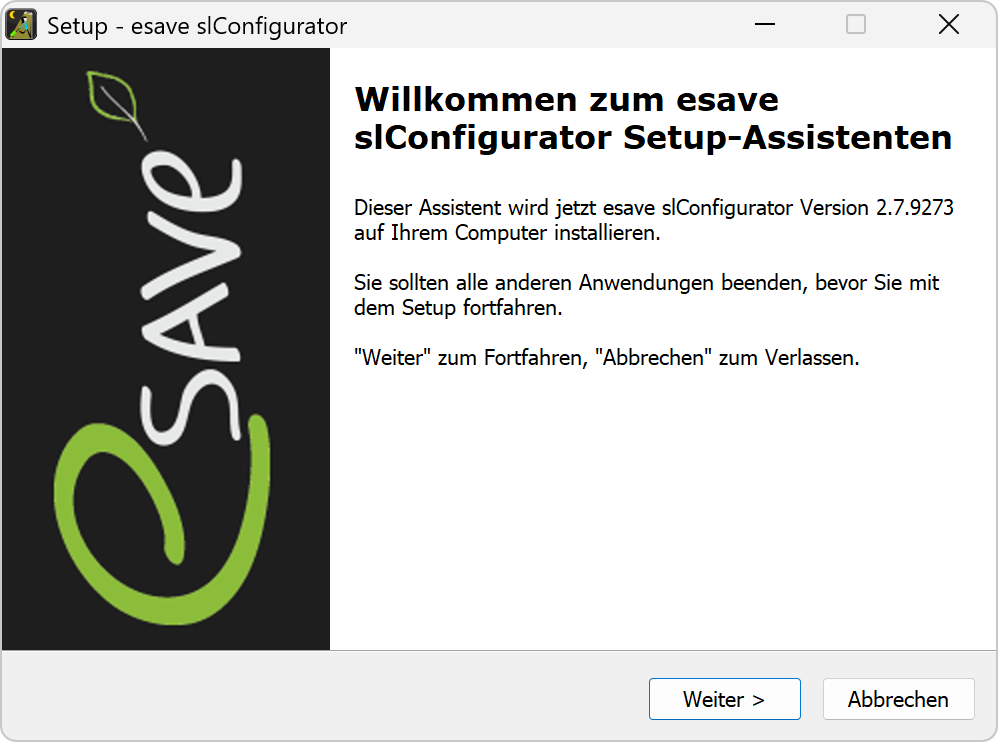

# Installation
># ⚠  
>Der esave-SLC-USB Stick darf erst nach der Installation der Software und des Treibers an den Computer angeschlossen werden.  

># ℹ  
>Die Software benötigt einen Computer oder ein Tablet mit Windows-Betriebssystem.
>Für die Konfiguration von Gen 2 SL-Controller (20x) wird die SL-Configurator Version 2.5 (Build 8441) oder höher benötigt. Die aktuelle Softwareversion kann auf Hilfe > Info Über … eingesehen werden.  

# [⬇ SL-Configurator herunterladen](https://www.esaveag.com/iLightConfigurator/esave/esave_slConfiguratorSetup.exe)  

*Klicken Sie auf die 3 Punkte neben dem Download, dann auf* `Weitere Aktionen`*.*  

*Klicken Sie auf* `Beibehalten`*.*  

*Klicken Sie auf* `Mehr anzeigen`*.*  

*Klicken Sie auf* `Trotzdem beibehalten`*.*  

*Der Download ist abgeschlossen, nun befindet sich die Datei im Downloads Ordner.*  

*Führen Sie die heruntergeladene Datei* `esave_slConfiguratorSetup.exe` *aus, um die Installation zu starten.*  

*Windows Smartscreen warnt vor unbekannten Anwendungen. Klicken Sie auf* `Weitere Informationen`*.*  

*Klicken Sie auf* `Trotzdem ausführen`*, um die Installation fortzusetzen.*  

*Wählen Sie die gewünschte Sprache der Software.*  

*Klicken Sie auf* `Weiter`*, um die Software in der gewünschten Sprache zu installieren.*  

*Wählen Sie den Ordner, in welchem Sie die Software installieren möchten.*  

*Klicken Sie auf* `Fertigstellen`*, um die Installation abzuschließen.*
