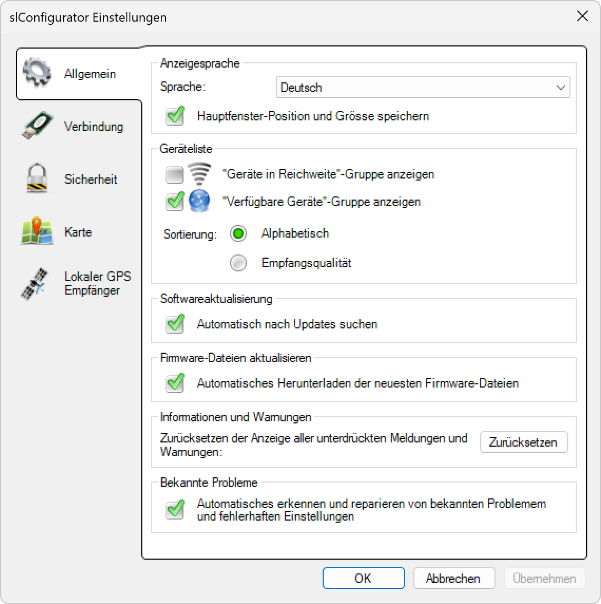

# Allgemein
  

<strong>Sprache</strong>  

Setzt die Sprache, in der die Anwendung angezeigt wird (Benutzeroberfläche). Zurzeit werden Deutsch und Englisch unterstützt.

---

<strong>Geräteliste</strong>  

Wählen Sie, welche Gerätegruppen Sie in der Geräteliste anzeigen möchten (Netzwerkscan – Verfügbare Geräte).

---

<strong>Softwareaktualisierung</strong>  

Definiert, ob die Anwendung einmal täglich automatisch nach einer Aktualisierung suchen soll (sofern eine Internetverbindung vorhanden ist).

---

<strong>Informationen und Warnungen</strong>  

Klicken Sie auf „Zurücksetzen“, um alle unterdrückten Meldungen und Warnungen wieder anzuzeigen.