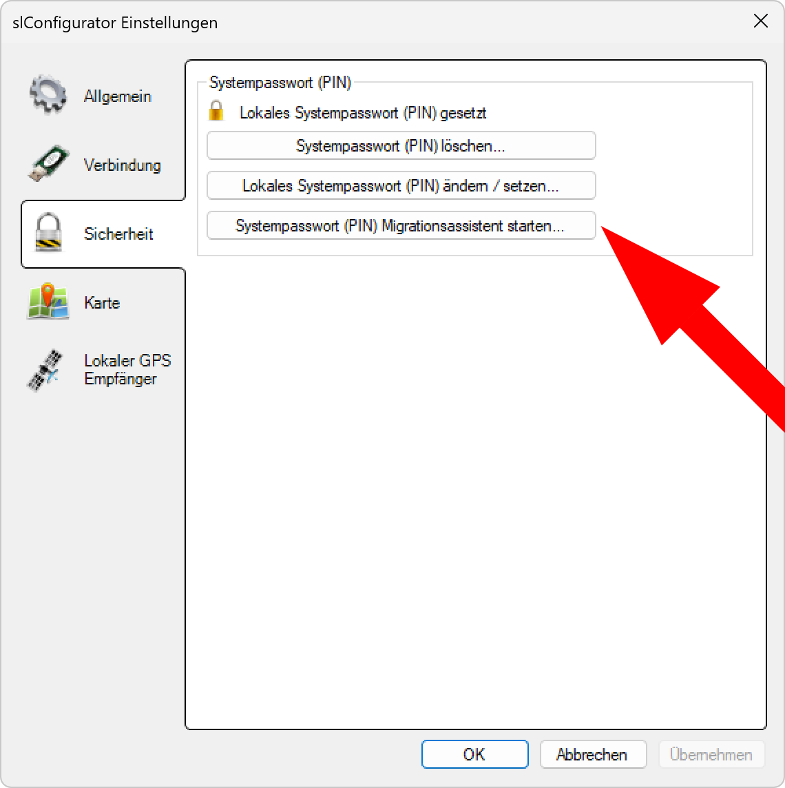
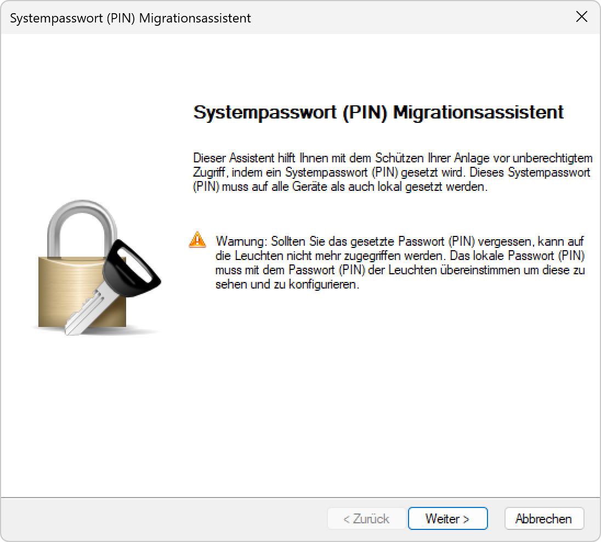
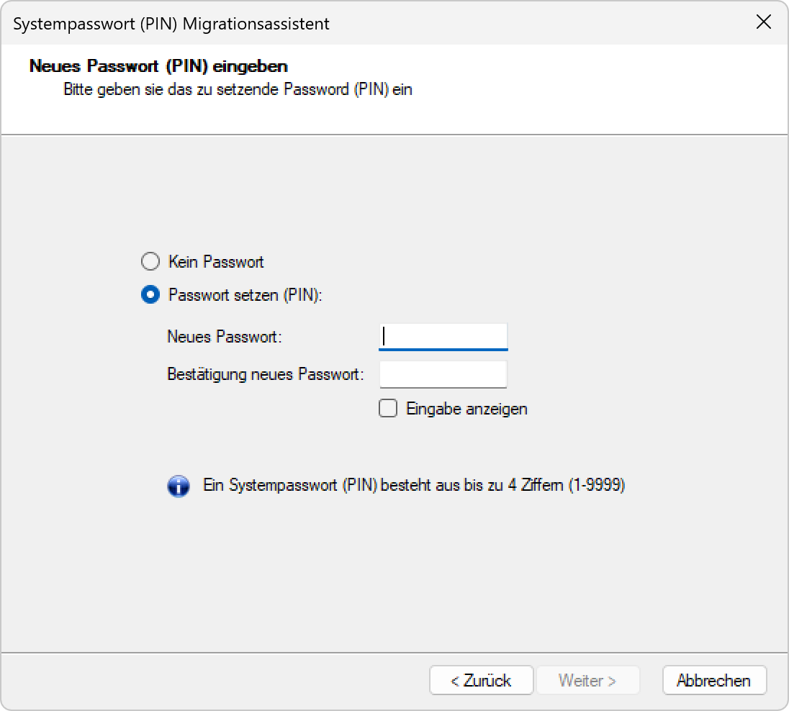
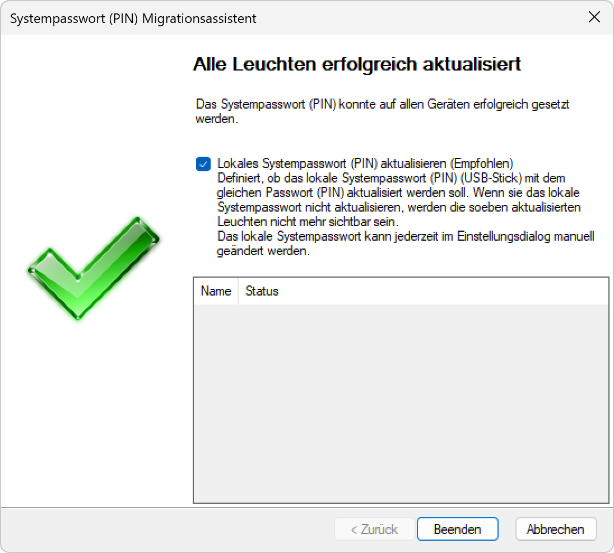

# Systempasswort (PIN) Migrationsassistent
  
*Klicken Sie auf <strong>systempasswort (PIN)Migrationsassistent starten</strong>.*
  
*Geben Sie das Passwort des Systems ein an dem Sie Arbeiten.*
  
*Klicken sie auf Weiter.*
  
*Geben Sie das Passwort ein das an die Controller verteilt werden soll.*
  
*Wählen Sie die Geräte die das neue Passwort erhalten aus der Liste aus.*
  
*Übereprüfen Sie in der Liste ob alle Controller mit dem neuen Passwort aktualisiert wurden.*