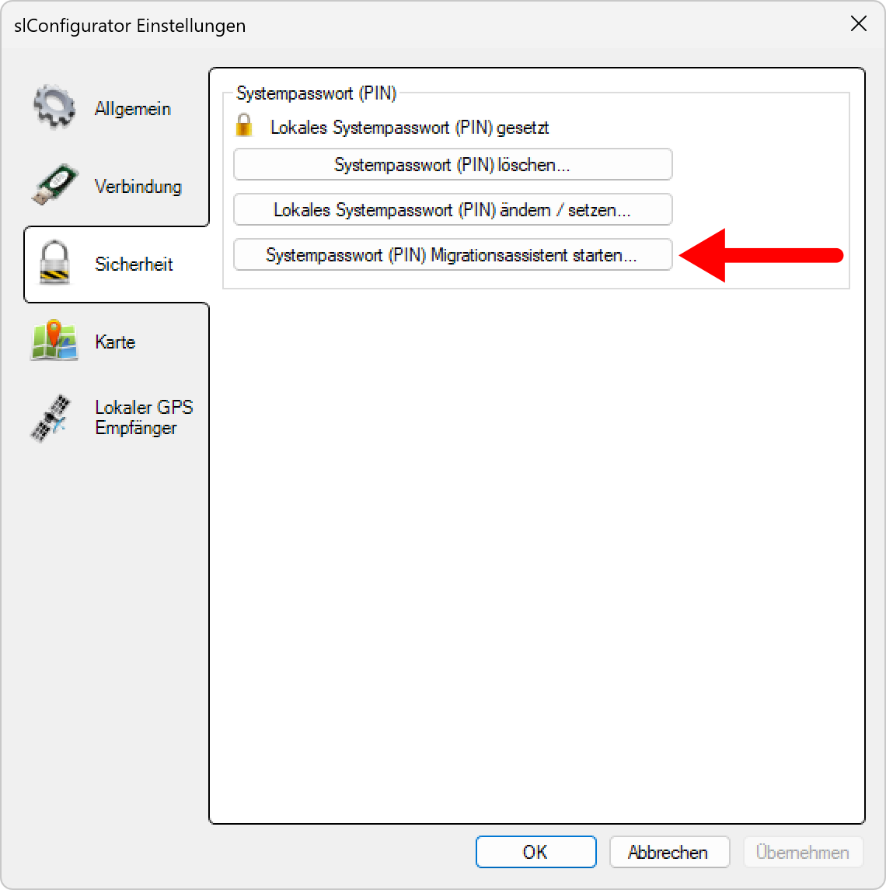
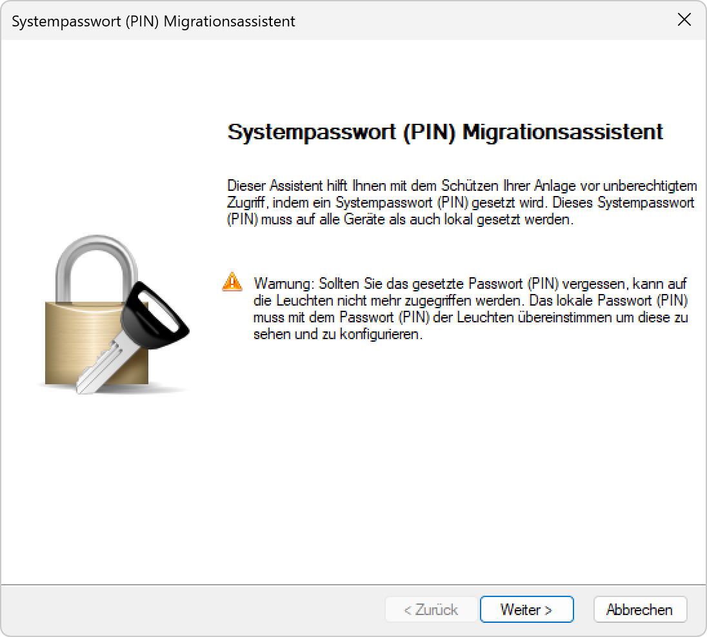

# Systempasswort (PIN) Migrationsassistent

Der Migrationsassistent verteilt das gesetzte Systempsswort (PIN) an die Lampencontroller.

*Klicken Sie auf „systempasswort (PIN) Migrationsassistent starten.*

*Geben Sie das Passwort des Systems ein an dem Sie Arbeiten.*

*Klicken sie auf Weiter.*

*Geben Sie das Passwort ein das an die Controller verteilt werden soll.*

*Wählen Sie die Geräte die das neue Passwort erhalten aus der Liste aus.*

*Übereprüfen Sie in der Liste ob alle Controller mit dem neuen Passwort aktualisiert wurden.*