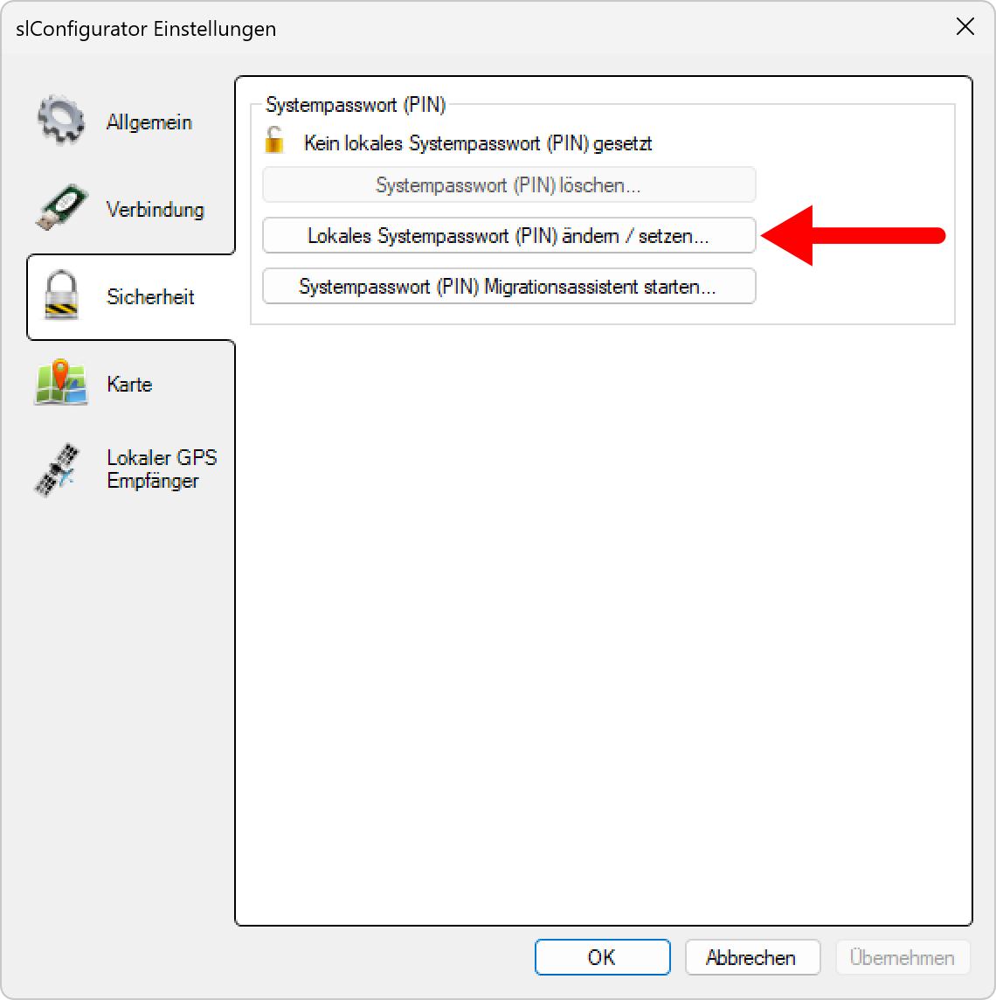
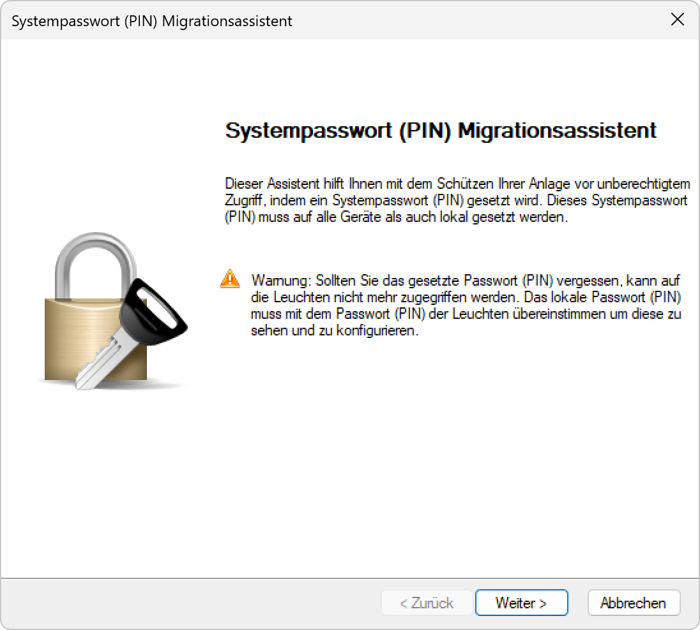
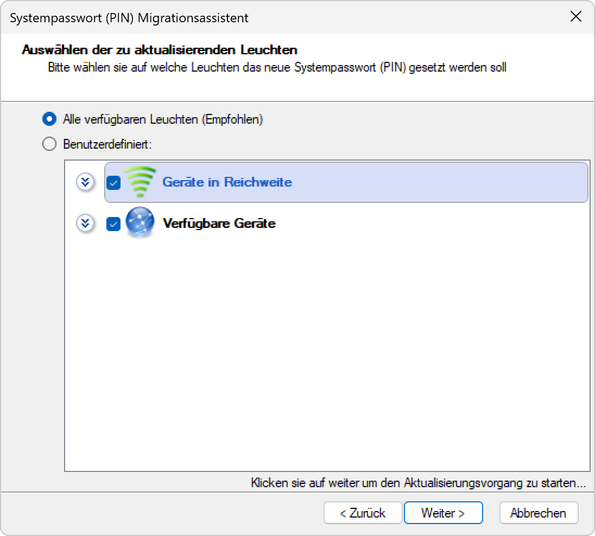

# Sicherheit
> ℹ️ **Info**  
>**Um mit den Leuchten kommunizieren zu können, muss das Systempasswort (PIN) der Leuchte und das Systempasswort (PIN) welches in SL-Configurator gesetzt ist <strong>übereinstimmen</strong>. Leuchten welche mit einem anderen Systempasswort (PIN) geschützt sind werden in der Geräteliste bewusst nicht angezeigt.**

<strong>Systempasswort (PIN)</strong>
Zeigt an, ob ein Systempasswort (PIN) für die Anwendung gesetzt ist. Die Anwendung kann in diesem Modus nur auf Leuchten mit <strong>demselben</strong> oder <strong>keinem</strong> Systempasswort zugreifen. Damit Leuchten welche mit einem Systempasswort geschützt in der Geräteliste angezeigt werden muss zwingend das richtige Systempasswort im SL-Configurator gesetzt sein. Der esave SLC-USB Stick kommuniziert ausschliesslich mit dem Systempasswort, welches hier gesetzt ist.

<strong>Systempasswort (PIN) setzen</strong>

*Klicken Sie auf hier, um das Systempasswort der Anwendung zu verändern oder zu setzen.*

*Vermeiden sie Bitte übliche Kombinationen wie die Postleitzahl usw.*

<strong>Systempasswort (PIN) löschen</strong>

*Klicken Sie hier um das Systempasswort, welches im SL- Configurator hinterlegt ist zu löschen.*

*Am besten den PIN notieren bevor man ihn löscht.*

<strong>Systempasswort (PIN) Migrationsassistent starten</strong>

Der Migrationsassistent verteilt das gesetzte Systempsswort (PIN) an die Lampencontroller.

*Klicken Sie auf „systempasswort (PIN) Migrationsassistent starten.*

*Geben Sie das Passwort des Systems ein an dem Sie Arbeiten.*

*Klicken sie auf Weiter.*

*Geben Sie das Passwort ein das an die Controller verteilt werden soll.*

*Wählen Sie die Geräte die das neue Passwort erhalten aus der Liste aus.*

*Übereprüfen Sie in der Liste ob alle Controller mit dem neuen Passwort aktualisiert wurden.*
