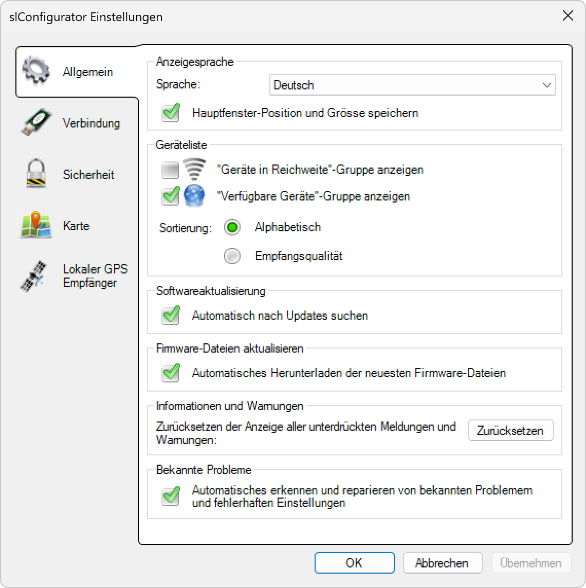

# Allgemein
  

**Sprache**  

Setzt die Sprache, in der die Anwendung angezeigt wird (Benutzeroberfläche).

---

**Geräteliste**  

Wählen Sie, welche Gerätegruppen Sie in der Geräteliste anzeigen möchten (Netzwerkscan – Verfügbare Geräte).

---

**Softwareaktualisierung**  

Definiert, ob die Anwendung einmal täglich automatisch nach einer Aktualisierung suchen soll (sofern eine Internetverbindung vorhanden ist).

---

**Informationen und Warnungen**  

Klicken Sie auf „Zurücksetzen“, um alle unterdrückten Meldungen und Warnungen wieder anzuzeigen.
