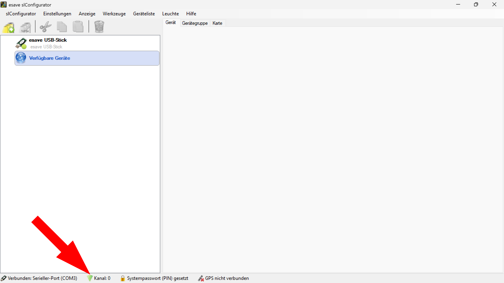

# Funkkanal

*Der Funkkanal kann im SL- Configurator unter* **Einstellungen > Verbindung > Verbindungseinstellungen** *geändert werden.*  

*Der Funkkanal kann auch durch einen Doppelklick auf das* **Kanal** *Symbol am unteren Bildschirmrand geändert werden.*  

*Definiert den aktuell benutzten Funkkanal des esave SLC- USB Stick.*  

**Funkkanal-Verwaltung**

Verwalten Sie die Funkkanal-Konfiguration für eine zuverlässige Kommunikation zwischen dem SL-Configurator und den esave SLC-Beleuchtungsgeräten.

## Hauptbereiche

### 1. Funkkanal-Einstellung
- Manuelle Auswahl spezifischer Funkkanäle
- Automatische Kanalsuche für unbekannte Geräte
- Schnelle Kanalwechsel über die Statusleiste

### 2. Automatische Verbindung
- Automatische Verbindungsherstellung beim Programmstart
- Optimierte Startsequenz für sofortige Geräteverfügbarkeit
- Hintergrundprozess für nahtlose Verbindung

### 3. Funkkanal-Migrationsassistent
- Assistierte Kanalwechsel für mehrere Geräte
- Sichere Übertragung neuer Kanaleinstellungen
- Synchronisation aller Netzwerkgeräte

### 4. Experteneinstellungen
- TTL-Konfiguration für Netzwerkoptimierung
- Erweiterte Kommunikationsparameter
- Warnhinweise für sicherheitskritische Änderungen

## Zugriff auf Funkkanal-Einstellungen

### Über Einstellungsmenü
- **Menüpfad**: Einstellungen > Verbindung > Verbindungseinstellungen
- **Vollständige Konfiguration**: Zugriff auf alle verfügbaren Optionen
- **Detaillierte Einstellungen**: Umfassende Kanalverwaltung
- **Expertenoptionen**: Erweiterte Konfigurationsmöglichkeiten

### Über Statusleiste
- **Schnellzugriff**: Doppelklick auf das "Kanal"-Symbol
- **Sofortige Änderung**: Direkter Kanalwechsel ohne Menünavigation
- **Echtzeit-Feedback**: Unmittelbare Anzeige der Kanaländerung
- **Workflow-Optimierung**: Minimale Unterbrechung der Arbeit

### Statusanzeige
- **Aktuelle Kanalanzeige**: "Kanal: 0" in der Statusleiste
- **Verbindungsstatus**: "Verbunden: Serieller-Port (COM3)"
- **Visueller Indikator**: Kontinuierliche Anzeige des aktiven Kanals
- **Sofort-Feedback**: Unmittelbare Bestätigung von Kanaländerungen

## Funkkanal-Konfiguration

### Manuelle Kanalauswahl
- **Dropdown-Menü**: Auswahl aus verfügbaren Funkkanälen (0-255)
- **Standardkanal**: Kanal 0 als Werkseinstellung
- **Direkte Eingabe**: Spezifischer Kanal wenn bekannt
- **Validierung**: Überprüfung der Kanalverfügbarkeit

### Automatische Kanalsuche
- **"Automatisch"-Option**: Durchsucht alle verfügbaren Kanäle
- **Intelligente Suche**: Stoppt bei erstem gefundenen Gerät
- **Sequenzielle Suche**: Systematische Durchsuchung aller Kanäle
- **Optimierte Erkennung**: Schnelle Identifikation aktiver Geräte

### Kanalauswahl-Strategien
- **Bekannte Umgebung**: Direkte Kanalauswahl für bekannte Installationen
- **Unbekannte Umgebung**: Automatische Suche für neue Standorte
- **Mehrfach-Installationen**: Systematische Kanaltrennung verschiedener Bereiche
- **Interferenzvermeidung**: Auswahl störungsfreier Kanäle

## Automatische Verbindung beim Start

### Verbindungsautomatisierung
- **Checkbox-Aktivierung**: "Beim Start automatisch verbinden"
- **Sofortverbindung**: Unmittelbare Verbindung nach Programmstart
- **Kanalwiederherstellung**: Automatische Wiederverbindung zum letzten Kanal
- **Fehlerbehandlung**: Automatische Wiederverbindung bei Verbindungsabbruch

### Startoptimierung
- **Hintergrundprozess**: Nicht-blockierende Verbindungsherstellung
- **Schnellstart**: Optimierte Verbindungssequenz
- **Statusvalidierung**: Überprüfung der Verbindungsqualität
- **Benutzerbenachrichtigung**: Rückmeldung über Verbindungsstatus

## Funkkanal-Migrationsassistent

### Assistierte Kanalwechsel
- **Button-Aktivierung**: "Funkkanal Migrationsassistent..."
- **Geräte-Scanning**: Automatische Erkennung aller Netzwerkgeräte
- **Batch-Verarbeitung**: Gleichzeitige Kanalaktualisierung mehrerer Geräte
- **Schritt-für-Schritt-Führung**: Benutzergeführte Kanalwechsel

### Migrationsprozess
- **Vorbereitung**: Analyse der aktuellen Netzwerkkonfiguration
- **Geräteidentifikation**: Erkennung aller zu migrierenden Geräte
- **Kanalverteilung**: Sichere Übertragung der neuen Kanaleinstellungen
- **Validierung**: Überprüfung der erfolgreichen Migration

### Sicherheitsmaßnahmen
- **Backup-Erstellung**: Automatische Sicherung der aktuellen Konfiguration
- **Rollback-Option**: Wiederherstellung bei Migrationsproblemen
- **Verbindungstest**: Kontinuierliche Prüfung der Geräteverbindung
- **Fortschrittsanzeige**: Echtzeitüberwachung des Migrationsstatus

## Experteneinstellungen

### Max. Time to Live (TTL)
- **TTL-Parameter**: Standardwert 100 für optimale Netzwerkperformance
- **Spin-Control**: Anpassung der TTL-Werte über Eingabefeld
- **Netzwerkoptimierung**: Anpassung an spezifische Installationsanforderungen
- **Loop-Prävention**: Verhinderung von Endlosschleifen in der Kommunikation

### Sicherheitswarnung
- **Warnsymbol**: Deutliche Warnung vor unsachgemäßen Änderungen
- **Warntext**: "Ändern Sie diese Einstellungen nur, wenn Sie Probleme haben und wissen was diese Einstellungen bewirken!"
- **Expertenwissen**: Empfehlung für technisches Verständnis
- **Dokumentation**: Verweis auf technische Dokumentation

### Standard wiederherstellen
- **Reset-Button**: "Standard wiederherstellen"
- **Werkseinstellungen**: Wiederherstellung der ursprünglichen Konfiguration
- **Sichere Rücksetzung**: Schrittweise Wiederherstellung ohne Datenverlust
- **Systemstabilität**: Gewährleistung der Grundfunktionalität

## Funkkanal-Synchronisation

### Kommunikationsvoraussetzungen
- **Kanalübereinstimmung**: Funkkanal von Leuchte und USB-Stick müssen identisch sein
- **Automatische Geräteerkennung**: Kompatible Geräte erscheinen unter "Verfügbare Geräte"
- **Verbindungsfilterung**: Nur Geräte mit übereinstimmendem Kanal werden angezeigt
- **Netzwerksegmentierung**: Verschiedene Kanäle für verschiedene Installationsbereiche

### Geräte-Discovery
- **Automatische Erkennung**: Sofortige Anzeige kompatibler Geräte
- **Kanalfilterung**: Nur Geräte mit übereinstimmendem Kanal werden gelistet
- **Echtzeit-Updates**: Dynamische Aktualisierung der Geräteliste
- **Verbindungsqualität**: Anzeige der Signalstärke und Verbindungsqualität

## Troubleshooting

### Häufige Probleme
- **Keine Geräte sichtbar**: Kanalinkonsistenz zwischen Geräten und Software
- **Verbindungsabbrüche**: Interferenzen oder Reichweitenprobleme
- **Langsame Verbindung**: Suboptimale TTL-Einstellungen
- **Migrationsfehler**: Probleme beim Kanalwechsel mehrerer Geräte

### Lösungsansätze
- **Automatische Kanalsuche**: Verwendung der "Automatisch"-Option
- **Manuelle Kanalauswahl**: Schrittweise Durchsuchung bekannter Kanäle
- **Migrationsassistent**: Verwendung des assistierten Kanalwechsels
- **Experteneinstellungen**: Anpassung der TTL-Werte bei Netzwerkproblemen

### Optimierungsstrategien
- **Kanalplanung**: Systematische Kanalzuordnung für verschiedene Bereiche
- **Interferenzvermeidung**: Auswahl störungsfreier Frequenzbereiche
- **Regelmäßige Wartung**: Periodische Überprüfung der Kanaleinstellungen
- **Dokumentation**: Führung einer Kanalübersicht für komplexe Installationen

## Vorteile der Funkkanal-Verwaltung

### Flexibilität
- **Mehrere Zugriffswege**: Menü und Statusleiste für verschiedene Arbeitsweisen
- **Automatisierte Suche**: Vereinfachte Konfiguration in unbekannten Umgebungen
- **Assistierte Migration**: Sichere Kanalwechsel für große Installationen
- **Expertenoptionen**: Erweiterte Konfiguration für spezielle Anforderungen

### Zuverlässigkeit
- **Automatische Verbindung**: Eliminierung manueller Verbindungsschritte
- **Kanalvalidierung**: Überprüfung der Kommunikationskompatibilität
- **Fehlerbehandlung**: Automatische Wiederverbindung bei Problemen
- **Backup-Mechanismen**: Sicherung kritischer Konfigurationen

### Benutzerfreundlichkeit
- **Intuitive Bedienung**: Einfache Kanalauswahl über Dropdown-Menü
- **Schnellzugriff**: Direkter Kanalwechsel über Statusleiste
- **Visuelle Rückmeldung**: Sofortige Anzeige von Kanaländerungen
- **Assistierte Prozesse**: Benutzergeführte Konfiguration komplexer Szenarien

> ## ℹ️ Wichtiger Hinweis zur Funkkanal-Synchronisation
>
> **Kanalübereinstimmung erforderlich**
>
> Um mit den Leuchten kommunizieren zu können, muss der Funkkanal der Leuchte und vom Configurator bzw. USB-Stick übereinstimmen. Die gefundenen Leuchten werden links unter "Verfügbare Geräte" automatisch aufgeführt.
>
> ### Kanalauswahl-Strategien:
> - **Bekannter Kanal**: Direkte Einstellung wenn Funkkanal bekannt ist
> - **Unbekannter Kanal**: Auswahl "Automatisch" durchsucht alle Funkkanäle
> - **Automatische Suche**: Stoppt bei erstem gefundenen Gerät und bleibt bei diesem Kanal
> - **Geräte-Discovery**: Kompatible Geräte erscheinen sofort in der Geräteliste

*Der Funkkanal definiert den aktuell benutzten Funkkanal des esave SLC-USB Stick. Standard: Kanal 0. Die Funkkanal-Verwaltung ermöglicht eine zuverlässige und flexible Kommunikation zwischen dem SL-Configurator und den Beleuchtungsgeräten.*