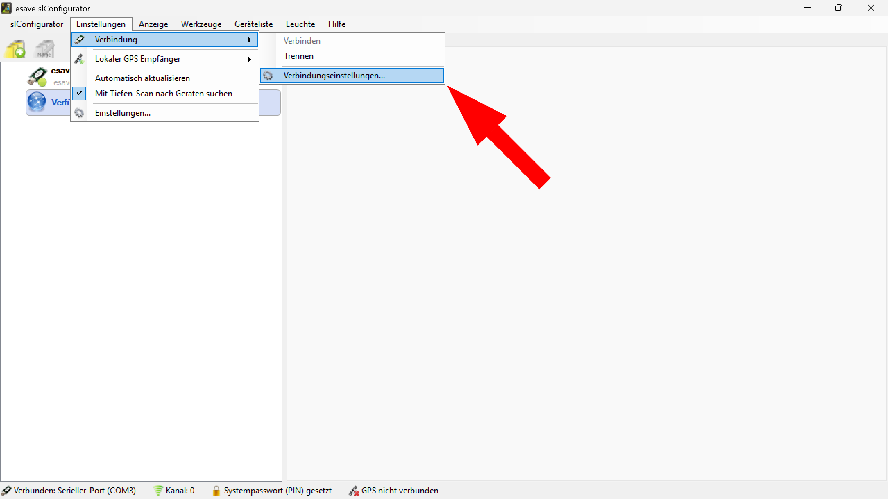

# Funkkanal  
># ℹ
> 
> Wenn der Funkkanal des Gerätes bekannt ist, kann er direkt eingestellt werden. Ist der Funkkanal nicht bekannt, können mit der Auswahl "Automatisch" alle Funkkanäle durchsucht werden. Findet der SL- Configurator ein Gerät, bricht er die Suche ab und bleibt bei diesem Kanal stehen. 

  
*Der Funkkanal kann im SL- Configurator unter* **Einstellungen > Verbindung > Verbindungseinstellungen** *geändert werden.*  

  
*Der Funkkanal kann auch durch einen Doppelklick auf das* **Kanal** *Symbol am unteren Bildschirmrand geändert werden.*  

  
*Definiert den aktuell benutzten Funkkanal des esave SLC- USB Stick.*  

Standard: Kanal 0  

># ℹ
>Um mit den Leuchten kommunizieren zu können, muss der Funkkanal der Leuchte und vom Configurator bzw. USB- Stick übereinstimmen.  

Die gefundenen Leuchten werden links unter „Verfügbare Geräte“ automatisch aufgeführt.