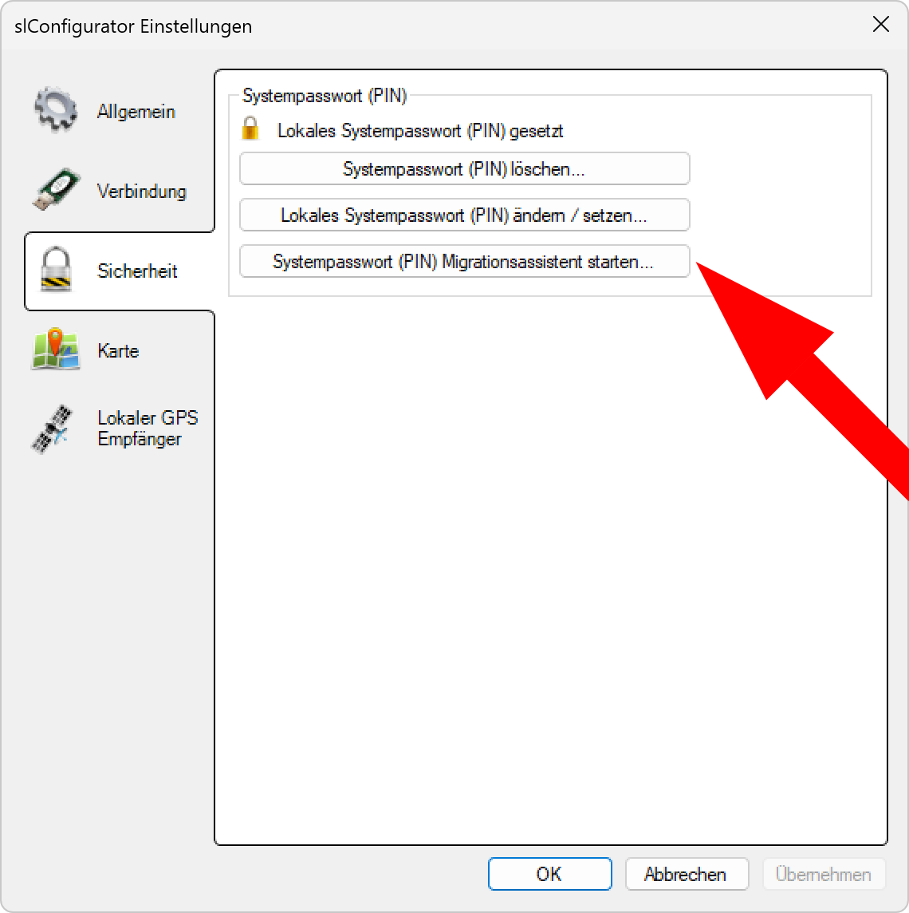
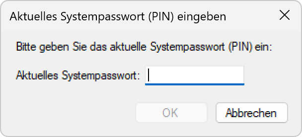
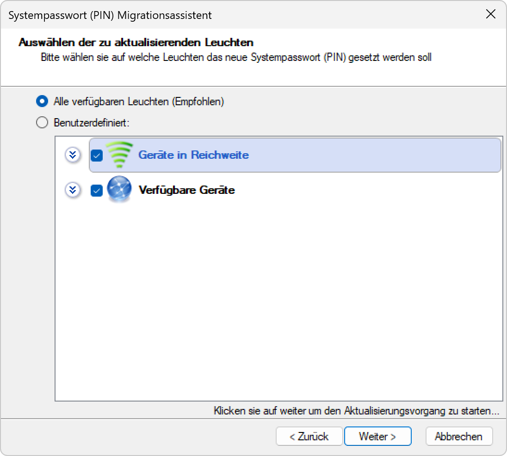
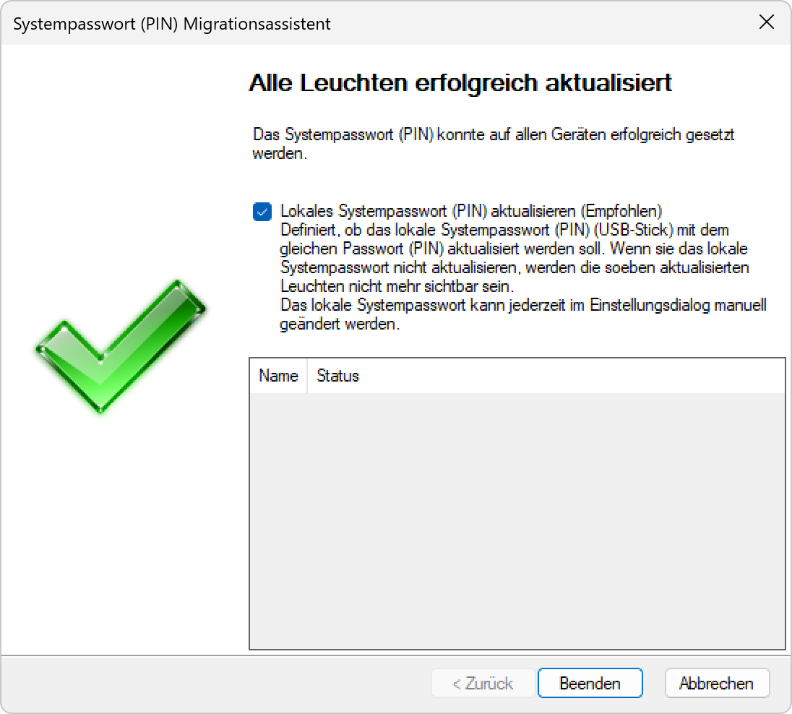

# Systempasswort (PIN) Migrationsassistent

*Klicken Sie auf* `Systempasswort (PIN)Migrationsassistent starten`*.*  

*Geben Sie das Passwort des Systems ein an dem Sie Arbeiten.*  

*Klicken sie auf `Weiter`.*  

*Geben Sie das Passwort ein, welches an die Controller verteilt werden soll.*  

*Wählen Sie die Geräte welche das neue Passwort erhalten aus der Liste aus.*  

*Überprüfen Sie in der Liste ob alle Controller mit dem neuen Passwort aktualisiert wurden.*

**Systempasswort (PIN) Migrationsassistent**

Sichere und systematische Migration von Systempasswörtern an alle Beleuchtungsgeräte in der Anlage durch einen benutzergeführten Assistenten.

## Hauptbereiche

### 1. Assistenten-Start
- Aktivierung des PIN-Migrationsassistenten
- Einführung in den Migrationsprozess
- Sicherheitshinweise und Warnungen

### 2. Aktuelle PIN-Eingabe
- Verifikation des bestehenden Systempassworts
- Authentifizierung für Migrationsberechtigung
- Sicherheitsvalidierung vor Prozessbeginn

### 3. Neue PIN-Definition
- Eingabe des neuen Systempassworts
- Bestätigung der neuen Sicherheitseinstellungen
- Validierung der PIN-Komplexität

### 4. Geräte-Auswahl
- Flexible Auswahl der zu migrierenden Geräte
- Kategorisierung nach Gerätezustand
- Multi-Selektion für Batch-Migration

### 5. Migrations-Durchführung
- Systematische PIN-Verteilung an ausgewählte Geräte
- Echtzeit-Fortschrittsüberwachung
- Erfolgs-Validierung und Statusreporting

### 6. Abschluss-Bestätigung
- Verifikation der erfolgreichen Migration
- Detaillierte Ergebnisanzeige
- Empfehlungen für Post-Migration-Aktivitäten

## Zugriff auf Migrationsassistent

### Navigation zur Funktion
- **Menüpfad**: Einstellungen > Sicherheit > Systempasswort (PIN) Migrationsassistent starten
- **Voraussetzung**: Lokales Systempasswort (PIN) muss bereits gesetzt sein
- **Sicherheitskontext**: Aktivierung nur bei vorhandenem PIN möglich
- **Einfacher Zugang**: Direkter Ein-Klick-Start des Assistenten

### Funktions-Aktivierung
- **Button-Klick**: "Systempasswort (PIN) Migrationsassistent starten..."
- **Sofortige Reaktion**: Unmittelbarer Start des geführten Prozesses
- **Wizard-Interface**: Schrittweise Führung durch alle Migrationsphasen
- **Benutzerführung**: Klare Anweisungen in jedem Schritt

## Schritt 1: Assistenten-Einführung

### Sicherheitswarnung
- **Hauptfunktion**: "Dieser Assistent hilft Ihnen mit dem Schützen Ihrer Anlage vor unberechtigtem Zugriff"
- **PIN-Requirement**: "indem ein Systempasswort (PIN) gesetzt wird"
- **Verteilungsnotwendigkeit**: "Dieses Systempasswort (PIN) muss auf alle Geräte als auch lokal gesetzt werden"
- **Kritische Warnung**: Passwort-Verlust führt zu permanentem Gerätezugriffsverlust

### Sicherheitshinweise
- **Warnsymbol**: Gelbes Ausrufezeichen für kritische Information
- **Passwort-Vergessen**: "Sollten Sie das gesetzte Passwort (PIN) vergessen, kann auf die Leuchten nicht mehr zugegriffen werden"
- **Synchronisations-Erfordernis**: "Das lokale Passwort (PIN) muss mit dem Passwort (PIN) der Leuchten übereinstimmen"
- **Sichtbarkeits-Kontrolle**: Nur Geräte mit übereinstimmendem PIN werden angezeigt

### Prozess-Navigation
- **"Weiter >"-Button**: Fortfahren zum nächsten Schritt
- **"Abbrechen"-Button**: Sichere Beendigung des Assistenten
- **Schrittweise Führung**: Kontrollierte Navigation durch Migrationsprozess
- **Rücksprung-Möglichkeit**: Zurück-Navigation zu vorherigen Schritten

## Schritt 2: Aktuelle PIN-Eingabe

### PIN-Verifikation
- **Dialog-Titel**: "Aktuelles Systempasswort (PIN) eingeben"
- **Eingabeaufforderung**: "Bitte geben Sie das aktuelle Systempasswort (PIN) ein:"
- **Eingabefeld**: "Aktuelles Systempasswort:" mit Passwort-Maskierung
- **Authentifizierung**: Überprüfung der Migrationsberechtigung

### Sicherheitsvalidierung
- **Bestehende PIN**: Eingabe des aktuell aktiven Systempassworts
- **Berechtigung**: Nachweis der Kenntnisse für Migrationsdurchführung
- **Fehlerbehandlung**: Warnung bei falscher PIN-Eingabe
- **Abbruch-Option**: Sichere Beendigung bei unbekannter PIN

### Prozess-Kontrolle
- **"OK"-Button**: Bestätigung der PIN-Eingabe
- **"Abbrechen"-Button**: Verlassen des Migrationsassistenten
- **Eingabe-Validierung**: Überprüfung der PIN-Korrektheit
- **Fehlermeldung**: Klare Rückmeldung bei Eingabefehlern

## Schritt 3: Neue PIN-Definition

### Neue PIN-Konfiguration
- **Dialog-Titel**: "Neues Passwort (PIN) eingeben"
- **Anweisung**: "Bitte geben sie das zu setzende Passwort (PIN) ein"
- **Passwort-Optionen**: Wahl zwischen "Kein Passwort" und "Passwort setzen (PIN)"
- **Eingabe-Interface**: Doppelte Eingabe für Fehlerprävention

### PIN-Eingabe-Felder
- **"Neues Passwort"**: Primäres Eingabefeld für neue PIN
- **"Bestätigung neues Passwort"**: Sekundäres Feld zur Validierung
- **"Eingabe anzeigen"**: Checkbox für temporäre Sichtbarmachung
- **Format-Hinweis**: "Ein Systempasswort (PIN) besteht aus bis zu 4 Ziffern (1-9999)"

### Sicherheitsoptionen
- **"Kein Passwort"**: Radiobutton für passwortfreien Betrieb
- **"Passwort setzen (PIN)"**: Radiobutton für PIN-Aktivierung (standardmäßig ausgewählt)
- **Konsistenz-Prüfung**: Überprüfung der Eingabe-Übereinstimmung
- **Komplexitäts-Validierung**: Bewertung der PIN-Sicherheit

## Schritt 4: Geräte-Auswahl

### Auswahlmodi
- **"Alle verfügbaren Leuchten (Empfohlen)"**: Radiobutton für komplette Migration
- **"Benutzerdefiniert"**: Radiobutton für selektive Geräteauswahl
- **Empfehlung**: Standardauswahl für einheitliche PIN-Konfiguration
- **Flexibilität**: Anpassung an spezifische Migrationsanforderungen

### Geräte-Kategorisierung
- **"Geräte in Reichweite"**: Checkbox mit Funkwellen-Symbol
- **"Verfügbare Geräte"**: Checkbox mit Netzwerk-Symbol
- **Visuelle Kennzeichnung**: Unterschiedliche Icons für Gerätezustände
- **Multi-Selektion**: Checkbox-basierte Auswahl mehrerer Geräte

### Migrations-Vorbereitung
- **Geräte-Inventar**: Vollständige Auflistung aller verfügbaren Geräte
- **Reichweiten-Prüfung**: Validierung der Kommunikationsfähigkeit
- **Selektions-Flexibilität**: Individuelle Geräteauswahl oder Batch-Verarbeitung
- **Fortschritts-Indikator**: "Klicken sie auf weiter um den Aktualisierungsvorgang zu starten..."

## Schritt 5: Migrations-Durchführung

### Batch-Migration
- **Simultane Aktualisierung**: Gleichzeitige PIN-Verteilung an ausgewählte Geräte
- **Sequenzielle Verarbeitung**: Systematische Abarbeitung der Geräteliste
- **Fortschrittsüberwachung**: Echtzeitanzeige des Migrationsstatus
- **Fehlerbehandlung**: Automatische Behandlung von Übertragungsproblemen

### Prozess-Monitoring
- **Echtzeit-Status**: Live-Anzeige der Migrations-Aktivitäten
- **Geräte-by-Geräte**: Individuelle Statusverfolgung für jedes Gerät
- **Erfolgs-Indikatoren**: Visuelle Bestätigung erfolgreicher PIN-Übertragung
- **Fehler-Protokollierung**: Dokumentation von Migrationsproblemen

## Schritt 6: Abschluss und Validierung

### Erfolgsmeldung
- **Titel**: "Alle Leuchten erfolgreich aktualisiert"
- **Bestätigung**: "Das Systempasswort (PIN) konnte auf allen Geräten erfolgreich gesetzt werden"
- **Erfolgs-Symbol**: Grünes Häkchen für visuelle Erfolgsbestätigung
- **Prozess-Abschluss**: Vollständige Migration aller ausgewählten Geräte

### USB-Stick Aktualisierung
- **Checkbox**: "Lokales Systempasswort (PIN) aktualisieren (Empfohlen)"
- **Empfehlung**: Synchronisation des USB-Stick-Passwortes
- **Konsistenz**: "Definiert, ob das lokale Systempasswort (PIN) (USB-Stick) mit dem gleichen Passwort (PIN) aktualisiert werden soll"
- **Sichtbarkeits-Warnung**: Ohne Aktualisierung werden migrierte Geräte nicht mehr sichtbar

### Status-Tabelle
- **Spalten**: "Name" und "Status" für detaillierte Ergebnisübersicht
- **Geräte-Details**: Auflistung aller migrierten Geräte mit Erfolgsstatus
- **Validierung**: Überprüfung der vollständigen Migration
- **Protokollierung**: Dokumentation für Audit-Zwecke

### Prozess-Abschluss
- **"Beenden"-Button**: Verlassen des Assistenten nach erfolgreicher Migration
- **Manuelle Anpassung**: "Das lokale Systempasswort kann jederzeit im Einstellungsdialog manuell geändert werden"
- **Flexibilität**: Nachträgliche Anpassungsmöglichkeiten
- **Dokumentation**: Hinweise für zukünftige PIN-Verwaltung

## Sicherheitsaspekte

### Migrations-Sicherheit
- **Authentifizierung**: Verifikation der aktuellen PIN vor Migrationsbeginn
- **Verschlüsselte Übertragung**: Sichere PIN-Verteilung an alle Geräte
- **Konsistenz-Prüfung**: Sicherstellung einheitlicher PIN-Konfiguration
- **Rollback-Fähigkeit**: Wiederherstellung bei Migrationsproblemen

### Systemintegrität
- **Batch-Verarbeitung**: Gleichzeitige Aktualisierung für einheitliche Sicherheit
- **Validierung**: Umfassende Überprüfung der Migration
- **Fehler-Recovery**: Robuste Behandlung von Übertragungsfehlern
- **Audit-Trail**: Vollständige Protokollierung aller Migrationsaktivitäten

## Anwendungsszenarien

### Sicherheits-Implementierung
- **Erstmalige PIN-Einführung**: Systemweite Aktivierung der Passwort-Authentifizierung
- **Sicherheits-Upgrade**: Übergang von ungesicherten zu gesicherten Geräten
- **Compliance-Erfüllung**: Erfüllung von Sicherheitsrichtlinien
- **System-Härtung**: Verbesserung der Gesamtsystemsicherheit

### PIN-Aktualisierung
- **Periodische Änderung**: Regelmäßige Aktualisierung der Systempasswörter
- **Sicherheits-Incident**: Reaktion auf Sicherheitsverletzungen
- **Personal-Wechsel**: Anpassung bei Personalveränderungen
- **Policy-Compliance**: Einhaltung von Passwort-Richtlinien

### System-Migration
- **Hardware-Austausch**: PIN-Migration bei Geräte-Erneuerung
- **Netzwerk-Erweiterung**: Integration neuer Geräte mit einheitlicher PIN
- **Architektur-Änderung**: Anpassung an neue Sicherheitsarchitekturen
- **Standardisierung**: Vereinheitlichung gemischter Sicherheitsumgebungen

## Vorteile des PIN-Migrationsassistenten

### Effizienz
- **Batch-Verarbeitung**: Simultane Aktualisierung aller Geräte
- **Automatisierung**: Minimierung manueller Konfigurationsschritte
- **Zeitersparnis**: Schnelle systemweite PIN-Verteilung
- **Optimierte Workflows**: Vereinfachung komplexer Migrationsprozesse

### Sicherheit
- **Assistierte Führung**: Reduzierung von Konfigurationsfehlern
- **Validierung**: Umfassende Überprüfung aller Migrationsschritte
- **Konsistenz**: Einheitliche PIN-Konfiguration im gesamten System
- **Fehler-Recovery**: Robuste Behandlung von Migrationsproblemen

### Benutzerfreundlichkeit
- **Wizard-Interface**: Schritt-für-Schritt-Führung durch komplexe Prozesse
- **Klare Navigation**: Intuitive Bedienung mit eindeutigen Anweisungen
- **Flexible Auswahl**: Anpassbare Geräteauswahl für verschiedene Szenarien
- **Transparente Rückmeldung**: Umfassende Information über Migrationsstatus

### Systemkontrolle
- **Zentrale Verwaltung**: Einheitliche Kontrolle über alle Sicherheitsaspekte
- **Vollständige Transparenz**: Detaillierte Übersicht über Migrationsergebnisse
- **Auswahl-Flexibilität**: Individuelle oder komplette Geräte-Migration
- **Status-Monitoring**: Echtzeit-Überwachung des Migrationsprozesses

## Troubleshooting

### Häufige Probleme
- **PIN-Inkonsistenz**: Unterschiedliche Passworte zwischen Geräten
- **Migrations-Fehler**: Fehlgeschlagene PIN-Übertragung
- **Geräte nicht erreichbar**: Kommunikationsprobleme während Migration
- **Validierungs-Fehler**: Inkorrekte PIN-Eingabe im Assistenten

### Lösungsansätze
- **Retry-Mechanismus**: Automatische Wiederholung fehlgeschlagener Übertragungen
- **Selektive Migration**: Individuelle Behandlung problematischer Geräte
- **Kommunikations-Check**: Überprüfung der Geräte-Konnektivität vor Migration
- **Backup-Wiederherstellung**: Rückfall auf vorherige PIN-Konfiguration

## Best Practices

### Vor der Migration
- **Backup erstellen**: Dokumentation der aktuellen PIN-Konfiguration
- **Konnektivität prüfen**: Sicherstellung aller Geräteverbindungen
- **Zeitplanung**: Migration außerhalb kritischer Betriebszeiten
- **Team-Information**: Benachrichtigung aller Beteiligten

### Während der Migration
- **Überwachung**: Kontinuierliche Beobachtung des Migrationsprozesses
- **Keine Unterbrechung**: Vermeidung von Systemstörungen während Migration
- **Dokumentation**: Protokollierung aller Aktivitäten und Ergebnisse
- **Sofort-Reaktion**: Schnelle Behandlung auftretender Probleme

### Nach der Migration
- **Validierung**: Überprüfung der erfolgreichen PIN-Verteilung
- **Funktionstest**: Test der Gerätekommunikation mit neuer PIN
- **Dokumentation**: Aktualisierung der Systemdokumentation
- **Backup**: Sicherung der neuen PIN-Konfiguration

> ## ⚠️ Kritischer Migrations-Hinweis
>
> **Systemweite PIN-Migration erfordert sorgfältige Planung**
>
> Dieser Assistent hilft beim Schutz Ihrer Anlage vor unberechtigtem Zugriff durch PIN-Verteilung. Das Systempasswort (PIN) muss auf alle Geräte als auch lokal gesetzt werden. Sollten Sie das gesetzte Passwort vergessen, kann auf die Leuchten nicht mehr zugegriffen werden.
>
> ### Kritische Empfehlungen:
> - **Aktuelle PIN dokumentieren**: Sichere Aufbewahrung vor Migrationsbeginn
> - **Neue PIN backup**: Dokumentation der neuen PIN für Recovery
> - **Vollständige Migration**: Verwenden Sie "Alle verfügbaren Leuchten" für Konsistenz
> - **USB-Stick aktualisieren**: Aktivieren Sie lokale PIN-Synchronisation
> - **Kommunikations-Test**: Überprüfen Sie Geräte-Erreichbarkeit nach Migration
> - **Recovery-Plan**: Bereiten Sie Verfahren für Migrationsprobleme vor

*Der PIN-Migrationsassistent ermöglicht eine sichere, systematische und benutzerfreundliche Migration von Systempasswörtern für umfassenden Schutz der Beleuchtungsanlage.*