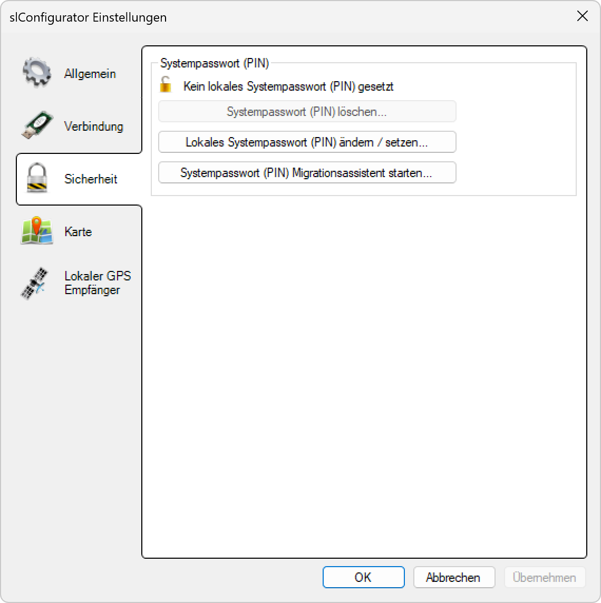

# Sicherheit

**Sicherheitseinstellungen**

Verwalten Sie die Systemsicherheit durch konfigurierbare Passwort-Authentifizierung für eine sichere Kommunikation zwischen der SL-Configurator-Software und den Beleuchtungsgeräten. Das Systempasswort (PIN) bildet die Grundlage für den Schutz vor unbefugtem Zugriff auf die Beleuchtungsanlage.

## Hauptbereiche

### 1. Systempasswort-Verwaltung

- Zentrale Verwaltung des lokalen Systempassworts (PIN)
- Sichere Authentifizierung zwischen Software und Geräten
- Schutz vor unbefugtem Zugriff auf die Beleuchtungsanlage

### 2. Passwort-Synchronisation

- Verteilung des Systempassworts an alle Beleuchtungsgeräte
- Migrationsassistent für sichere Passwort-Aktualisierung
- Synchronisation der Sicherheitseinstellungen im gesamten System

### 3. Zugriffskontrolle

- Filterung der Geräteliste basierend auf Passwort-Übereinstimmung
- Schutz vor versehentlicher Konfiguration fremder Geräte
- Sicherheitsbarriere für kritische Systemfunktionen

## Systempasswort (PIN) Grundlagen

### Funktionsweise

- **Authentifizierung**: Das Systempasswort authentifiziert die Software gegenüber den Beleuchtungsgeräten
- **Übereinstimmung erforderlich**: Software-PIN und Geräte-PIN müssen identisch sein für erfolgreiche Kommunikation
- **Geräteschutz**: Geräte mit abweichendem PIN werden bewusst nicht in der Geräteliste angezeigt
- **Kommunikationsschutz**: USB-Stick kommuniziert ausschließlich mit dem gesetzten Systempasswort

### Sicherheitsebenen

- **Kein Passwort**: Zugriff auf ungeschützte Geräte und Geräte ohne PIN-Schutz
- **Lokales Passwort**: Schutz durch benutzerdefiniertes Systempasswort
- **Einheitliches Passwort**: Alle Geräte nutzen dasselbe Systempasswort
- **Isolierte Systeme**: Verschiedene Passworte für verschiedene Anlagenbereiche

### PIN-Status-Anzeige

- **🔒 Kein lokales Systempasswort (PIN) gesetzt**: Indikator für ungeschützten Zustand
- **Statusvisualisierung**: Klare Darstellung des aktuellen Sicherheitsstatus
- **Sofortige Erkennung**: Unmittelbare Anzeige der Passwortkonfiguration
- **Sicherheitsebene**: Visueller Hinweis auf die aktuelle Schutzebene

## Lokales Systempasswort (PIN) ändern / setzen

### Passwort-Erstellung

- **Benutzergeführte Eingabe**: Sichere Eingabe des gewünschten Systempassworts
- **Passwort-Validierung**: Überprüfung der Passwort-Komplexität und -Sicherheit
- **Bestätigung**: Doppelte Eingabe zur Vermeidung von Tippfehlern
- **Sofortige Aktivierung**: Unmittelbare Wirksamkeit des neuen Passwortes

### Passwort-Richtlinien

- **Komplexitätsanforderungen**: Empfohlene Mindestanforderungen für sichere PINs
- **Längenempfehlung**: Optimale Passwort-Länge für Balance zwischen Sicherheit und Benutzerfreundlichkeit
- **Zeichen-Vielfalt**: Verwendung verschiedener Zeichentypen für erhöhte Sicherheit
- **Vermeidung schwacher Passworte**: Prävention häufig verwendeter oder einfacher PINs

### Passwort-Änderung

- **Sichere Aktualisierung**: Kontrollierte Aktualisierung bestehender Passworte
- **Alte PIN-Verifikation**: Bestätigung der aktuellen PIN vor Änderung
- **Neue PIN-Eingabe**: Sichere Eingabe der neuen Passwort-Kombination
- **Sofortige Synchronisation**: Automatische Aktualisierung der Gerätekommunikation

### Ersteinrichtung

- **Initiale Konfiguration**: Erstmalige Einrichtung des Systempassworts
- **Systemvorbereitung**: Vorbereitung des Systems für passwortgeschützte Kommunikation
- **Geräte-Registrierung**: Registrierung der Geräte mit dem neuen Systempasswort
- **Funktionstest**: Validierung der erfolgreichen Passwort-Implementierung

## Systempasswort (PIN) löschen

### Löschvorgang

- **Sichere Entfernung**: Kontrollierte Deaktivierung des Systempassworts
- **Bestätigung**: Sicherheitsabfrage vor Durchführung der Löschung
- **Sofortige Wirkung**: Unmittelbare Deaktivierung der Passwort-Authentifizierung
- **Status-Aktualisierung**: Aktualisierung der Sicherheitsanzeige nach Löschung

### Auswirkungen der Löschung

- **Offener Zugang**: Zugriff auf alle Geräte ohne Passwort-Beschränkung
- **Sicherheitsreduzierung**: Verringerung der Systemsicherheit
- **Erweiterte Geräteliste**: Anzeige aller verfügbaren Geräte unabhängig vom Passwort-Status
- **Vereinfachte Kommunikation**: Wegfall der Authentifizierung für Geräte-Zugriff

### Anwendungsszenarien

- **Wartungsmodus**: Temporäre Deaktivierung für Wartungsarbeiten
- **Systemreset**: Vollständige Rücksetzung der Sicherheitseinstellungen
- **Fehlerbehebung**: Lösung von Authentifizierungsproblemen
- **Systemumstellung**: Vorbereitung für neue Sicherheitskonfiguration

### Sicherheitsüberlegungen

- **Risikobewertung**: Bewertung der Sicherheitsrisiken vor PIN-Löschung
- **Zeitliche Begrenzung**: Minimierung der Zeit ohne Passwort-Schutz
- **Überwachung**: Verstärkte Überwachung während passwortloser Phasen
- **Schnelle Wiedereinrichtung**: Zügige Wiederherstellung der Passwort-Authentifizierung

## Systempasswort (PIN) Migrationsassistent

### Assistenten-Funktionalität

- **Benutzerführung**: Schritt-für-Schritt-Anleitung für sichere Passwort-Migration
- **Geräte-Erkennung**: Automatische Identifikation aller zu migrierenden Geräte
- **Batch-Verarbeitung**: Gleichzeitige Passwort-Aktualisierung mehrerer Geräte
- **Fortschrittsüberwachung**: Echtzeitanzeige des Migrationsstatus

### Migrationsprozess

- **Vorbereitung**: Analyse der aktuellen Passwort-Konfiguration
- **Planung**: Optimale Reihenfolge für die Geräte-Aktualisierung
- **Durchführung**: Kontrollierte Passwort-Verteilung an alle Geräte
- **Validierung**: Überprüfung der erfolgreichen Migration aller Geräte

### Sicherheitsmaßnahmen

- **Verschlüsselte Übertragung**: Sichere Übertragung des Systempassworts
- **Authentifizierung**: Verifikation der Geräteberechtigung vor Passwort-Übertragung
- **Rollback-Fähigkeit**: Möglichkeit zur Rückgängigmachung bei Problemen
- **Backup-Erstellung**: Automatische Sicherung vor Migrationsbeginn

### Migrationsstrategien

- **Sequenzielle Migration**: Schrittweise Aktualisierung einzelner Geräte
- **Parallele Migration**: Gleichzeitige Aktualisierung aller Geräte
- **Gruppenbasierte Migration**: Migration nach Gerätegruppierungen
- **Prioritätsbasierte Migration**: Berücksichtigung kritischer Geräte

## Erweiterte Sicherheitsfeatures

### Passwort-Sicherheit

- **Verschlüsselung**: Sichere Speicherung und Übertragung von Passwörtern
- **Salting**: Zusätzliche Sicherheitsebene durch Salt-Werte
- **Hashing**: Sichere Speicherung durch Hash-Algorithmen
- **Brute-Force-Schutz**: Schutz vor systematischen Angriffsversuchen

### Zugriffskontrolle

- **Gerätefilterung**: Automatische Filterung der Geräteliste basierend auf PIN-Übereinstimmung
- **Selektive Anzeige**: Nur passwort-kompatible Geräte werden angezeigt
- **Unsichtbare Geräte**: Geräte mit abweichendem PIN bleiben verborgen
- **Schutzbarriere**: Präventive Maßnahme gegen versehentliche Konfiguration fremder Geräte

### Audit und Protokollierung

- **Zugriffsprotokolle**: Detaillierte Aufzeichnung aller Authentifizierungsversuche
- **Änderungshistorie**: Vollständige Dokumentation aller Passwort-Änderungen
- **Sicherheitsereignisse**: Protokollierung sicherheitsrelevanter Ereignisse
- **Compliance-Unterstützung**: Dokumentation für Sicherheitsaudits

## Troubleshooting

### Häufige Probleme

- **PIN-Inkonsistenz**: Unterschiedliche Passworte zwischen Software und Geräten
- **Vergessene PINs**: Verlust des Systempassworts
- **Geräte nicht sichtbar**: Geräte erscheinen nicht in der Geräteliste
- **Authentifizierungsfehler**: Fehlgeschlagene Kommunikation mit Geräten

### Diagnosewerkzeuge

- **PIN-Validierung**: Überprüfung der Passwort-Übereinstimmung
- **Kommunikationstest**: Test der Geräte-Authentifizierung
- **Geräte-Scanner**: Identifikation aller verfügbaren Geräte
- **Sicherheitsprotokoll**: Analyse der Authentifizierungsprotokolle

### Lösungsansätze

- **PIN-Synchronisation**: Wiederherstellung der Passwort-Übereinstimmung
- **Systemreset**: Vollständige Rücksetzung der Sicherheitseinstellungen
- **Schrittweise Wiederherstellung**: Systematische Wiederherstellung der Gerätekommunikation
- **Backup-Wiederherstellung**: Wiederherstellung aus Sicherheitskopien

## Sicherheitsrichtlinien

### Best Practices

- **Regelmäßige Passwort-Aktualisierung**: Periodische Erneuerung der Systempassworte
- **Sichere Passwort-Speicherung**: Schutz der Passwort-Informationen
- **Dokumentation**: Sichere Dokumentation der Sicherheitseinstellungen
- **Schulung**: Benutzerausbildung für sichere Passwort-Verwaltung

### Compliance-Anforderungen

- **Industriestandards**: Einhaltung gängiger Sicherheitsstandards
- **Regulatorische Anforderungen**: Konformität mit gesetzlichen Bestimmungen
- **Audit-Bereitschaft**: Vorbereitung für Sicherheitsaudits
- **Zertifizierungen**: Unterstützung für Sicherheitszertifizierungen

### Risikomanagement

- **Bedrohungsanalyse**: Identifikation potenzieller Sicherheitsrisiken
- **Risikobewertung**: Bewertung der Auswirkungen von Sicherheitsverletzungen
- **Präventive Maßnahmen**: Vorbeugende Sicherheitsmaßnahmen
- **Incident Response**: Reaktionsplan für Sicherheitsvorfälle

## Vorteile der Sicherheitseinstellungen

### Systemsicherheit

- **Unbefugter Zugriff**: Effektiver Schutz vor unberechtigtem Zugriff
- **Datenintegrität**: Schutz der Konfigurationsdaten vor Manipulation
- **Systemstabilität**: Verhinderung versehentlicher Fehlkonfigurationen
- **Compliance**: Erfüllung von Sicherheitsanforderungen

### Benutzerfreundlichkeit

- **Intuitive Bedienung**: Einfache Verwaltung komplexer Sicherheitseinstellungen
- **Automatisierte Prozesse**: Vereinfachung der Passwort-Verwaltung
- **Klare Statusanzeige**: Transparente Darstellung des Sicherheitsstatus
- **Assistenten-Unterstützung**: Benutzergeführte Sicherheitskonfiguration

### Wartungseffizienz

- **Zentrale Verwaltung**: Einheitliche Kontrolle über alle Sicherheitseinstellungen
- **Automatisierte Migration**: Vereinfachte Passwort-Aktualisierung
- **Protokollierung**: Vollständige Dokumentation aller Sicherheitsaktivitäten
- **Fehlerdiagnose**: Schnelle Identifikation und Behebung von Sicherheitsproblemen

> ## ℹ️ Wichtiger Hinweis zur Passwort-Synchronisation
>
> **Systempasswort-Übereinstimmung erforderlich**
>
> Um mit den Leuchten kommunizieren zu können, muss das Systempasswort (PIN) der Leuchte und das Systempasswort (PIN) welches in SL-Configurator gesetzt ist **übereinstimmen**. Leuchten welche mit einem anderen Systempasswort (PIN) geschützt sind werden in der Geräteliste bewusst nicht angezeigt.
>
> ### Kritische Sicherheitsaspekte:
> - **PIN-Übereinstimmung**: Software-PIN und Geräte-PIN müssen identisch sein
> - **Geräteschutz**: Nur kompatible Geräte werden in der Geräteliste angezeigt
> - **Kommunikationssicherheit**: USB-Stick nutzt ausschließlich das gesetzte Systempasswort
> - **Migrationsnotwendigkeit**: Verwenden Sie den Migrationsassistenten für PIN-Änderungen
> - **Sicherheitsbarriere**: Schutz vor versehentlicher Konfiguration fremder Geräte

*Hier haben Sie die Möglichkeiten den PIN zu erstellen, zu löschen und den Migrationsassistent zu starten um das gesetzte Systempasswort an die Controller zu verteilen.*

Die Sicherheitseinstellungen gewährleisten eine sichere und kontrollierte Kommunikation zwischen der SL-Configurator-Software und den Beleuchtungsgeräten durch robuste Passwort-Authentifizierung und umfassende Zugriffskontrolle.