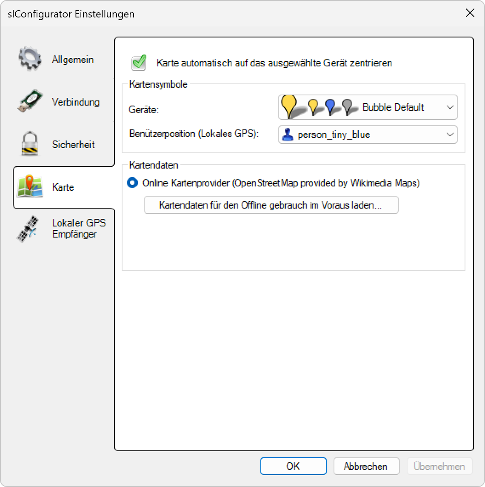

# Karte
  

**Toggle** Karte automatisch auf das ausgewählte Gerät zentrieren.

Kartensymbole anpassen

Benutzersymbol anpassen

Kartendaten für offlinegebrauch herunterladen
Kartendaten werden von Wikimedia Maps zur Verfügung gestellt.