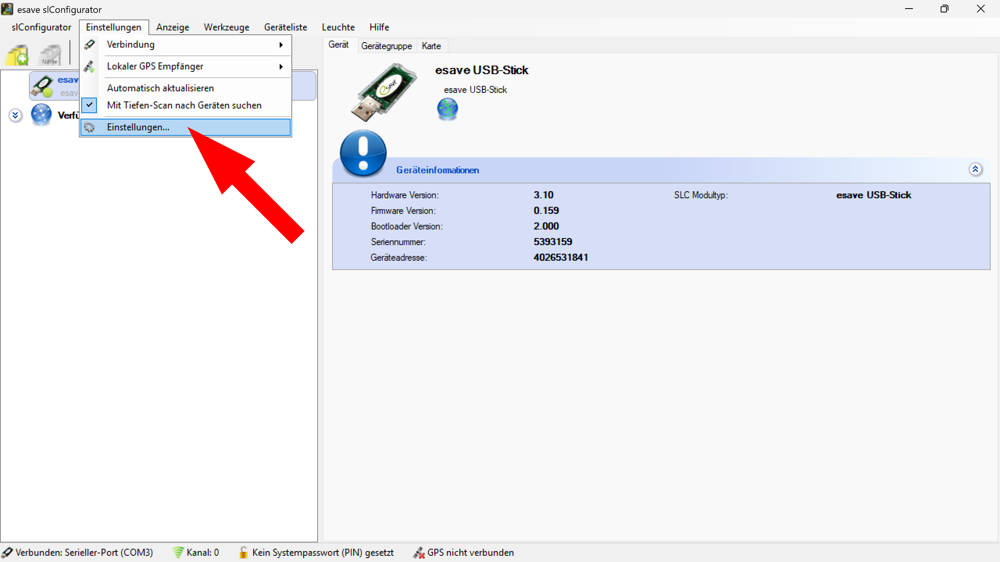
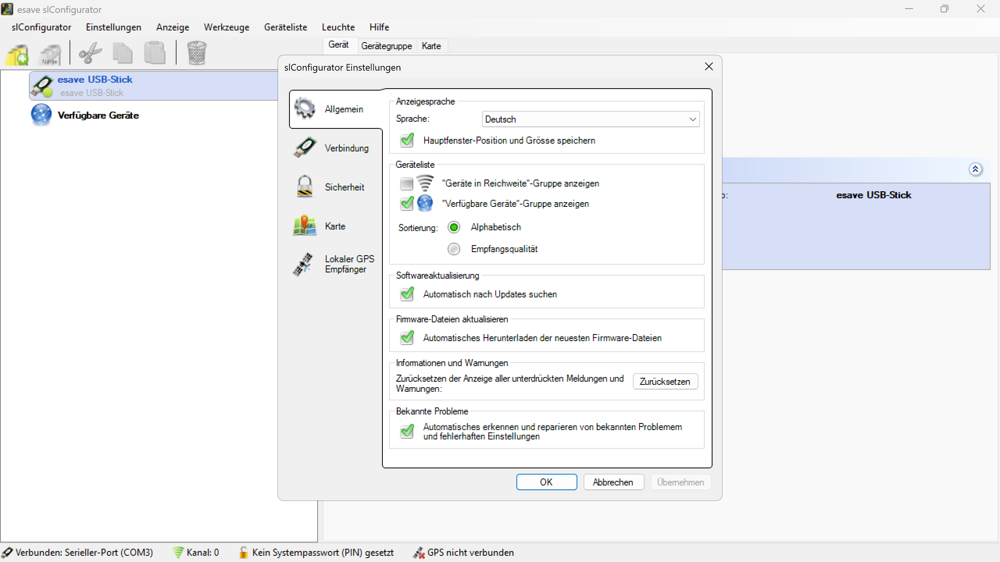

# Einstellungen
  
*Öffnen Sie die SL-Configurator Einstellungen.*

## Hauptfenster SL-Configurator Einstellungen

  
*Hier finden Sie die fünf Kategorien um die wichtigsten Einstellungen vorzunehmen.*
