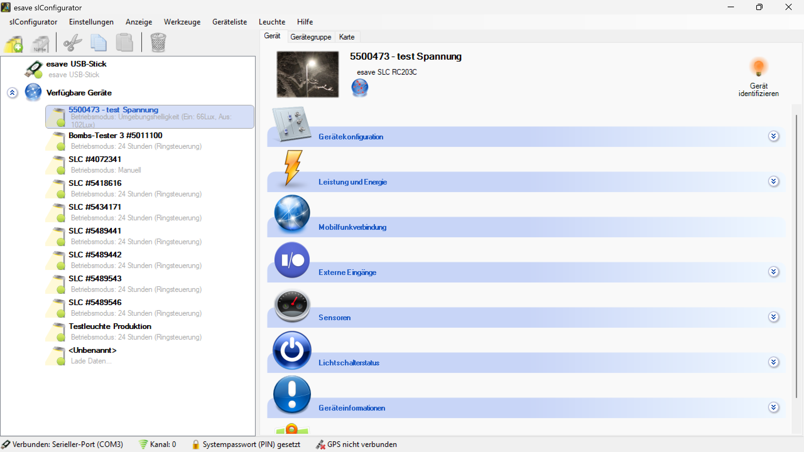

# Leuchten Suchen

Um mit den Leuchten kommunizieren zu können, muss der Funkkanal der Leuchte und mit dem Funkkanal, welcher im SL- Configurator eingestellt ist übereinstimmen. Der Funkkanal kann im SL- Configurator unter Einstellungen > Verbindung > Funkkanal oder durch Doppelklick auf das Funkkanal Symbol am unteren Bildschirmrand geändert werden.

Wenn der Funkkanal der Leuchte bekannt ist, kann er direkt eingestellt werden. Ist der Funkkanal nicht bekannt, können mit der Auswahl "Automatisch" alle Funkkanäle durchsucht werden.Findet der SL- Configurator eine Leuchte auf einem Funkkanal, bricht er die Suche ab und bleibt bei diesem Kanal stehen. 

*Die gefundenen Leuchten werden auf der linken Seite unter den verfügbaren Geräten automatisch aufgelistet.*

*Um eine ausgewählte Leuchte zu identifizieren, links in der Geräteliste eine Leuchte auswählen kann diese durch Anklicken des Blinken Symbols identifiziert werden. Die Leuchte blinkt dann einmal.*