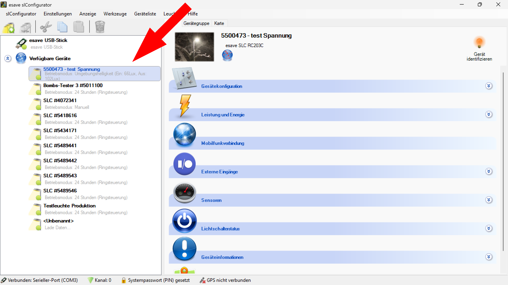

# Leuchten Suchen

> ℹ️ **Info**
> 
> Um mit den Leuchten kommunizieren zu können, muss der Funkkanal der Leuchte und mit dem Funkkanal, welcher im SL- Configurator eingestellt ist übereinstimmen.

*Der Funkkanal kann im SL- Configurator unter <strong>Einstellungen > Verbindung > Verbindungseinstellungen</strong> geändert werden.*

*Der Funkkanal kann auch durch Doppelklick auf das Kanal Symbol am unteren Bildschirmrand geändert werden.*

> ℹ️ **Info**
> 
> Wenn der Funkkanal der Leuchte bekannt ist, kann er direkt eingestellt werden. Ist der Funkkanal nicht bekannt, können mit der Auswahl "Automatisch" alle Funkkanäle durchsucht werden.Findet der SL- Configurator eine Leuchte auf einem Funkkanal, bricht er die Suche ab und bleibt bei diesem Kanal stehen. 

*Die gefundenen Leuchten werden auf der linken Seite unter den verfügbaren Geräten automatisch aufgelistet.*

*Um eine ausgewählte Leuchte zu identifizieren, links in der Geräteliste eine Leuchte auswählen kann diese durch Anklicken des Blinken Symbols identifiziert werden. Die Leuchte blinkt dann einmal.*