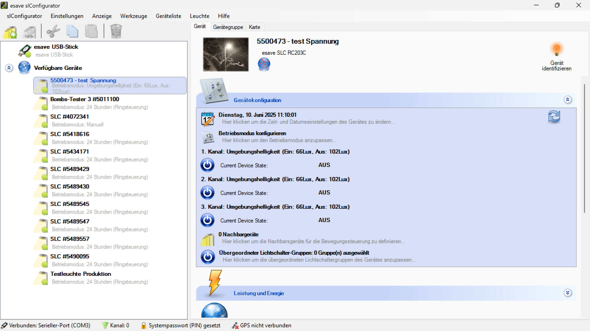
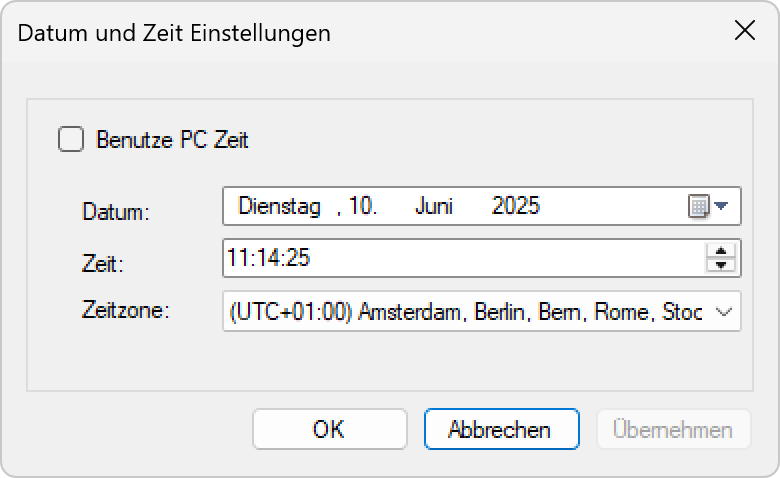

# Uhrzeit und Datum

*Um die Uhrzeit und das Datum einer Leuchte zu ändern, wälen Sie die Leuchte in der Liste aus und unter Gerätekonfiguration klicken Sie auf das Datumsfeld.*

*Geben Sie die aktuelle Uhrzeit und Datum ein oder wählen Sie Benutze PC Zeit um automatisch die Zeit des Computers zu übernehmen.*