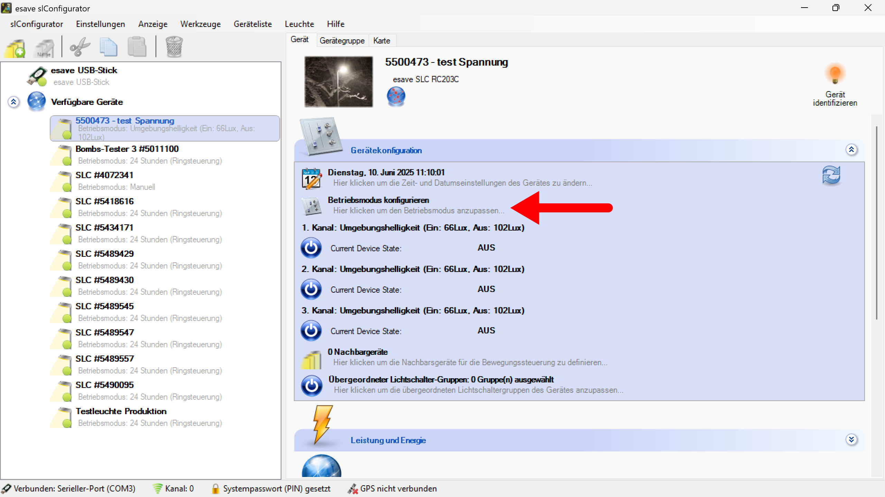
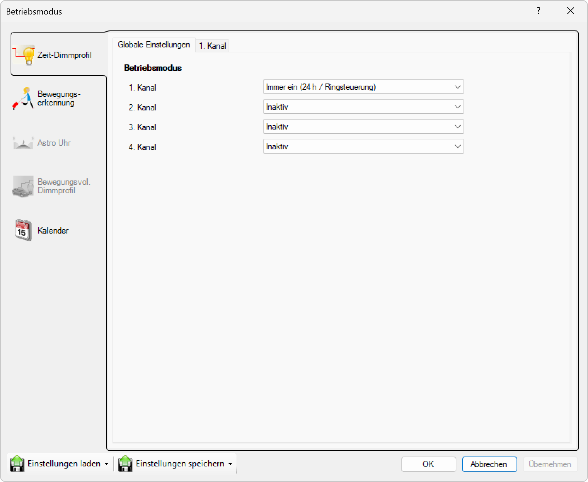
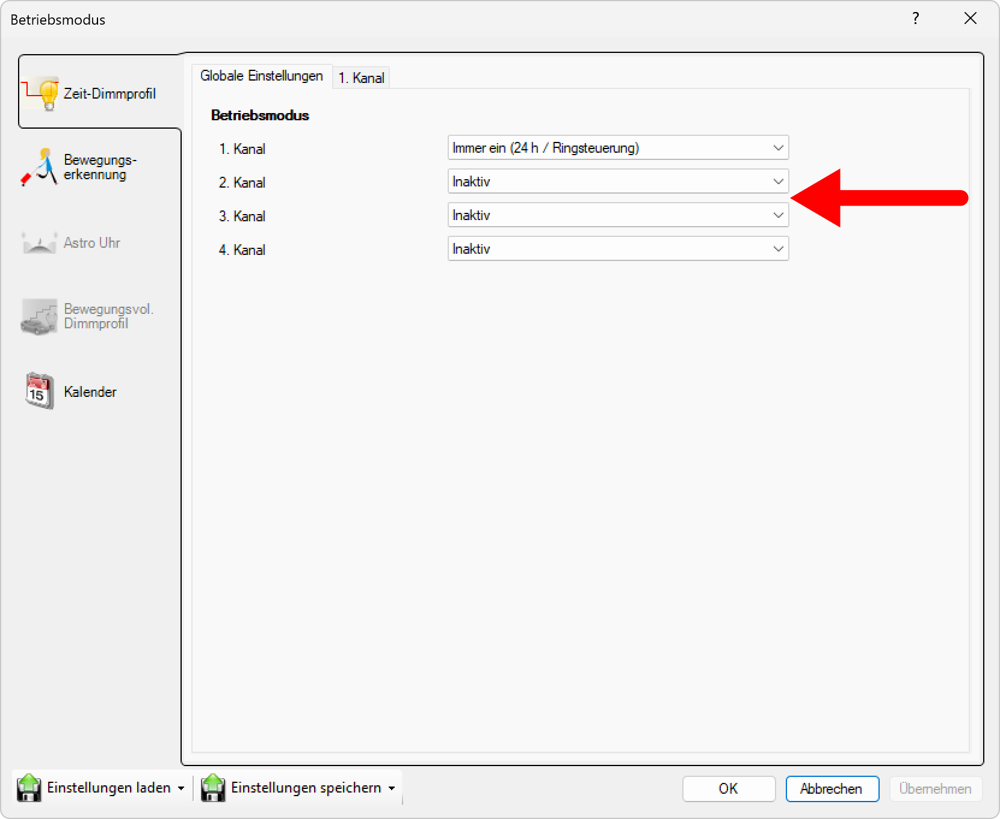

# Betriebsmodus

*Um den Betriebsmodus einer Leuchte zu ändern, wählen Sie das zu konfigurierende Gerät in der Liste aus und klicken Sie auf das "Betriebsmodus konfigurieren" Feld, um das Fenster Betriebsmodus zu öffnen.*

*Um den Betriebsmodus einer Leuchte zu ändern, klicken Sie auf das Betriebsmodus- Feld, um das Fenster Betriebsmodus zu öffnen.*

*Hier können auf bis zu Vier Kanälen die Betriebsmodi konfiguriert werden.*