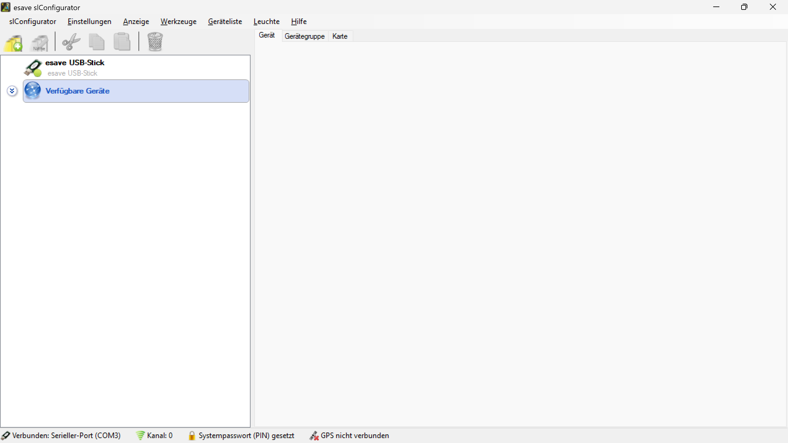

# Leuchten Konfiguration

*Wählen Sie unter "verfügbare Geräte" die Steuerung aus die Sie konfigurieren möchten*

Bitte beachten Sie, dass je nach dem Typ der Beleuchtungssteuerung nicht alle Optionen in der Software ausgewählt werden können.

Zum Beispiel ist der Ausgangstyp der Dimmschnittstelle des SLC- Hubs auf DALI beschränkt.

Wenn ein Menü ausgegraut ist, kann es mit den aktuellen Einstellungen oder mit dem verwendeten Controller nicht geändert werden. 