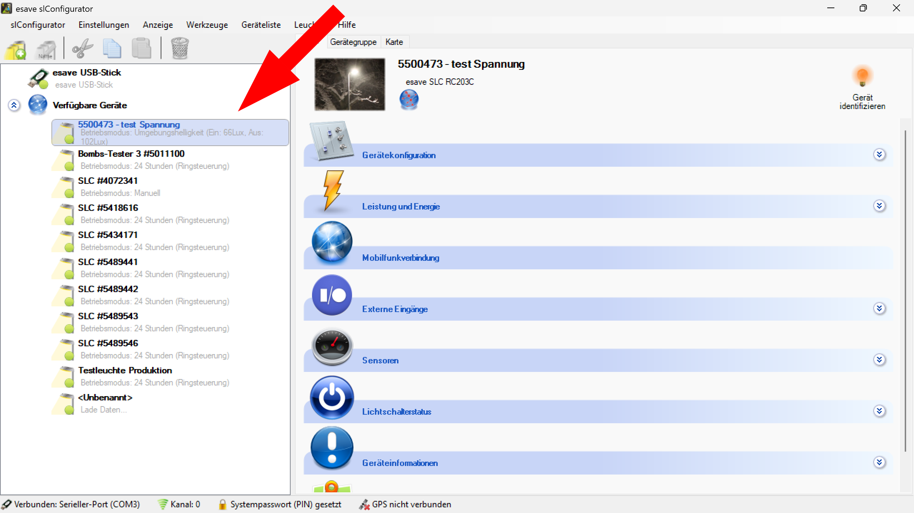

# Geräte identifizieren

*Die gefundenen Geräte werden auf der linken Seite unter den verfügbaren Geräten automatisch aufgelistet.*  

*Um eine ausgewählte Leuchte zu identifizieren, links in der Geräteliste eine Leuchte auswählen kann diese durch Anklicken des Blinken Symbols identifiziert werden.* **Die Leuchte blinkt dann einmal**
