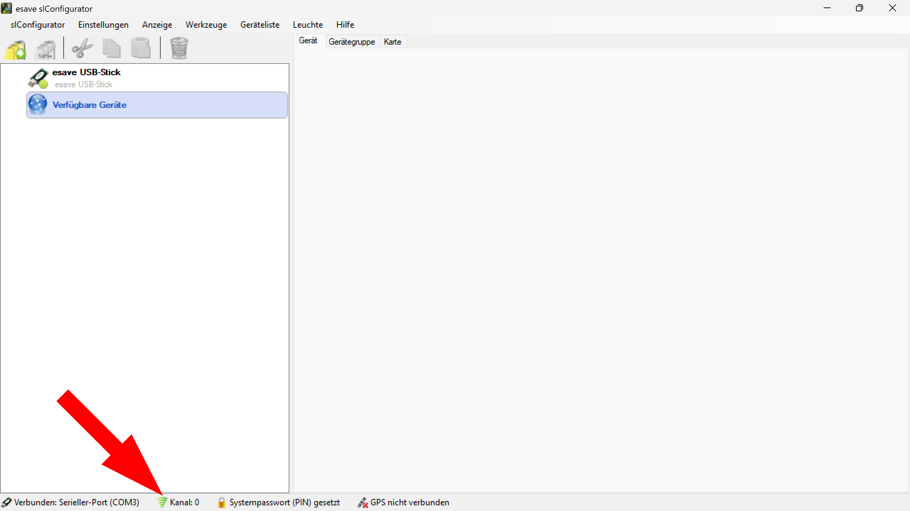

# Geräte identifizieren 

># ℹ
> 
> Wenn der Funkkanal des Gerätes bekannt ist, kann er direkt eingestellt werden. Ist der Funkkanal nicht bekannt, können mit der Auswahl "Automatisch" alle Funkkanäle durchsucht werden. Findet der SL- Configurator ein Gerät, bricht er die Suche ab und bleibt bei diesem Kanal stehen. 

  

Toggle beim Start automatisch verbinden

---

Funkkanal

---

Experteneistellungen

---

Standart widerherstelllen  

## Verbindungseinstellungen  

  
*Der Funkkanal kann im SL- Configurator unter* **Einstellungen > Verbindung > Verbindungseinstellungen** *geändert werden.*  

  
*Der Funkkanal kann auch durch einen Doppelklick auf das* **Kanal** *Symbol am unteren Bildschirmrand geändert werden.*  

  

*Die gefundenen Geräte werden auf der linken Seite unter den verfügbaren Geräten automatisch aufgelistet.*  

  

*Um eine ausgewählte Leuchte zu identifizieren, links in der Geräteliste eine Leuchte auswählen kann diese durch Anklicken des Blinken Symbols identifiziert werden.* **Die Leuchte blinkt dann einmal**.