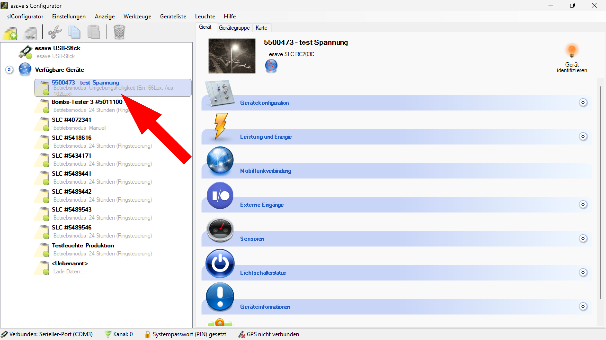

# Namen ändern

**Namen ändern**

Passen Sie die Gerätenamen Ihrer Beleuchtungsanlage an, um eine bessere Identifikation und Verwaltung zu ermöglichen. Diese Funktion erlaubt es, aussagekräftige Namen zu vergeben, die die Funktion, Position oder andere relevante Eigenschaften der Geräte widerspiegeln.

## Hauptbereiche

### 1. Geräteauswahl

- Wählen Sie das gewünschte Gerät aus der Liste der verfügbaren Geräte aus
- Übersichtliche Darstellung aller Geräte in der Anlage
- Aktuelle Gerätenamen werden in der Liste angezeigt

### 2. Namensbearbeitung

- Direktes Bearbeiten der Gerätenamen durch Klicken auf den aktuellen Namen
- Eingabefeld für die Namensänderung wird automatisch aktiviert
- Bestätigung der Änderung durch Eingabetaste oder Klick außerhalb des Feldes

## Namensänderungs-Funktionen

### Grundlegende Bearbeitung

- **Direktbearbeitung**: Klicken Sie auf den Namen des Geräts zur Aktivierung des Eingabefelds
- **Freie Texteingabe**: Vergabe beliebiger Namen bis zu einer bestimmten Zeichenanzahl
- **Sofortige Aktualisierung**: Änderungen werden umgehend in der Benutzeroberfläche angezeigt
- **Rückgängig-Funktion**: Möglichkeit zur Wiederherstellung des ursprünglichen Namens

### Erweiterte Funktionen

- **Batch-Umbenennung**: Gleichzeitige Umbenennung mehrerer Geräte
- **Namensvorlagen**: Verwendung vordefinierter Namensschemas
- **Automatische Nummerierung**: Systematische Nummerierung gleichartiger Geräte
- **Duplikats-Prüfung**: Warnung bei doppelten Gerätenamen

## Namenskonventionen

### Empfohlene Namensstrukturen

- **Standort-basiert**: "Büro-1-Deckenleuchte", "Flur-EG-Wandleuchte"
- **Funktions-basiert**: "Arbeitsplatz-LED", "Notbeleuchtung-Ausgang"
- **Bereichs-basiert**: "Produktion-Halle-A", "Lager-Sektor-3"
- **Kombiniert**: "B1-Büro-201-Arbeitsplatz"

### Namensrichtlinien

- **Eindeutigkeit**: Jeder Name sollte einzigartig sein
- **Beschreibend**: Namen sollten die Funktion oder Position beschreiben
- **Konsistenz**: Einheitliche Namensgebung in der gesamten Anlage
- **Kürze**: Prägnante Namen für bessere Übersichtlichkeit

## Anwendungsszenarien

### Bürogebäude

- **Raum-basierte Benennung**: "Büro-A-201", "Besprechungsraum-1", "Empfang-Haupteingang"
- **Funktionsbezeichnungen**: "Arbeitsplatz-LED", "Präsentationsbeleuchtung", "Flurbeleuchtung"
- **Etagen-Kennzeichnung**: "EG-Lobby", "1.OG-Süd", "2.OG-Nord"

### Industrielle Anlagen

- **Produktionsbereich**: "Halle-A-Sektor-1", "Montage-Platz-3", "Qualitätskontrolle"
- **Lagerbereich**: "Lager-Hochregal-A", "Kommissionierung-Zone-2", "Warenausgang"
- **Infrastruktur**: "Maschinenbeleuchtung-CNC-1", "Sicherheitsbeleuchtung-Notausgang"

### Einzelhandel

- **Verkaufsbereiche**: "Verkaufsfläche-Mode", "Kasse-Position-3", "Schaufenster-Süd"
- **Lagerbereiche**: "Lager-Textilien", "Anlieferung-Rampe-1", "Personalraum"
- **Spezialbeleuchtung**: "Produktpräsentation-Schmuck", "Akzentbeleuchtung-Eingang"

### Öffentliche Gebäude

- **Funktionsbereiche**: "Wartehalle-Hauptbereich", "Schalter-Position-5", "Informationstafel"
- **Sicherheitsbereiche**: "Notausgang-Ost", "Treppenhaus-A", "Fluchtwegbeleuchtung"
- **Servicebereiche**: "Reinigung-Zugang", "Technikraum-UG", "Wartung-Dachbereich"

## Vorteile der Namensänderung

### Verwaltungsvorteile

- **Bessere Identifikation**: Eindeutige Zuordnung von Geräten zu Standorten
- **Vereinfachte Wartung**: Schnelle Lokalisierung von Geräten für Servicearbeiten
- **Effiziente Planung**: Bessere Übersicht bei der Anlagenplanung
- **Dokumentation**: Eindeutige Referenzierung in technischen Dokumenten

### Betriebsvorteile

- **Schnelle Fehlerbehebung**: Sofortige Identifikation problematischer Geräte
- **Intuitive Bedienung**: Benutzerfreundliche Geräteverwaltung
- **Teamkommunikation**: Klare Kommunikation über Gerätepositionen
- **Schulungseffizienz**: Einfachere Einarbeitung neuer Mitarbeiter

### Sicherheitsvorteile

- **Notfallmanagement**: Schnelle Lokalisierung kritischer Beleuchtung
- **Wartungsprotokoll**: Eindeutige Zuordnung von Wartungsarbeiten
- **Compliance**: Erfüllung von Dokumentationsanforderungen
- **Audit-Unterstützung**: Nachvollziehbare Geräteverwaltung

## Schritt-für-Schritt-Anleitung

### Einzelne Namensänderung

1. **Geräteauswahl**: Wählen Sie das gewünschte Gerät aus der Liste "Verfügbare Geräte"
2. **Namensaktivierung**: Klicken Sie auf den aktuellen Namen des Geräts
3. **Eingabe**: Geben Sie den neuen Namen in das erscheinende Eingabefeld ein
4. **Bestätigung**: Drücken Sie die Eingabetaste oder klicken Sie außerhalb des Feldes
5. **Überprüfung**: Kontrollieren Sie die Änderung in der Geräteliste

### Mehrfache Namensänderung

1. **Geräteauswahl**: Wählen Sie mehrere Geräte aus (falls unterstützt)
2. **Batch-Funktion**: Aktivieren Sie die Batch-Umbenennung
3. **Namensschema**: Definieren Sie ein Namensschema mit Platzhaltern
4. **Vorschau**: Überprüfen Sie die Vorschau der neuen Namen
5. **Anwendung**: Bestätigen Sie die Änderungen für alle ausgewählten Geräte

## Best Practices

### Namensplanung

- **Konzept entwickeln**: Erstellen Sie ein einheitliches Namenskonzept vor der Implementierung
- **Dokumentation**: Führen Sie eine Dokumentation der Namenskonventionen
- **Konsistenz**: Verwenden Sie einheitliche Abkürzungen und Strukturen
- **Zukunftssicherheit**: Berücksichtigen Sie zukünftige Erweiterungen

### Wartung und Pflege

- **Regelmäßige Überprüfung**: Kontrolle der Namenskonformität
- **Aktualisierung**: Anpassung der Namen bei Änderungen der Raumnutzung
- **Backup**: Sicherung der Namenskonfiguration vor größeren Änderungen
- **Schulung**: Mitarbeiterschulung zu Namenskonventionen

## Fehlervermeidung

### Häufige Probleme

- **Doppelte Namen**: Vermeidung identischer Gerätenamen
- **Unklare Bezeichnungen**: Verwendung aussagekräftiger Namen
- **Inkonsistente Struktur**: Einhaltung einheitlicher Namenskonventionen
- **Zu lange Namen**: Verwendung angemessener Namenslängen

### Lösungsansätze

- **Namensvalidierung**: Automatische Prüfung auf Eindeutigkeit
- **Namensvorschläge**: Systemgestützte Namensvorschläge
- **Warnsystem**: Hinweise bei problematischen Namensgebungen
- **Rollback-Funktion**: Rückgängigmachen fehlerhafter Änderungen

Die Namen-ändern-Funktion ermöglicht eine professionelle und systematische Verwaltung der Gerätebezeichnungen und trägt wesentlich zur Effizienz und Übersichtlichkeit der Beleuchtungsanlagenverwaltung bei.