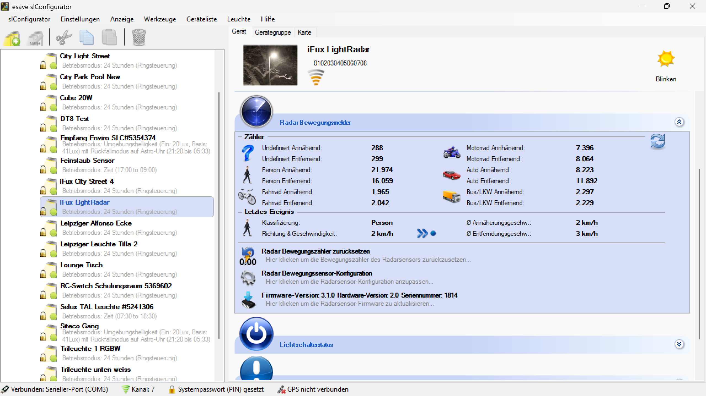
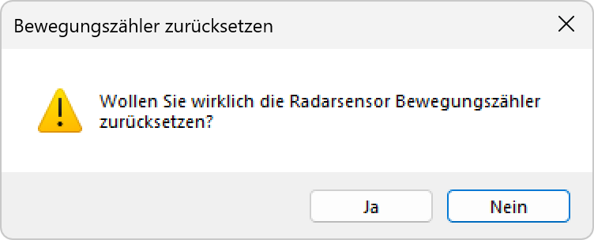

# Radar-Bewegungsmelder-Zurücksetzen

  
*Hier klicken um die Bewegungszähler des Radarsensors zurückzusetzen...*

  
*Wollen Sie wirklich die Radarsensor Bewegungszähler zurücksetzen?*

**Radar-Bewegungsmelder Zurücksetzen**

Reset der Bewegungszähler-Statistiken des integrierten Radarsensors für präzise Neuauswertung der Bewegungserkennungsdaten.

## Hauptbereiche

### 1. Bewegungszähler-Reset
- Vollständige Rücksetzung aller Bewegungsstatistiken
- Löschung der kumulierten Zählerdaten
- Neustart der Bewegungserfassung

### 2. Sicherheitsbestätigung
- Bestätigungsdialog für kritische Datenoperation
- Schutz vor versehentlicher Rücksetzung
- Klare Warnung vor Datenverlust

### 3. Statistik-Kategorien
- Unterschiedliche Bewegungstypen (Person, Fahrzeug, Fahrrad)
- Richtungsbasierte Erfassung (Annäherung/Entfernung)
- Geschwindigkeitsdifferenzierung

### 4. Datenwiederherstellung
- Unwiderrufliche Löschung der Zählerdaten
- Kein Backup-Mechanismus verfügbar
- Sofortige Aktivierung nach Bestätigung

## Zugriff auf Reset-Funktion

### Navigation zur Funktion
- **Gerätekonfiguration**: Auswahl eines spezifischen Geräts mit Radar-Funktion
- **Radar-Sektion**: Bereich "Radar Bewegungsmelder" in der Geräteübersicht
- **Reset-Button**: "Radar Bewegungszähler zurücksetzen" mit Zeitanzeige
- **Direkter Zugriff**: Ein-Klick-Aktivierung der Reset-Funktion

### Voraussetzungen
- **Gerätekommunikation**: Aktive Verbindung zum Radar-Sensor
- **Gerätekompatibilität**: Unterstützung der Radar-Bewegungsmelder-Funktion
- **Berechtigungen**: Ausreichende Zugriffsrechte für Konfigurationsänderungen
- **Betriebsstatus**: Funktionsfähiger Radar-Sensor

## Bewegungszähler-Statistiken

### Erfasste Bewegungstypen
- **Undefiniert**: Nicht klassifizierte Bewegungen
- **Person**: Fußgänger und Personenbewegungen
- **Fahrrad**: Radfahrer und Fahrradbewegungen
- **Motorrad**: Motorradverkehr
- **Auto**: Pkw-Verkehr
- **Bus/LKW**: Schwere Fahrzeuge

### Geschwindigkeitsdaten
- **Annäherungsgeschwindigkeit**: Durchschnittliche Geschwindigkeit bei Annäherung
- **Entfernungsgeschwindigkeit**: Durchschnittliche Geschwindigkeit bei Entfernung
- **Klassifizierung**: Automatische Objekterkennung
- **Richtungserkennung**: Bidirektionale Bewegungserfassung

### Kumulierte Statistiken
- **Gesamtannäherungen**: Summe aller erkannten Annäherungsbewegungen
- **Gesamtentfernungen**: Summe aller erkannten Entfernungsbewegungen
- **Kategorisierte Erfassung**: Automatische Zuordnung zu Bewegungstypen
- **Langzeit-Trending**: Kontinuierliche Datenakkumulation

## Reset-Bestätigung

### Sicherheitsdialog
- **Titel**: "Bewegungszähler zurücksetzen"
- **Warnsymbol**: Gelbes Ausrufezeichen für kritische Aktion
- **Bestätigungsfrage**: "Wollen Sie wirklich die Radarsensor Bewegungszähler zurücksetzen?"
- **Klare Kommunikation**: Eindeutige Beschreibung der Auswirkungen

### Entscheidungsoptionen
- **"Ja"-Button**: Bestätigung der Zähler-Rücksetzung
- **"Nein"-Button**: Abbruch der Reset-Operation (hervorgehoben)
- **Standard-Auswahl**: "Nein" als sicherere Standardoption
- **Finale Entscheidung**: Keine weitere Bestätigung nach "Ja"

### Auswirkungen der Bestätigung
- **Sofortiger Reset**: Unmittelbare Rücksetzung aller Zähler auf Null
- **Datenverlust**: Unwiderrufliche Löschung der historischen Daten
- **Neustart-Erfassung**: Beginn neuer Bewegungsstatistik-Erfassung
- **Systemkontinuität**: Fortlaufende Bewegungserkennung nach Reset

## Auswirkungen des Resets

### Sofortige Änderungen
- **Zähler-Nullstellung**: Alle Bewegungszähler werden auf 0 zurückgesetzt
- **Statistik-Löschung**: Vollständige Entfernung der kumulierten Daten
- **Erfassungs-Neustart**: Sofortige Wiederaufnahme der Bewegungserkennung
- **Trend-Unterbrechung**: Unterbrechung der Langzeit-Datenreihen

### Betroffene Datentypen
- **Objektzähler**: Alle kategorisierten Bewegungszähler
- **Richtungsdaten**: Annäherungs- und Entfernungsstatistiken
- **Geschwindigkeitsdaten**: Durchschnittswerte und Extremwerte
- **Zeitstempel**: Erfassungszeiten und Intervallstatistiken

### Nicht betroffene Bereiche
- **Sensor-Konfiguration**: Radar-Einstellungen bleiben unverändert
- **Erkennungsparameter**: Klassifizierungsalgorithmen bleiben aktiv
- **Systemkonfiguration**: Grundlegende Geräteeinstellungen unverändert
- **Betriebsmodus**: Normale Bewegungserkennung läuft weiter

## Anwendungsszenarien

### Wartungssituationen
- **Periodische Wartung**: Regelmäßige Rücksetzung für klare Datenintervalle
- **Kalibrierung**: Reset nach Sensor-Kalibrierung oder -Justierung
- **Umgebungsänderungen**: Neustart nach Standortmodifikationen
- **Systemupdate**: Bereinigung nach Firmware-Updates

### Datenanalyse
- **Periode-Trennung**: Klare Abgrenzung verschiedener Erfassungsperioden
- **Saisonale Analysen**: Neustart für spezifische Zeiträume
- **Ereignis-basierte Messung**: Reset vor besonderen Ereignissen
- **Vergleichsstudien**: Standardisierte Ausgangsbasis für Messungen

### Troubleshooting
- **Anomalie-Korrektur**: Bereinigung bei verdächtigen Zählerwerten
- **Sensor-Test**: Validierung der Bewegungserkennungsgenauigkeit
- **Konfigurationstest**: Überprüfung neuer Erkennungsparameter
- **Performance-Bewertung**: Neustart für Leistungsanalysen

### Compliance und Reporting
- **Berichtszeiträume**: Definierte Startpunkte für Compliance-Berichte
- **Audit-Vorbereitung**: Saubere Datengrundlage für Überprüfungen
- **Dokumentation**: Klare Referenzpunkte für Datenauswertungen
- **Standardisierung**: Einheitliche Erfassungsintervalle

## Risiken und Vorsichtsmaßnahmen

### Datenverlust-Risiken
- **Unwiderruflichkeit**: Keine Wiederherstellung gelöschter Statistiken
- **Historische Daten**: Verlust wertvoller Langzeit-Trendanalysen
- **Compliance-Relevanz**: Mögliche Probleme bei Audit-Anforderungen
- **Vergleichsgrundlage**: Verlust der Referenzdaten für Analysen

### Präventive Maßnahmen
- **Daten-Export**: Sicherung der Statistiken vor Reset
- **Dokumentation**: Aufzeichnung der Reset-Zeitpunkte und -Gründe
- **Geplante Resets**: Strukturierte Durchführung zu definierten Zeitpunkten
- **Backup-Strategie**: Alternative Datenquellen für kritische Analysen

### Best Practices
- **Zeitplanung**: Reset außerhalb kritischer Erfassungszeiten
- **Team-Kommunikation**: Information aller Beteiligten über Reset
- **Dokumentation**: Protokollierung der Reset-Aktivitäten
- **Validierung**: Überprüfung der korrekten Funktion nach Reset

## Technische Aspekte

### Sensor-Technologie
- **Radar-Prinzip**: Hochfrequenz-Bewegungserfassung mit Doppler-Effekt
- **Klassifizierungsalgorithmus**: Automatische Objekterkennung basierend auf Signaturanalyse
- **Richtungserkennung**: Bidirektionale Erfassung durch Frequenzanalyse
- **Geschwindigkeitsmessung**: Präzise Doppler-basierte Geschwindigkeitsbestimmung

### Datenverarbeitung
- **Echtzeit-Klassifizierung**: Sofortige Zuordnung zu Bewegungstypen
- **Kumulative Zählung**: Kontinuierliche Akkumulation der Erfassungsdaten
- **Statistik-Berechnung**: Automatische Durchschnittswerte und Trends
- **Speicher-Management**: Effiziente Verwaltung der Zählerdaten

### Reset-Mechanismus
- **Atomare Operation**: Unteilbare Rücksetzung aller Zähler
- **Konsistenz-Sicherung**: Gewährleistung der Datenintegrität
- **Sofortige Aktivierung**: Unmittelbare Wirksamkeit nach Bestätigung
- **Kontinuierliche Erfassung**: Nahtlose Fortsetzung der Bewegungserkennung

## Vorteile der Reset-Funktion

### Datenqualität
- **Saubere Startbasis**: Eliminierung von Altdaten für neue Analysen
- **Periodische Bereinigung**: Regelmäßige Datenqualitätssicherung
- **Konsistente Intervalle**: Standardisierte Erfassungsperioden
- **Anomalie-Korrektur**: Bereinigung bei Sensor-Fehlern

### Wartungsunterstützung
- **Einfache Bedienung**: Intuitive Ein-Klick-Rücksetzung
- **Sofortige Wirkung**: Unmittelbare Aktivierung ohne Systemneustart
- **Sicherheitsmechanismus**: Schutz vor versehentlicher Aktivierung
- **Flexible Zeitplanung**: Durchführung nach Wartungsbedarf

### Systemeffizienz
- **Speicher-Optimierung**: Reduzierung der Datenmenge für bessere Performance
- **Analyse-Vereinfachung**: Klare Datenstrukturen für Auswertungen
- **Monitoring-Support**: Unterstützung für systematische Überwachung
- **Troubleshooting**: Hilfsmittel für Diagnose und Problemlösung

> ## ⚠️ Wichtiger Hinweis zur Zähler-Rücksetzung
>
> **Datenverlust ist unwiderruflich**
>
> Das Zurücksetzen der Radar-Bewegungszähler löscht alle kumulierten Statistiken permanent. Historische Daten können nicht wiederhergestellt werden. Stellen Sie sicher, dass Sie die Auswirkungen verstehen und gegebenenfalls Daten vor dem Reset exportieren.
>
> ### Reset-Empfehlungen:
> - **Daten-Backup**: Exportieren Sie wichtige Statistiken vor dem Reset
> - **Zeitplanung**: Führen Sie Reset außerhalb kritischer Erfassungszeiten durch
> - **Dokumentation**: Protokollieren Sie Reset-Zeitpunkte und -Gründe
> - **Team-Information**: Informieren Sie alle Beteiligten über den Reset
> - **Funktionsvalidierung**: Überprüfen Sie die korrekte Funktion nach dem Reset

*Die Radar-Bewegungsmelder-Reset-Funktion ermöglicht eine präzise Kontrolle über die Bewegungsstatistiken und bietet eine saubere Grundlage für neue Datenerfassungsperioden bei gleichzeitiger Bewahrung der Systemfunktionalität.*
