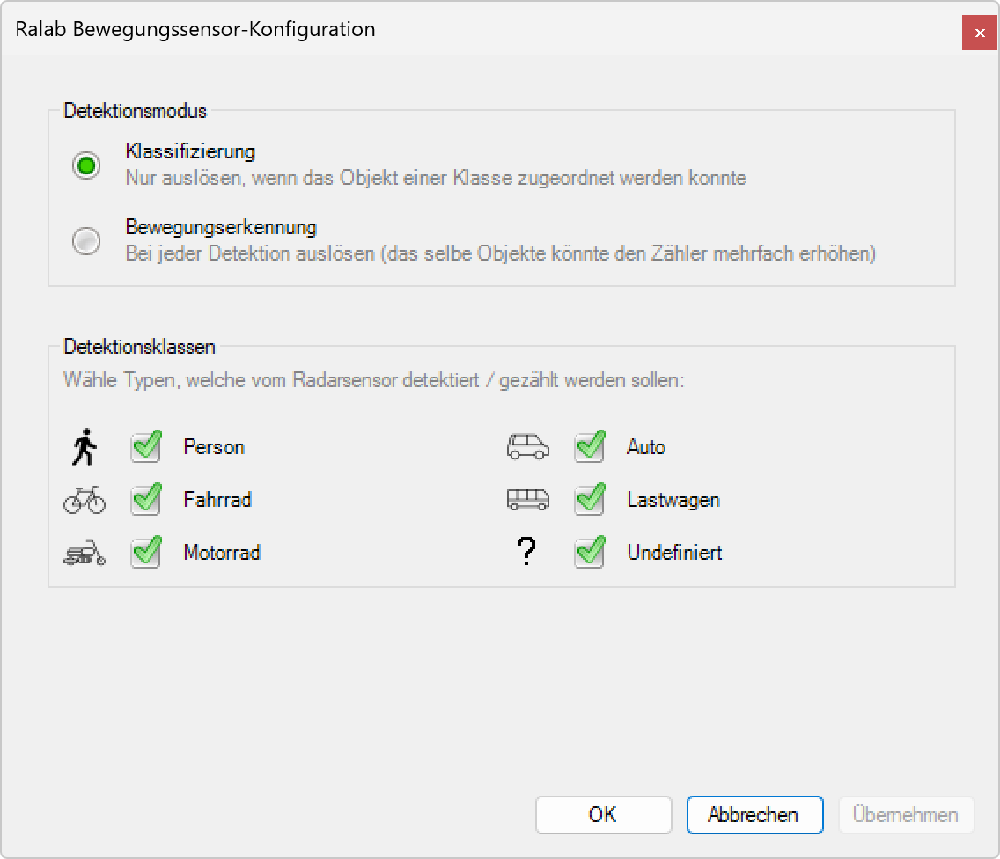

# Radar bewegungssensor Konfigurieren

  
*Hier klicken um die Radarsensor-Konfiguration anzupassen...*

**Radar-Bewegungssensor Konfiguration**

Konfiguration der Erkennungsparameter und Detektionsklassen des integrierten Radarsensors für optimierte Bewegungserfassung.

## Hauptbereiche

### 1. Detektionsmodus
- Auswahl zwischen Klassifizierung und Bewegungserkennung
- Optimierung für spezifische Anwendungsszenarien
- Einfluss auf Sensorverhalten und Zählerlogik

### 2. Detektionsklassen
- Selektive Aktivierung verschiedener Objekttypen
- Flexible Anpassung an Umgebungsanforderungen
- Checkbox-basierte Konfiguration

### 3. Objektklassifizierung
- Automatische Erkennung von Personen, Fahrzeugen und Fahrrädern
- Intelligente Unterscheidung verschiedener Bewegungstypen
- Präzise Kategorisierung für statistische Auswertung

### 4. Konfigurationspersistenz
- Speicherung der Einstellungen im Gerät
- Sofortige Aktivierung nach Bestätigung
- Validierung der Konfigurationsparameter

## Detektionsmodus-Auswahl

### Klassifizierung (Empfohlen)
- **Radiobutton**: Grüner Punkt für aktive Auswahl
- **Beschreibung**: "Nur auslösen, wenn das Objekt einer Klasse zugeordnet werden konnte"
- **Funktionalität**: Präzise Erkennung nur bei erfolgreicher Objektklassifizierung
- **Vorteil**: Reduzierte Falschauslösungen durch intelligente Filterung

### Bewegungserkennung
- **Radiobutton**: Deaktiviert (grauer Punkt)
- **Beschreibung**: "Bei jeder Detektion auslösen (das selbe Objekte könnte den Zähler mehrfach erhöhen)"
- **Funktionalität**: Auslösung bei jeder erkannten Bewegung
- **Nachteile**: Mögliche Mehrfachzählung desselben Objekts

### Modus-Auswirkungen
- **Klassifizierung**: Höhere Präzision, weniger Fehlalarme
- **Bewegungserkennung**: Höhere Sensitivität, potentiell mehr Fehlauslösungen
- **Empfehlung**: Klassifizierung für die meisten Anwendungen
- **Spezialfälle**: Bewegungserkennung für maximale Sensitivität

## Detektionsklassen-Konfiguration

### Verfügbare Objekttypen
- **Person**: Fußgänger und Personenbewegungen
- **Fahrrad**: Radfahrer und Fahrradbewegungen
- **Motorrad**: Motorradverkehr und ähnliche Fahrzeuge
- **Auto**: Pkw-Verkehr und vergleichbare Fahrzeuge
- **Lastwagen**: Schwere Fahrzeuge (LKW, Bus)
- **Undefiniert**: Nicht klassifizierbare Objekte

### Auswahl-Mechanismus
- **Checkboxen**: Grüne Häkchen für aktivierte Klassen
- **Standardkonfiguration**: Alle Klassen aktiviert
- **Flexible Anpassung**: Individuelle Deaktivierung unerwünschter Klassen
- **Sofortige Anwendung**: Direkte Auswirkung auf Erkennungsverhalten

### Objektsymbole
- **Person**: Piktogramm eines Fußgängers
- **Fahrrad**: Fahrrad-Symbol
- **Motorrad**: Motorrad-Piktogramm
- **Auto**: Pkw-Symbol
- **Lastwagen**: Lkw-Piktogramm
- **Undefiniert**: Fragezeichen für unklare Objekte

## Klassifizierungslogik

### Erkennungsalgorithmus
- **Radar-Signatur**: Analyse der Doppler-Frequenz und Signalstärke
- **Objektgröße**: Bestimmung basierend auf Reflexionscharakteristika
- **Geschwindigkeit**: Bewegungsgeschwindigkeit als Klassifizierungskriterium
- **Bewegungsmuster**: Charakteristische Bewegungsprofile verschiedener Objekte

### Klassifizierungskriterien
- **Person**: Niedrige Geschwindigkeit, geringe Reflexionsfläche
- **Fahrrad**: Mittlere Geschwindigkeit, charakteristische Bewegung
- **Motorrad**: Höhere Geschwindigkeit, mittlere Reflexionsfläche
- **Auto**: Hohe Geschwindigkeit, große Reflexionsfläche
- **Lastwagen**: Variable Geschwindigkeit, sehr große Reflexionsfläche

### Unklare Klassifizierung
- **Undefiniert-Kategorie**: Für nicht eindeutig zuordenbare Objekte
- **Grenzfälle**: Objekte zwischen Klassifizierungsschwellen
- **Umgebungseinflüsse**: Witterung, Interferenzen, Mehrfachreflexionen
- **Kontinuierliche Verbesserung**: Lernende Algorithmen für bessere Erkennung

## Konfigurationsanwendung

### Änderungen speichern
- **OK-Button**: Bestätigung und Speicherung der Konfiguration
- **Abbrechen-Button**: Verwerfung der Änderungen
- **Übernehmen-Button**: Anwendung ohne Dialog-Schließung
- **Validierung**: Überprüfung der Konfigurationskonsistenz

### Sofortige Aktivierung
- **Live-Anwendung**: Unmittelbare Wirksamkeit nach Bestätigung
- **Sensor-Update**: Übertragung der neuen Parameter an Hardware
- **Funktionstest**: Automatische Validierung der neuen Einstellungen
- **Rückmeldung**: Bestätigung der erfolgreichen Konfiguration

### Konfigurationspersistenz
- **Gerätespeicher**: Dauerhafte Speicherung in der Hardware
- **Neustart-Sicherheit**: Beibehaltung der Einstellungen nach Systemneustart
- **Backup-Mechanismus**: Automatische Sicherung der Konfiguration
- **Wiederherstellung**: Möglichkeit zur Rückkehr zu vorherigen Einstellungen

## Anwendungsszenarien

### Verkehrsüberwachung
- **Vollständige Erfassung**: Alle Verkehrsteilnehmer aktiviert
- **Differenzierte Analyse**: Separate Zählung verschiedener Fahrzeugtypen
- **Geschwindigkeitsmessung**: Präzise Erfassung für Verkehrsanalysen
- **Compliance**: Erfüllung verkehrsrechtlicher Anforderungen

### Personenerfassung
- **Nur Personen**: Deaktivierung aller Fahrzeugklassen
- **Fußgängerbereich**: Optimierung für Gehwege und Plätze
- **Sicherheitsanwendungen**: Erkennung unberechtigter Personen
- **Komfortfunktionen**: Beleuchtungssteuerung für Fußgänger

### Spezifische Filterung
- **Fahrradwege**: Aktivierung nur für Fahrräder und Personen
- **Industriebereiche**: Fokus auf Fahrzeuge, Ausschluss von Personen
- **Mischverkehr**: Flexible Anpassung an komplexe Verkehrssituationen
- **Sicherheitszonen**: Selektive Überwachung kritischer Bereiche

### Troubleshooting
- **Diagnose-Modus**: Aktivierung aller Klassen für Problemanalyse
- **Sensitivitäts-Test**: Wechsel zwischen Klassifizierung und Bewegungserkennung
- **Kalibrierung**: Optimierung für spezifische Umgebungsbedingungen
- **Performance-Analyse**: Bewertung der Erkennungsgenauigkeit

## Optimierungsstrategien

### Falscherkennungen reduzieren
- **Klassifizierung bevorzugen**: Reduzierung von Fehlauslösungen
- **Selektive Aktivierung**: Nur relevante Objektklassen aktivieren
- **Umgebungsanpassung**: Konfiguration entsprechend der Örtlichkeit
- **Regelmäßige Validierung**: Überprüfung der Erkennungsqualität

### Erkennungsrate maximieren
- **Bewegungserkennung**: Höhere Sensitivität für kritische Anwendungen
- **Alle Klassen aktiviert**: Vollständige Erfassung aller Objekte
- **Niedrige Schwellenwerte**: Empfindlichere Erkennung
- **Kontinuierliche Überwachung**: Lückenlose Erfassung

### Energieeffizienz
- **Bedarfsgerechte Konfiguration**: Nur notwendige Klassen aktivieren
- **Intelligente Filterung**: Reduzierung der Verarbeitungslast
- **Optimierte Algorithmen**: Effiziente Klassifizierungsverfahren
- **Adaptive Einstellungen**: Anpassung an Verkehrsaufkommen

## Technische Aspekte

### Radar-Technologie
- **Doppler-Effekt**: Geschwindigkeitsmessung durch Frequenzverschiebung
- **Signalanalyse**: Auswertung der Radarreflexionen
- **Interferenz-Resistenz**: Robustheit gegen externe Störungen
- **Weitbereichserfassung**: Präzise Erkennung in verschiedenen Entfernungen

### Klassifizierungsalgorithmus
- **Machine Learning**: Adaptive Erkennungsverfahren
- **Signaturanalyse**: Charakteristische Muster verschiedener Objekte
- **Echtzeit-Verarbeitung**: Sofortige Klassifizierung nach Erkennung
- **Kontinuierliche Verbesserung**: Lernende Systeme für höhere Präzision

### Konfigurationsarchitektur
- **Modularer Aufbau**: Flexible Anpassung einzelner Parameter
- **Validierungsmechanismen**: Sicherstellung konsistenter Einstellungen
- **Rollback-Funktionen**: Wiederherstellung bei Konfigurationsproblemen
- **Audit-Trail**: Protokollierung aller Konfigurationsänderungen

## Vorteile der Sensor-Konfiguration

### Präzision
- **Objektspezifische Erkennung**: Genaue Unterscheidung verschiedener Typen
- **Reduzierte Fehlalarme**: Intelligente Filterung unerwünschter Auslösungen
- **Adaptive Algorithmen**: Kontinuierliche Verbesserung der Erkennungsqualität
- **Umgebungsanpassung**: Optimierung für spezifische Einsatzbedingungen

### Flexibilität
- **Anpassbare Konfiguration**: Individuelle Einstellung für verschiedene Szenarien
- **Selektive Aktivierung**: Fokus auf relevante Objektklassen
- **Einfache Anpassung**: Intuitive Checkbox-basierte Konfiguration
- **Sofortige Anwendung**: Direkte Wirksamkeit ohne Systemneustart

### Effizienz
- **Optimierte Verarbeitung**: Reduzierte Systemlast durch selektive Erkennung
- **Energieeinsparung**: Bedarfsgerechte Sensoraktivierung
- **Verbesserte Performance**: Fokussierte Analyse relevanter Objekte
- **Ressourcenschonung**: Effiziente Nutzung der Rechenkapazität

> ## ℹ️ Radar-Bewegungssensor Konfiguration
>
> **Intelligente Objekterkennung mit selektiver Klassifizierung**
>
> Die Konfiguration ermöglicht die präzise Anpassung der Erkennungsparameter für verschiedene Objekttypen. Wählen Sie zwischen Klassifizierung (empfohlen) und Bewegungserkennung, und aktivieren Sie nur die relevanten Detektionsklassen für optimale Ergebnisse.
>
> ### Konfigurationsbereiche:
> - **Detektionsmodus**: Klassifizierung vs. Bewegungserkennung
> - **Objektklassen**: Person, Fahrrad, Motorrad, Auto, Lastwagen, Undefiniert
> - **Selektive Aktivierung**: Checkbox-basierte Konfiguration
> - **Sofortige Anwendung**: Direkte Wirksamkeit nach Bestätigung

*Die Radar-Bewegungssensor-Konfiguration ermöglicht eine präzise, flexible und effiziente Anpassung der Erkennungsparameter für optimale Bewegungserfassung in verschiedenen Anwendungsszenarien.*
