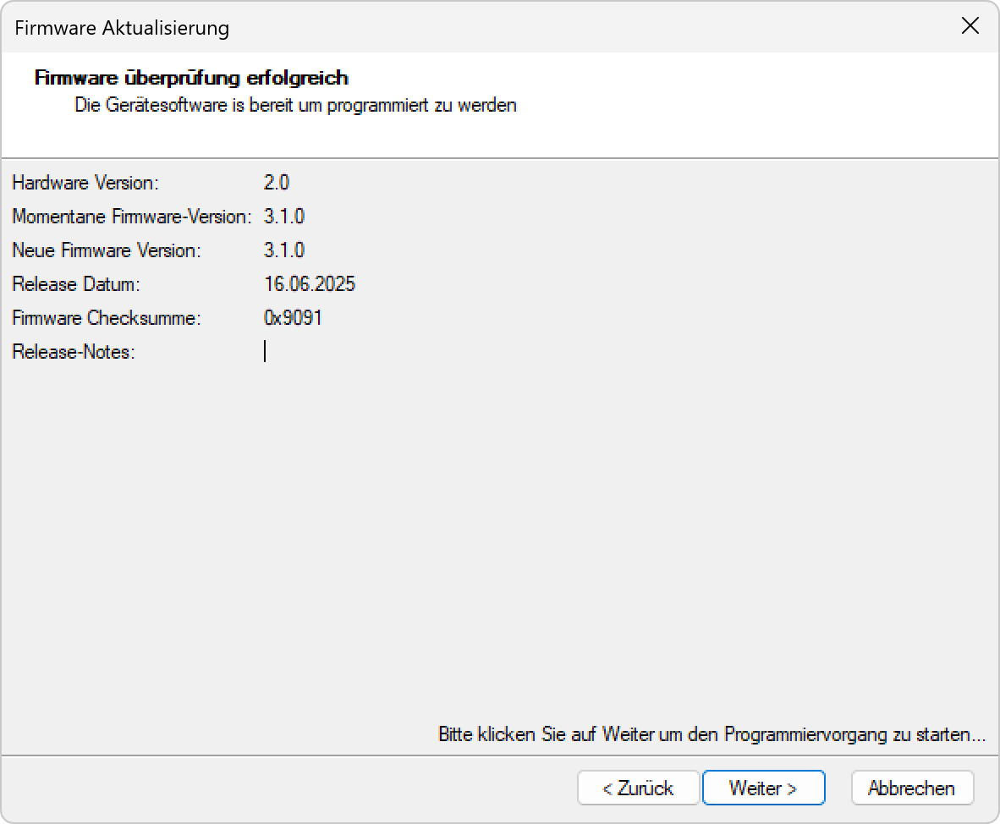

# Radarsensor-Firmware-Aktualisieren

  
*Hier klicken um die Radarsensor-Firmware zu aktualisieren...*

**Radarsensor-Firmware Aktualisierung**

Systematische Aktualisierung der Radarsensor-Firmware für verbesserte Funktionalität, Fehlerbehebungen und neue Features.

## Hauptbereiche

### 1. Firmware-Überprüfung
- Vergleich der aktuellen und verfügbaren Firmware-Versionen
- Automatische Erkennung von Updates
- Validierung der Kompatibilität

### 2. Update-Informationen
- Detaillierte Anzeige der Hardware- und Firmware-Versionen
- Release-Datum und Checksumme
- Release-Notes für Änderungsdokumentation

### 3. Aktualisierungsprozess
- Sichere Firmware-Übertragung
- Fortschrittsüberwachung
- Validierung der erfolgreichen Installation

### 4. Systemvalidierung
- Überprüfung der Funktionalität nach Update
- Wiederherstellung bei Fehlern
- Backup-Mechanismen

## Firmware-Überprüfung

### Erfolgreiche Überprüfung
- **Status**: "Firmware überprüfung erfolgreich"
- **Bereitschaft**: "Die Gerätesoftware ist bereit um programmiert zu werden"
- **Automatische Erkennung**: System erkennt verfügbare Updates
- **Kompatibilitätsprüfung**: Validierung der Hardware-Firmware-Kompatibilität

### Versionsinformationen
- **Hardware Version**: Aktuelle Hardware-Revision
- **Momentane Firmware-Version**: Derzeit installierte Firmware
- **Neue Firmware Version**: Verfügbare Update-Version
- **Release Datum**: Veröffentlichungsdatum der neuen Firmware

### Integritätsprüfung
- **Firmware Checksumme**: Kryptographische Validierung der Firmware-Integrität
- **Authentizität**: Überprüfung der Firmware-Herkunft
- **Korruptions-Schutz**: Erkennung beschädigter Firmware-Dateien
- **Sicherheitsvalidierung**: Verifikation der digitalen Signatur

## Update-Informationen

### Versionsdetails
- **Hardware Version**: Kompatible Hardware-Revision
- **Momentane Firmware-Version**: Aktuelle Firmware-Version
- **Neue Firmware Version**: Ziel-Firmware-Version
- **Versions-Upgrade**: Systematische Versionsnummer-Erhöhung

### Release-Informationen
- **Release Datum**: Veröffentlichungsdatum der neuen Firmware
- **Firmware Checksumme**: Integritätsprüfung der Update-Datei
- **Release-Notes**: Detaillierte Änderungsdokumentation
- **Kompatibilitätsinformationen**: Hardware-Anforderungen und -Beschränkungen

### Changelog-Dokumentation
- **Neue Features**: Hinzugefügte Funktionalitäten
- **Fehlerbehebungen**: Gelöste Probleme und Bugs
- **Verbesserungen**: Performance-Optimierungen
- **Sicherheitsupdates**: Behebung von Sicherheitslücken

## Aktualisierungsprozess

### Prozess-Initiierung
- **Weiter-Button**: "Weiter >" zum Start der Aktualisierung
- **Anweisung**: "Bitte klicken Sie auf Weiter um den Programmiervorgang zu starten..."
- **Sicherheitsbestätigung**: Bestätigung vor kritischer Operation
- **Vorbereitung**: Systemvorbereitung für Firmware-Update

### Firmware-Übertragung
- **Sichere Übertragung**: Verschlüsselte Datenübertragung
- **Fortschrittsanzeige**: Echtzeit-Übertragungsstatus
- **Fehlerbehandlung**: Automatische Wiederholung bei Übertragungsfehlern
- **Integritätsprüfung**: Kontinuierliche Validierung während Übertragung

### Programmiervorgang
- **Flash-Programmierung**: Schreibvorgang in den Gerätespeicher
- **Backup-Erstellung**: Sicherung der aktuellen Firmware
- **Atomare Operation**: Unteilbare Aktualisierung für Konsistenz
- **Rollback-Fähigkeit**: Wiederherstellung bei Fehlern

### Validierung
- **Erfolgs-Verifikation**: Bestätigung der korrekten Installation
- **Funktionstest**: Überprüfung der Grundfunktionalität
- **Kompatibilitäts-Check**: Validierung der System-Integration
- **Performance-Test**: Überprüfung der Systemleistung

## Sicherheitsaspekte

### Backup-Strategien
- **Automatisches Backup**: Sicherung der aktuellen Firmware vor Update
- **Recovery-Partition**: Separate Wiederherstellungspartition
- **Rollback-Mechanismus**: Automatische Wiederherstellung bei Fehlern
- **Dual-Boot-System**: Parallele Firmware-Versionen für Ausfallsicherheit

### Risikominimierung
- **Unterbrechungsschutz**: Schutz vor Stromausfall während Update
- **Fehlerbehandlung**: Robuste Behandlung von Aktualisierungsfehlern
- **Konsistenz-Prüfung**: Sicherstellung der Datenintegrität
- **Sichere Übertragung**: Verschlüsselte Kommunikation

### Wiederherstellungsoptionen
- **Automatische Recovery**: Selbstständige Wiederherstellung bei Problemen
- **Manuelle Wiederherstellung**: Benutzergeführte Recovery-Prozesse
- **Factory Reset**: Rücksetzung auf Werkszustand
- **Notfall-Firmware**: Minimal-Firmware für Wiederherstellung

## Anwendungsszenarien

### Regelmäßige Wartung
- **Geplante Updates**: Systematische Aktualisierung nach Wartungsplan
- **Sicherheitsupdates**: Dringende Aktualisierung bei Sicherheitslücken
- **Feature-Updates**: Installation neuer Funktionalitäten
- **Bug-Fixes**: Behebung bekannter Probleme

### Troubleshooting
- **Problemlösung**: Firmware-Update zur Behebung von Problemen
- **Performance-Verbesserung**: Optimierung der Systemleistung
- **Kompatibilitäts-Updates**: Anpassung an neue Hardware oder Software
- **Stabilisierung**: Verbesserung der Systemstabilität

### Systemerweiterung
- **Neue Features**: Aktivierung zusätzlicher Funktionalitäten
- **Protocol-Updates**: Unterstützung neuer Kommunikationsprotokolle
- **Algorithm-Verbesserungen**: Optimierte Erkennungsalgorithmen
- **Integration-Updates**: Bessere Systemintegration

### Compliance
- **Regulatorische Anforderungen**: Erfüllung gesetzlicher Vorschriften
- **Zertifizierungen**: Aufrechterhaltung von Produktzertifizierungen
- **Sicherheitsstandards**: Einhaltung von Sicherheitsrichtlinien
- **Audit-Vorbereitung**: Vorbereitung auf Compliance-Prüfungen

## Technische Aspekte

### Firmware-Architektur
- **Modularer Aufbau**: Getrennte Funktionsmodule für einzelne Updates
- **Bootloader**: Sicheres Ladeprogramm für Firmware-Updates
- **Kernel**: Grundlegende Systemfunktionalität
- **Anwendungsschicht**: Spezifische Radar-Funktionalitäten

### Update-Mechanismen
- **Over-the-Air**: Drahtlose Firmware-Updates
- **Staged Updates**: Schrittweise Aktualisierung verschiedener Komponenten
- **Delta Updates**: Nur Änderungen werden übertragen
- **Vollständige Updates**: Komplette Firmware-Neuinstallation

### Validierungsprozesse
- **Checksumme-Verifikation**: Kryptographische Integritätsprüfung
- **Digitale Signatur**: Authentizitätsnachweis der Firmware
- **Kompatibilitäts-Matrix**: Überprüfung der Hardware-Software-Kompatibilität
- **Regressionstests**: Automatische Funktionstests nach Update

## Best Practices

### Vor dem Update
- **Backup erstellen**: Sicherung der aktuellen Konfiguration
- **Systemstabilität prüfen**: Überprüfung der Hardware-Integrität
- **Zeitplanung**: Update außerhalb kritischer Betriebszeiten
- **Dokumentation**: Aufzeichnung der aktuellen Systemkonfiguration

### Während des Updates
- **Unterbrechung vermeiden**: Stabile Stromversorgung sicherstellen
- **Überwachung**: Kontinuierliche Beobachtung des Update-Prozesses
- **Keine Eingriffe**: Vermeidung von Systemänderungen während Update
- **Bereitschaft**: Vorbereitung auf mögliche Problembehandlung

### Nach dem Update
- **Funktionstest**: Überprüfung aller Grundfunktionen
- **Konfiguration validieren**: Überprüfung der Einstellungen
- **Performance-Check**: Bewertung der Systemleistung
- **Dokumentation**: Aktualisierung der Systemdokumentation

## Troubleshooting

### Häufige Probleme
- **Update-Fehler**: Fehlgeschlagene Firmware-Aktualisierung
- **Kompatibilitätsprobleme**: Inkompatible Hardware-Software-Kombination
- **Übertragungsfehler**: Probleme bei der Firmware-Übertragung
- **Validierungsfehler**: Fehlgeschlagene Integritätsprüfung

### Lösungsansätze
- **Retry-Mechanismus**: Wiederholung der Aktualisierung
- **Recovery-Modus**: Wiederherstellung über Notfall-Firmware
- **Rollback**: Rückkehr zur vorherigen Firmware-Version
- **Factory Reset**: Vollständige Rücksetzung auf Werkszustand

### Präventive Maßnahmen
- **Regelmäßige Wartung**: Systematische Überprüfung der Firmware
- **Staging-Tests**: Test der Updates in Testumgebung
- **Monitoring**: Kontinuierliche Überwachung der System-Performance
- **Backup-Strategie**: Regelmäßige Sicherung der Firmware-Konfiguration

## Vorteile der Firmware-Aktualisierung

### Funktionalität
- **Neue Features**: Zusätzliche Funktionalitäten und Verbesserungen
- **Bug-Fixes**: Behebung bekannter Probleme und Fehler
- **Performance**: Optimierte Systemleistung und Effizienz
- **Stabilität**: Verbesserte Systemstabilität und Zuverlässigkeit

### Sicherheit
- **Sicherheitsupdates**: Behebung von Sicherheitslücken
- **Schutz vor Angriffen**: Widerstandsfähigkeit gegen Cyberattacken
- **Datenintegrität**: Schutz der Systemdaten und Konfigurationen
- **Compliance**: Erfüllung von Sicherheitsanforderungen

### Zukunftssicherheit
- **Kompatibilität**: Unterstützung neuer Standards und Protokolle
- **Erweiterbarkeit**: Vorbereitung für zukünftige Funktionalitäten
- **Langzeitsupport**: Erhaltung der Systemfunktionalität über längere Zeit
- **Innovation**: Zugang zu neuesten Technologien und Algorithmen

> ## ⚠️ Wichtiger Hinweis zur Firmware-Aktualisierung
>
> **Kritische Systemoperation erfordert Vorsicht**
>
> Die Firmware-Aktualisierung ist ein kritischer Prozess, der bei unsachgemäßer Durchführung zu Systemausfällen führen kann. Stellen Sie sicher, dass Sie die Auswirkungen verstehen und alle Vorbereitungsschritte befolgen.
>
> ### Update-Empfehlungen:
> - **Backup erstellen**: Sichern Sie die aktuelle Firmware vor Update
> - **Stromversorgung**: Stabile Energieversorgung während des Updates
> - **Zeitplanung**: Update außerhalb kritischer Betriebszeiten
> - **Dokumentation**: Aufzeichnung der Firmware-Versionen und -Änderungen
> - **Funktionstest**: Überprüfung aller Funktionen nach Update
> - **Recovery-Plan**: Vorbereitung für mögliche Wiederherstellungsmaßnahmen

*Die Radarsensor-Firmware-Aktualisierung ermöglicht eine sichere, systematische und benutzerfreundliche Aktualisierung der Gerätesoftware für optimale Funktionalität, Sicherheit und Zukunftssicherheit.*