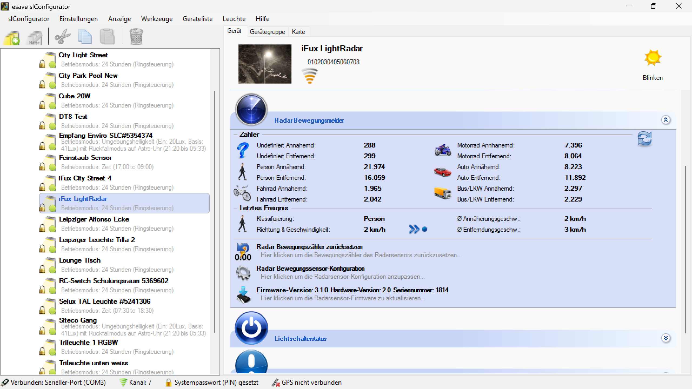

# Radar-Bewegungsmelder

**Radar-Bewegungsmelder**

Konfigurieren Sie hochpräzise Radar-Bewegungsmelder für eine zuverlässige und intelligente Bewegungserkennung. Diese fortschrittliche Technologie ermöglicht eine präzise Detektion von Bewegungen auch durch Hindernisse hindurch und bietet überlegene Leistung gegenüber herkömmlichen PIR-Sensoren.

## Hauptbereiche

### 1. Radar-Konfiguration

- Detaillierte Einstellungen für Radar-Parameter und Erkennungsverhalten
- Anpassung der Erfassungsreichweite und Empfindlichkeit
- Konfiguration von Detektionszonen und Ausschlussbereichen

### 2. Erweiterte Erkennungsoptionen

- Intelligente Bewegungsanalyse und Mustererkennung
- Unterscheidung zwischen verschiedenen Objekttypen
- Adaptive Kalibrierung für optimale Leistung

## Radar-Technologie-Grundlagen

### Funktionsprinzip

- **Hochfrequenz-Radar**: Verwendung von Mikrowellen für präzise Bewegungserkennung
- **Doppler-Effekt**: Erkennung von Geschwindigkeitsänderungen bewegter Objekte
- **Durchdringungsfähigkeit**: Erkennung durch Glas, dünne Wände und andere Materialien
- **Wetterunabhängigkeit**: Zuverlässige Funktion bei allen Witterungsbedingungen

### Technische Spezifikationen

- **Frequenzbereich**: 24 GHz ISM-Band für störungsfreien Betrieb
- **Erfassungsreichweite**: Einstellbar von 0,5m bis 20m
- **Erfassungswinkel**: Horizontal 90°, vertikal 60°
- **Auflösung**: Bewegungserkennung ab 0,1 m/s
- **Reaktionszeit**: < 100ms für sofortige Reaktion

## Konfigurationsoptionen

### Grundeinstellungen

- **Erfassungsreichweite**: Einstellung der maximalen Detektionsdistanz
- **Empfindlichkeit**: Anpassung der Erkennungsempfindlichkeit
- **Geschwindigkeitsfilter**: Filterung nach Bewegungsgeschwindigkeit
- **Richtungsfilter**: Erkennung nur in bestimmten Bewegungsrichtungen

### Erweiterte Parameter

- **Zonenkonfiguration**: Definition mehrerer Erfassungszonen
- **Ausschlussbereiche**: Bereiche, die von der Erkennung ausgenommen werden
- **Objektgrößenfilter**: Filterung nach Objektgröße zur Störungsreduzierung
- **Zeitfenster**: Zeitbasierte Aktivierung und Deaktivierung

### Intelligente Funktionen

- **Adaptive Kalibrierung**: Selbstständige Anpassung an Umgebungsbedingungen
- **Lernmodus**: Erlernen typischer Bewegungsmuster
- **Störungsunterdrückung**: Automatische Filterung von Störsignalen
- **Multitarget-Erkennung**: Gleichzeitige Erkennung mehrerer Objekte

## Erkennungs-Modi

### Standard-Bewegungserkennung

- **Einfache Erkennung**: Grundlegende Bewegungsdetektion
- **Anwesenheitserkennung**: Kontinuierliche Überwachung der Präsenz
- **Verlassen-Erkennung**: Detektion, wenn Bereiche verlassen werden
- **Richtungsbestimmung**: Erkennung der Bewegungsrichtung

### Erweiterte Erkennungsmodi

- **Präzisionserkennung**: Hochauflösende Bewegungsanalyse
- **Geschwindigkeitsanalyse**: Messung und Bewertung der Bewegungsgeschwindigkeit
- **Bahnerkennung**: Verfolgung von Bewegungspfaden
- **Verhaltensanalyse**: Erkennung spezifischer Bewegungsmuster

### Spezialfunktionen

- **Sturzerkennung**: Erkennung von Stürzen für Sicherheitsanwendungen
- **Vitaldatenerfassung**: Messung von Atmung und Herzschlag (bei entsprechender Hardware)
- **Gestensteuerung**: Erkennung von Handbewegungen für Steuerung
- **Zonenwechsel**: Verfolgung von Objekten zwischen verschiedenen Zonen

## Anwendungsszenarien

### Büro- und Arbeitsplätze

- **Arbeitsplatzbeleuchtung**: Präzise Erkennung für individuelle Arbeitsplätze
- **Besprechungsräume**: Zuverlässige Anwesenheitserkennung auch bei geringer Bewegung
- **Großraumbüros**: Zonenbasierte Erkennung für verschiedene Arbeitsbereiche
- **Ruhezonen**: Erkennung auch bei minimalen Bewegungen

### Industrielle Anwendungen

- **Produktionshallen**: Robuste Erkennung in staubigen und rauen Umgebungen
- **Lagerbereiche**: Durchdringung von Regalen und Hindernissen
- **Sicherheitszonen**: Zuverlässige Überwachung kritischer Bereiche
- **Maschinenbereiche**: Präzise Erkennung trotz Vibrationen und Störungen

### Gesundheitswesen

- **Patientenzimmer**: Diskrete Überwachung ohne Sichtverbindung
- **Operationssäle**: Sterile Umgebung ohne mechanische Kontakte
- **Intensivstationen**: Kontinuierliche Überwachung kritischer Patienten
- **Therapiebereiche**: Bewegungsanalyse für Rehabilitationszwecke

### Einzelhandel und Gastgewerbe

- **Verkaufsflächen**: Kundenfrequenz-Analyse und Beleuchtungssteuerung
- **Eingangsbereiche**: Zuverlässige Erkennung auch bei Glaswänden
- **Lagerbereiche**: Erkennung durch Regale und Verpackungen
- **Restaurants**: Diskrete Überwachung von Tischbereichen

### Sicherheitsanwendungen

- **Perimeterschutz**: Großflächige Überwachung von Außenbereichen
- **Einbruchschutz**: Erkennung auch bei Versuchen der Tarnung
- **Notfallsysteme**: Schnelle Erkennung von Notfallsituationen
- **Zugangskontrollen**: Präzise Personenerkennung für Zugangsbereiche

## Vorteile gegenüber PIR-Sensoren

### Technische Überlegenheit

- **Durchdringungsfähigkeit**: Erkennung durch Glas, Kunststoff und dünne Wände
- **Wetterunabhängigkeit**: Keine Beeinflussung durch Temperaturänderungen
- **Präzision**: Genauere Bestimmung von Position und Geschwindigkeit
- **Störungsresistenz**: Unempfindlich gegen Licht, Wärme und andere Störfaktoren

### Funktionale Vorteile

- **Kontinuierliche Erkennung**: Auch bei sehr langsamen Bewegungen
- **Richtungserkennung**: Bestimmung der Bewegungsrichtung
- **Entfernungsmessung**: Präzise Abstandsbestimmung zu Objekten
- **Multiobjekt-Fähigkeit**: Gleichzeitige Überwachung mehrerer Personen

### Betriebsvorteile

- **Langzeitstabilität**: Keine Drift oder Alterungseffekte
- **Wartungsfreiheit**: Keine mechanischen Teile oder Verschleiß
- **Energieeffizienz**: Niedrigerer Stromverbrauch als vergleichbare Systeme
- **Zuverlässigkeit**: Hohe Verfügbarkeit und geringe Ausfallraten

## Installation und Kalibrierung

### Installationsrichtlinien

- **Positionierung**: Optimale Platzierung für maximale Erfassungsreichweite
- **Höhe**: Empfohlene Installationshöhe von 2,5-4m
- **Ausrichtung**: Korrekte Ausrichtung der Antenne
- **Hindernisse**: Berücksichtigung von Reflexionen und Abschattungen

### Kalibrierungsverfahren

- **Umgebungskalibrierung**: Anpassung an spezifische Raumgegebenheiten
- **Störsignalunterdrückung**: Identifikation und Filterung von Störquellen
- **Empfindlichkeitsanpassung**: Optimierung für spezifische Anwendungen
- **Zonendefinition**: Präzise Abgrenzung der Erfassungsbereiche

### Optimierungsstrategien

- **Interferenzvermeidung**: Koordination mit anderen Radar-Systemen
- **Leistungsoptimierung**: Anpassung der Sendeleistung
- **Algorithmus-Tuning**: Feinabstimmung der Erkennungsalgorithmen
- **Feldtests**: Validierung unter realen Betriebsbedingungen

## Wartung und Diagnose

### Präventive Wartung

- **Antennenpflege**: Reinigung der Radarantenne
- **Kalibrierungscheck**: Regelmäßige Überprüfung der Kalibrierung
- **Leistungsmonitoring**: Überwachung der Systemleistung
- **Firmware-Updates**: Aktualisierung der Radarsoftware

### Diagnosefunktionen

- **Signalanalyse**: Bewertung der Signalqualität
- **Störungsdiagnose**: Identifikation von Interferenzquellen
- **Leistungstest**: Überprüfung der Erkennungsleistung
- **Selbstdiagnose**: Automatische Systemselbstprüfung

### Fehlerbehebung

- **Erkennungsprobleme**: Lösungsansätze für Detektionsfehler
- **Interferenzen**: Behebung von Störsignalen
- **Kalibrierungsfehler**: Korrektur von Kalibrierungsproblemen
- **Hardware-Diagnose**: Erkennung von Hardwaredefekten

## Sicherheit und Compliance

### Strahlenschutz

- **Sendeleistung**: Einhaltung der zulässigen Strahlungsgrenzwerte
- **SAR-Werte**: Spezifische Absorptionsrate weit unter Grenzwerten
- **Expositionszeit**: Minimierung der Strahlenexposition
- **Sicherheitsabstände**: Einhaltung empfohlener Mindestabstände

### Regulatorische Compliance

- **CE-Kennzeichnung**: Konformität mit europäischen Richtlinien
- **FCC-Zulassung**: Zulassung für nordamerikanische Märkte
- **Frequenzregulierung**: Einhaltung nationaler Frequenzvorschriften
- **Umweltstandards**: Compliance mit Umwelt- und Entsorgungsvorschriften

## Zukunftsperspektiven

### Technologische Entwicklungen

- **KI-Integration**: Maschinelles Lernen für verbesserte Mustererkennung
- **Edge Computing**: Lokale Verarbeitung für reduzierte Latenz
- **Sensor-Fusion**: Kombination mit anderen Sensortypen
- **5G-Integration**: Hochgeschwindigkeits-Datenübertragung

### Neue Anwendungen

- **Smart Cities**: Integration in städtische Infrastruktur
- **Autonome Systeme**: Unterstützung autonomer Fahrzeuge und Roboter
- **IoT-Integration**: Vernetzung in Internet-of-Things-Umgebungen
- **Gesundheitsmonitoring**: Erweiterte Vitalparameter-Überwachung

Der Radar-Bewegungsmelder bietet eine hochmoderne Lösung für anspruchsvolle Bewegungserkennungsanwendungen und ermöglicht eine präzise, zuverlässige und vielseitige Beleuchtungssteuerung für professionelle Installationen.