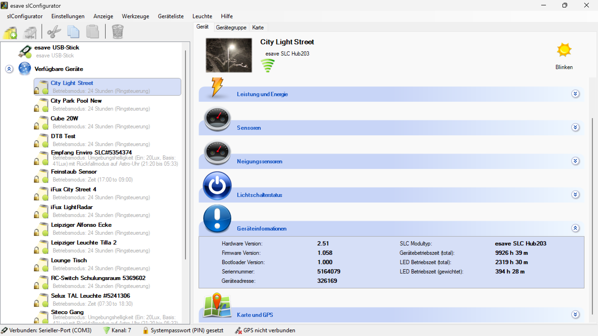

# Geräteinformationen

**Geräteinformationen**

Erhalten Sie detaillierte Informationen über alle Aspekte Ihrer Beleuchtungsgeräte für eine umfassende Übersicht und professionelle Dokumentation. Diese Funktion bietet vollständige Transparenz über Geräteeigenschaften, Status, Konfiguration und Betriebsparameter.

## Hauptbereiche

### 1. Geräte-Übersicht

- Umfassende Darstellung aller wichtigen Gerätedaten
- Strukturierte Anzeige von technischen Spezifikationen
- Aktuelle Status- und Betriebsinformationen

### 2. Detailinformationen

- Erweiterte technische Details und Parameter
- Historische Daten und Ereignisprotokolle
- Wartungs- und Serviceinformationen

## Grundlegende Geräteinformationen

### Identifikationsdaten

- **Geräte-ID**: Eindeutige Identifikationsnummer des Geräts
- **Seriennummer**: Herstellerspezifische Seriennummer
- **MAC-Adresse**: Netzwerk-Hardware-Adresse für Kommunikation
- **Gerätename**: Benutzerdefinierter Name zur besseren Identifikation

### Herstellerinformationen

- **Hersteller**: Name des Geräteherstellers
- **Modellbezeichnung**: Exakte Modell- und Typenbezeichnung
- **Produktionsdatum**: Herstellungsdatum des Geräts
- **Revisionsstand**: Hardware- und Software-Revisionen

### Technische Spezifikationen

- **Eingangsspannung**: Betriebsspannungsbereich des Geräts
- **Leistungsaufnahme**: Maximale und typische Stromaufnahme
- **Ausgangsleistung**: LED-Leistung und Lichtleistung
- **Schutzklasse**: IP-Schutzart und Sicherheitsklassifizierung

## Betriebsinformationen

### Aktueller Status

- **Betriebszustand**: Aktueller Betriebsmodus und Status
- **Helligkeit**: Momentane Helligkeitseinstellung in Prozent
- **Temperatur**: Aktuelle Betriebstemperatur des Geräts
- **Letzter Kontakt**: Zeitpunkt der letzten Kommunikation

### Betriebsstatistiken

- **Betriebsstunden**: Gesamtbetriebszeit seit Inbetriebnahme
- **Schaltzyklen**: Anzahl der Ein-/Ausschaltzyklen
- **Dimm-Zyklen**: Häufigkeit von Dimmvorgängen
- **Durchschnittliche Nutzung**: Mittlere Betriebszeit pro Tag

### Energiedaten

- **Energieverbrauch gesamt**: Kumulierter Energieverbrauch
- **Aktueller Verbrauch**: Momentane Leistungsaufnahme
- **Effizienzwerte**: Lichtausbeute und Energieeffizienz
- **Energiekosten**: Berechnete Betriebskosten

## Software und Firmware

### Firmware-Informationen

- **Firmware-Version**: Aktuelle Firmware-Version
- **Bootloader-Version**: Version des Systemstartprogramms
- **Konfigurationsversion**: Version der aktuellen Konfiguration
- **Letztes Update**: Datum des letzten Firmware-Updates

### Software-Komponenten

- **Betriebssystem**: Eingebettetes Betriebssystem
- **Treiber-Versionen**: Versionen der Hardware-Treiber
- **Protokoll-Stack**: Kommunikationsprotokolle und Versionen
- **Anwendungsmodule**: Installierte Funktionsmodule

### Update-Historie

- **Update-Protokoll**: Chronologie aller durchgeführten Updates
- **Rollback-Möglichkeiten**: Verfügbare Firmware-Versionen
- **Geplante Updates**: Anstehende Software-Aktualisierungen
- **Update-Status**: Status laufender oder geplanter Updates

## Hardware-Details

### Elektronische Komponenten

- **Hauptprozessor**: CPU-Typ und Taktfrequenz
- **Speicher**: RAM und Flash-Speicher-Kapazität
- **LED-Controller**: Typ und Spezifikationen des LED-Treibers
- **Kommunikationsmodule**: Verfügbare Kommunikationsschnittstellen

### Sensoren und Eingänge

- **Integrierte Sensoren**: Liste aller eingebauten Sensoren
- **Externe Eingänge**: Verfügbare Eingänge für externe Sensoren
- **Kalibrierungsstatus**: Kalibrierungszustand aller Sensoren
- **Sensor-Genauigkeit**: Spezifikationen und Toleranzen

### Ausgänge und Schnittstellen

- **LED-Ausgänge**: Anzahl und Spezifikationen der LED-Kanäle
- **Schaltausgänge**: Verfügbare Relais- oder Transistorausgänge
- **Kommunikationsports**: Serielle und Netzwerkschnittstellen
- **Erweiterungsoptionen**: Möglichkeiten für Hardware-Erweiterungen

## Netzwerk und Kommunikation

### Netzwerkstatus

- **IP-Adresse**: Aktuelle Netzwerk-IP-Adresse
- **Subnetzmaske**: Netzwerkkonfiguration
- **Gateway**: Standard-Gateway-Adresse
- **DNS-Server**: Konfigurierte Domain Name Server

### Kommunikationsprotokoll

- **Mesh-Status**: Status der Mesh-Netzwerk-Verbindung
- **Signalstärke**: Empfangsstärke der Funkverbindung
- **Verbindungsqualität**: Qualität der Netzwerkverbindung
- **Datenübertragungsrate**: Aktuelle Übertragungsgeschwindigkeit

### Sicherheitseinstellungen

- **Verschlüsselung**: Verwendete Verschlüsselungsverfahren
- **Authentifizierung**: Authentifizierungsmethoden
- **Zertifikate**: Installierte Sicherheitszertifikate
- **Zugriffsrechte**: Konfigurierte Benutzerberechtigungen

## Wartungs- und Servicedaten

### Wartungsintervalle

- **Nächste Wartung**: Datum der nächsten planmäßigen Wartung
- **Wartungshistorie**: Protokoll durchgeführter Wartungsarbeiten
- **Verschleißindikatoren**: Zustand verschleißanfälliger Komponenten
- **Empfohlene Maßnahmen**: Wartungsempfehlungen basierend auf Nutzung

### Garantie und Support

- **Garantiestatus**: Aktueller Garantiestand des Geräts
- **Supportvertrag**: Informationen zu Supportvereinbarungen
- **Ersatzteilstatus**: Verfügbarkeit von Ersatzteilen
- **Kontaktinformationen**: Support- und Servicekontakte

### Diagnose und Logs

- **Systemlogs**: Protokoll von Systemereignissen
- **Fehlerlogs**: Aufzeichnung von Fehlern und Warnungen
- **Performance-Logs**: Leistungsüberwachung und -protokollierung
- **Debug-Informationen**: Technische Diagnosedaten

## Export und Dokumentation

### Datenexport

- **PDF-Report**: Formatierter Bericht aller Geräteinformationen
- **CSV-Export**: Strukturierte Daten für Tabellenkalkulationen
- **XML-Export**: Standardisiertes Datenformat für Systemintegration
- **JSON-Format**: Maschinenlesbare Datenstruktur

### Dokumentationsfunktionen

- **QR-Code-Generierung**: QR-Codes für schnellen Gerätezugriff
- **Etiketten-Druck**: Druckbare Geräte-Etiketten
- **Inventarlisten**: Automatische Inventarisierung
- **Asset-Management**: Integration in Asset-Management-Systeme

### Compliance-Dokumentation

- **Konformitätserklärungen**: CE, FCC und andere Zertifizierungen
- **Umweltdaten**: Energieeffizienz und Umweltauswirkungen
- **Sicherheitsdatenblätter**: Sicherheitsrelevante Informationen
- **Recycling-Informationen**: Entsorgung und Recycling-Hinweise

## Anwendungsszenarien

### Facility Management

- **Inventarverwaltung**: Vollständige Übersicht aller installierten Geräte
- **Wartungsplanung**: Datenbasierte Wartungsplanung
- **Energiemanagement**: Überwachung des Energieverbrauchs
- **Asset-Tracking**: Verfolgung von Gerätelebenszyklus

### Technischer Service

- **Ferndiagnose**: Remote-Analyse von Geräteproblemen
- **Präventive Wartung**: Frühzeitige Erkennung von Wartungsbedarfen
- **Ersatzteilplanung**: Optimierung der Ersatzteilbevorratung
- **Schulungsunterstützung**: Technische Dokumentation für Servicepersonal

### Qualitätsmanagement

- **Compliance-Überwachung**: Einhaltung von Standards und Vorschriften
- **Auditunterstützung**: Bereitstellung von Prüfdaten
- **Dokumentationspflichten**: Erfüllung regulatorischer Anforderungen
- **Zertifizierungsverfahren**: Unterstützung bei Zertifizierungsprozessen

## Vorteile der detaillierten Geräteinformationen

### Betriebsoptimierung

- **Transparenz**: Vollständige Sichtbarkeit aller Geräteparameter
- **Entscheidungsgrundlage**: Fundierte Entscheidungen basierend auf Fakten
- **Effizienzsteigerung**: Optimierung durch detaillierte Datenanalyse
- **Kostenreduktion**: Reduzierung von Betriebskosten durch bessere Planung

### Wartung und Service

- **Predictive Maintenance**: Vorhersage von Wartungsbedarfen
- **Störungsreduzierung**: Frühzeitige Problemerkennung
- **Servicequalität**: Verbesserung der Serviceleistungen
- **Lebensdauerverlängerung**: Optimale Gerätenutzung

### Compliance und Dokumentation

- **Regulatorische Compliance**: Einhaltung gesetzlicher Vorschriften
- **Auditfähigkeit**: Bereitstellung prüffähiger Dokumentation
- **Qualitätssicherung**: Kontinuierliche Qualitätsüberwachung
- **Risikomanagement**: Identifikation und Bewertung von Risiken

Die Geräteinformationen-Funktion bietet eine umfassende Grundlage für das professionelle Management von Beleuchtungsanlagen und ermöglicht eine optimale Nutzung, Wartung und Dokumentation aller Systemkomponenten.