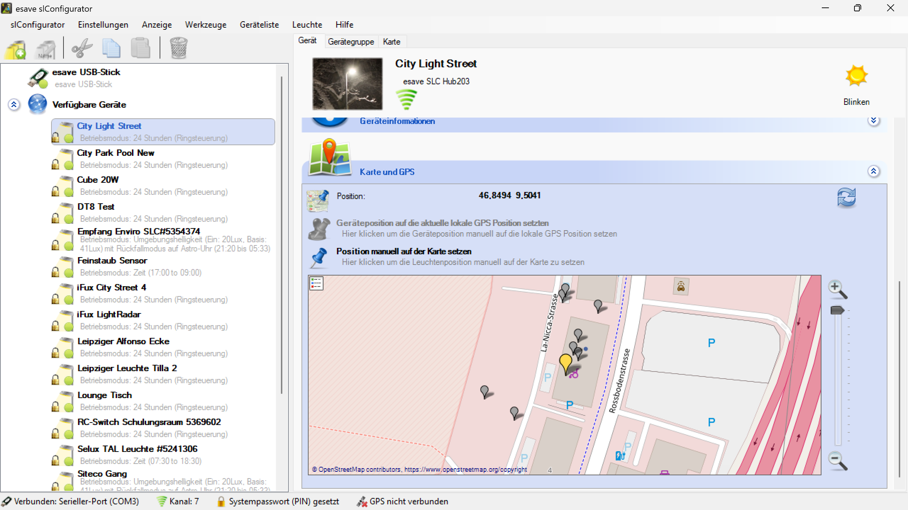

# Karte und GPS

**Karte und GPS**

Verwalten Sie die geografische Positionierung und Kartendarstellung Ihrer Beleuchtungsgeräte mit präzisen GPS-Koordinaten und interaktiven Kartenfunktionen. Diese umfassende Lösung ermöglicht eine professionelle Standortverwaltung, Navigation und geografische Analyse Ihrer Beleuchtungsinstallationen.

## Hauptbereiche

### 1. GPS-Positionierung

- Präzise Erfassung und Verwaltung von Gerätestandorten
- Integration verschiedener GPS-Technologien und Koordinatensysteme
- Automatische und manuelle Positionsbestimmung

### 2. Kartendarstellung und -navigation

- Interaktive Kartenfunktionen für Anlagenübersicht
- Verschiedene Kartenansichten und Darstellungsoptionen
- Navigation und Routenplanung zu Beleuchtungsgeräten

## GPS-Technologie und Koordinatensysteme

### Unterstützte Koordinatensysteme

- **WGS84**: World Geodetic System 1984 als internationaler Standard
- **UTM**: Universal Transverse Mercator für präzise lokale Messungen
- **MGRS**: Military Grid Reference System für militärische Anwendungen
- **Gauss-Krüger**: Deutsches Koordinatensystem für nationale Projekte

### GPS-Genauigkeit und -präzision

- **Standard-GPS**: Genauigkeit von 3-5 Metern unter optimalen Bedingungen
- **Differential GPS (DGPS)**: Verbesserte Genauigkeit von 1-3 Metern
- **Real-Time Kinematic (RTK)**: Zentimetergenauigkeit für Präzisionsanwendungen
- **Assisted GPS (A-GPS)**: Schnellere Positionsbestimmung in städtischen Gebieten

### Satellitensysteme

- **GPS**: Amerikanisches Global Positioning System
- **GLONASS**: Russisches Satellitennavigationssystem
- **Galileo**: Europäisches Satellitennavigationssystem
- **BeiDou**: Chinesisches Satellitennavigationssystem

## Positionserfassung und -zuordnung

### Automatische Positionsbestimmung

- **Integrierter GPS-Empfänger**: Automatische Koordinatenerfassung über eingebaute GPS-Module
- **Smartphone/Tablet-GPS**: Nutzung der GPS-Funktionalität mobiler Geräte
- **Externe GPS-Empfänger**: Anschluss professioneller GPS-Geräte für höhere Genauigkeit
- **Netzwerk-RTK**: Verbindung zu RTK-Korrekturservices für Zentimetergenauigkeit

### Manuelle Positionserfassung

- **Koordinateneingabe**: Direkte Eingabe von Längen- und Breitengraden
- **Kartenselektion**: Interaktive Positionsauswahl per Mausklick auf der Karte
- **Adresseingabe**: Automatische Koordinatenermittlung über Adresseingabe
- **Vermessungsdaten**: Import von professionellen Vermessungskoordinaten

### Position-Validierung

- **Plausibilitätsprüfung**: Automatische Überprüfung der Koordinatenlogik
- **Genauigkeitsbewertung**: Bewertung der Positionsgenauigkeit
- **Konsistenzcheck**: Vergleich mit benachbarten Gerätestandorten
- **Höhenvalidierung**: Überprüfung der Höhenangaben gegen Geländemodelle

## Kartenfunktionen und -darstellung

### Kartenansichten

- **Straßenkarten**: Detaillierte Straßen- und Gebäudeinformationen
- **Satellitenkarten**: Hochauflösende Luftbilder und Satellitenaufnahmen
- **Topografische Karten**: Geländedarstellung mit Höhenlinien
- **Hybridkarten**: Kombination aus Satellitenbild und Straßeninformationen

### Kartenanbieter

- **OpenStreetMap**: Open-Source-Kartenmaterial mit weltweiter Abdeckung
- **Google Maps**: Kommerzielle Karten mit hoher Detailgenauigkeit
- **Bing Maps**: Microsoft-Kartendienst mit Luftbildern
- **HERE Maps**: Professioneller Kartendienst für Unternehmensanwendungen

### Interaktive Funktionen

- **Zoom und Pan**: Stufenloses Zoomen und Verschieben der Kartenansicht
- **Layer-Management**: Ein- und Ausblenden verschiedener Informationsebenen
- **Measuring Tools**: Entfernungs- und Flächenmessung auf der Karte
- **Marker und Annotationen**: Hinzufügung von benutzerdefinierten Markierungen

## Geräte-Positionierung

### Einzelgeräte-Positionierung

- **Präzise Koordinaten**: Genaue GPS-Koordinaten für jedes Beleuchtungsgerät
- **Höheninformationen**: Erfassung der Installationshöhe über Meereshöhe
- **Ausrichtungsdaten**: Orientierung und Ausrichtung der Beleuchtungsgeräte
- **Installationsdetails**: Zusätzliche Standortinformationen und -beschreibungen

### Gruppenpositionierung

- **Gebäudezuordnung**: Zuordnung von Geräten zu spezifischen Gebäuden
- **Bereichsdefinition**: Gruppierung nach geografischen Bereichen
- **Hierarchische Struktur**: Aufbau von Standorthierarchien
- **Massenbearbeitung**: Gleichzeitige Positionierung mehrerer Geräte

### Importfunktionen

- **CSV-Import**: Massenimport von Koordinaten aus Tabellenkalkulationen
- **KML/KMZ-Import**: Import von Google Earth-Dateien
- **Shapefile-Import**: Integration von GIS-Daten
- **CAD-Integration**: Import von AutoCAD- und anderen CAD-Formaten

## Navigationsfunktionen

### Routenplanung

- **Optimierte Routen**: Berechnung der effizientesten Routen zu Gerätestandorten
- **Wartungsrouten**: Spezielle Routenplanung für Wartungs- und Serviceeinsätze
- **Multi-Stop-Routen**: Planung von Routen mit mehreren Zwischenstopps
- **Verkehrsberücksichtigung**: Integration aktueller Verkehrsinformationen

### Turn-by-Turn-Navigation

- **Sprachnavigation**: Akustische Navigationsanweisungen
- **Visuelle Führung**: Bildschirmbasierte Routenführung
- **Offline-Navigation**: Navigation auch ohne Internetverbindung
- **Alternative Routen**: Bereitstellung alternativer Routenoptionen

### Proximity-Funktionen

- **Näherungsalarme**: Benachrichtigung bei Annäherung an Gerätestandorte
- **Geofencing**: Definition geografischer Bereiche mit automatischen Aktionen
- **Location-based Services**: Standortbasierte Servicefunktionen
- **Arrival Detection**: Automatische Erkennung der Ankunft am Zielort

## Mobile Anwendungen

### Smartphone-Integration

- **Native Apps**: Spezialisierte Apps für iOS und Android
- **Progressive Web Apps**: Browserbasierte mobile Anwendungen
- **Offline-Funktionalität**: Kartenfunktionen auch ohne Internetverbindung
- **Synchronisation**: Automatische Synchronisation mit dem Hauptsystem

### Tablet-Funktionen

- **Großbilddarstellung**: Optimierte Kartenansicht für Tablet-Displays
- **Touch-Bedienung**: Intuitive Gestensteuerung für Kartenfunktionen
- **Mehrbenutzerfähigkeit**: Gleichzeitige Nutzung durch mehrere Techniker
- **Robuste Hardware**: Unterstützung für Industrie-Tablets

### Augmented Reality (AR)

- **AR-Overlay**: Einblendung von Geräteinformationen in die Kameraansicht
- **Richtungsanzeige**: Visuelle Führung zu Gerätestandorten
- **Remote Assistance**: AR-basierte Fernunterstützung für Techniker
- **Installation Guide**: AR-Anleitungen für Geräteinstallation

## Anwendungsszenarien

### Facility Management

- **Asset-Tracking**: Vollständige Übersicht aller Beleuchtungsgeräte
- **Wartungsplanung**: Geografisch optimierte Wartungsplanung
- **Bestandsverwaltung**: Räumliche Zuordnung des gesamten Beleuchtungsbestands
- **Compliance-Dokumentation**: Geografische Dokumentation für Audits

### Städtische Beleuchtung

- **Straßenbeleuchtung**: Verwaltung öffentlicher Beleuchtungsinfrastruktur
- **Park- und Platzbeleuchtung**: Management von Grünanlagen-Beleuchtung
- **Verkehrsleitsysteme**: Integration in Verkehrsmanagementsysteme
- **Smart City Integration**: Einbindung in Smart City-Plattformen

### Industrielle Anwendungen

- **Werksgelände**: Übersicht über Industriegelände-Beleuchtung
- **Außenbeleuchtung**: Management von Sicherheits- und Arbeitsplatzbeleuchtung
- **Logistikzentren**: Beleuchtungsmanagement für Lager- und Umschlagflächen
- **Infrastrukturprojekte**: Beleuchtung für Infrastruktur- und Bauprojekte

### Veranstaltungsmanagement

- **Event-Beleuchtung**: Planung und Verwaltung von Veranstaltungsbeleuchtung
- **Temporäre Installationen**: Management von temporären Beleuchtungslösungen
- **Festival-Beleuchtung**: Koordination komplexer Beleuchtungsaufbauten
- **Sicherheitsbeleuchtung**: Notfall- und Sicherheitsbeleuchtung für Events

## Geodatenintegration

### GIS-Integration

- **Geographic Information Systems**: Vollständige GIS-Kompatibilität
- **Layered Data**: Mehrschichtige Geodatenanzeige
- **Spatial Analysis**: Räumliche Datenanalyse und -auswertung
- **Data Overlay**: Überlagerung verschiedener Datenebenen

### Building Information Modeling (BIM)

- **3D-Gebäudemodelle**: Integration von 3D-Gebäudedaten
- **BIM-Koordination**: Koordination mit BIM-Planungsprozessen
- **As-Built-Dokumentation**: Dokumentation der tatsächlichen Installation
- **Lifecycle Management**: BIM-basiertes Lebenszyklus-Management

### Vermessungsdaten

- **Katasterdaten**: Integration amtlicher Katasterinformationen
- **Vermessungsnetze**: Anbindung an offizielle Vermessungsnetze
- **Höhenmodelle**: Integration digitaler Geländemodelle
- **Orthophotos**: Verwendung georeferenzierter Luftbilder

## Sicherheit und Datenschutz

### Lokalisierungssicherheit

- **Verschlüsselung**: Sichere Übertragung von Standortdaten
- **Zugriffskontrollen**: Beschränkung des Zugriffs auf Standortinformationen
- **Anonymisierung**: Schutz sensibler Standortinformationen
- **Audit-Logs**: Protokollierung aller Standortzugriffe

### Compliance

- **DSGVO-Konformität**: Einhaltung europäischer Datenschutzbestimmungen
- **Standortprivatsphäre**: Schutz der Privatsphäre bei Standortdaten
- **Rechtemanagement**: Granulare Berechtigung für Standortfunktionen
- **Datenminimierung**: Erhebung nur erforderlicher Standortdaten

## Wartung und Service

### Präventive Wartung

- **Standortbasierte Wartung**: Wartungsplanung basierend auf geografischer Lage
- **Umgebungseinflüsse**: Berücksichtigung standortspezifischer Umweltfaktoren
- **Zugänglichkeit**: Bewertung der Gerätezugänglichkeit für Wartungsarbeiten
- **Servicerouten**: Optimierung von Servicerouten und -zyklen

### Störungsmanagement

- **Rapid Response**: Schnelle Lokalisierung gestörter Geräte
- **Nearest Technician**: Zuordnung des nächstgelegenen Technikers
- **Emergency Services**: Notfallservices basierend auf Standortdaten
- **Service History**: Standortbasierte Servicehistorie

### Remote Diagnostics

- **Ferndiagnose**: Remote-Diagnose basierend auf Standortkontext
- **Environmental Correlation**: Korrelation von Problemen mit Umgebungseinflüssen
- **Predictive Analytics**: Vorhersage standortspezifischer Probleme
- **Performance Monitoring**: Standortbasierte Leistungsüberwachung

## Berichtsfunktionen

### Geografische Berichte

- **Standortübersichten**: Umfassende geografische Bestandsberichte
- **Dichtekarten**: Visualisierung der Geräteverteilung
- **Coverage Analysis**: Analyse der Beleuchtungsabdeckung
- **Gap Analysis**: Identifikation von Beleuchtungslücken

### Performance-Analyse

- **Standortbasierte Performance**: Leistungsanalyse nach geografischen Kriterien
- **Environmental Impact**: Auswirkungen der Umgebung auf die Geräteleistung
- **Usage Patterns**: Nutzungsmuster basierend auf Standortdaten
- **Efficiency Mapping**: Kartierung der Energieeffizienz

### Compliance-Berichte

- **Regulatory Compliance**: Standortbasierte Compliance-Berichte
- **Safety Documentation**: Sicherheitsdokumentation nach Standorten
- **Environmental Reports**: Umweltberichte für verschiedene Standorte
- **Audit Trails**: Prüfpfade für standortbasierte Änderungen

## Zukunftstechnologien

### Künstliche Intelligenz

- **Machine Learning**: KI-basierte Optimierung von Standortfunktionen
- **Pattern Recognition**: Automatische Erkennung von Standortmustern
- **Predictive Modeling**: Vorhersagemodelle für standortbasierte Ereignisse
- **Intelligent Routing**: KI-optimierte Routen- und Serviceplanung

### Internet of Things (IoT)

- **Sensor Networks**: Integration von IoT-Sensornetzwerken
- **Edge Computing**: Lokale Datenverarbeitung an Gerätestandorten
- **Mesh Networks**: Selbstorganisierende Netzwerke basierend auf Standortdaten
- **5G Integration**: Hochgeschwindigkeits-Konnektivität für Standortdienste

### Emerging Technologies

- **Digital Twins**: Digitale Zwillinge für geografische Bereiche
- **Blockchain**: Sichere, unveränderliche Standortdokumentation
- **Quantum Positioning**: Zukünftige Quantenpositionierungstechnologien
- **Autonomous Systems**: Autonome Systeme für standortbasierte Services

## Vorteile der GPS- und Kartenfunktionen

### Betriebseffizienz

- **Optimierte Navigation**: Effiziente Navigation zu allen Gerätestandorten
- **Zeitersparnis**: Reduzierung der Suchzeiten für Beleuchtungsgeräte
- **Ressourcenoptimierung**: Optimale Nutzung von Personal- und Fahrzeugressourcen
- **Servicequalität**: Verbesserte Servicequalität durch präzise Lokalisierung

### Kosteneinsparung

- **Kraftstoffeinsparung**: Reduzierte Fahrtkosten durch optimierte Routen
- **Arbeitszeiteinsparung**: Weniger Zeitaufwand für Standortsuche
- **Wartungseffizienz**: Effizientere Wartungsplanung und -durchführung
- **Inventarmanagement**: Präzises Inventarmanagement basierend auf Standorten

### Strategische Vorteile

- **Datenbasierte Entscheidungen**: Fundierte Entscheidungen durch geografische Datenanalyse
- **Expansionsplanung**: Unterstützung bei der Planung neuer Installationen
- **Compliance-Management**: Vereinfachte Compliance-Überwachung und -berichterstattung
- **Innovation**: Grundlage für innovative standortbasierte Services

Die GPS- und Kartenfunktionen bieten eine umfassende Lösung für das geografische Management von Beleuchtungsanlagen und ermöglichen eine präzise, effiziente und intelligente Verwaltung aller standortbezogenen Aspekte der Beleuchtungsinfrastruktur.