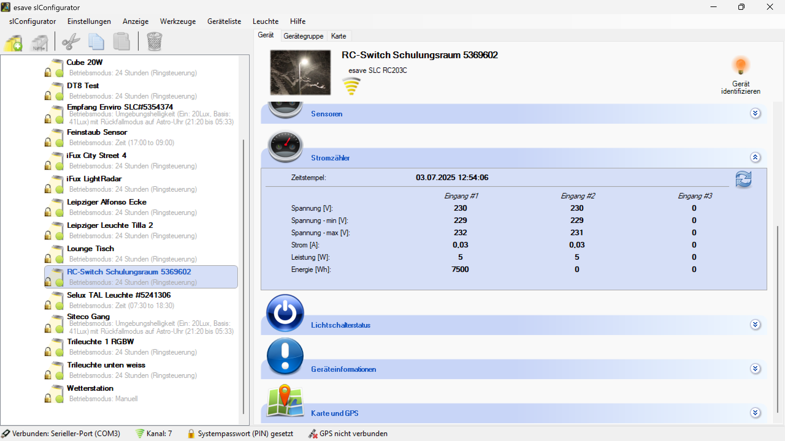

# Stromzähler

**Stromzähler**

Überwachen und verwalten Sie den Energieverbrauch Ihrer Beleuchtungsgeräte mit integrierten digitalen Stromzählern für präzise Verbrauchsmessung und Energiemanagement. Diese fortschrittliche Funktion ermöglicht eine detaillierte Analyse des Energieverbrauchs, Kostenkontrolle und Optimierung der Energieeffizienz.

## Hauptbereiche

### 1. Energiemessung und -überwachung

- Präzise Erfassung von Energieverbrauch und Leistungsparametern
- Echtzeitüberwachung von Strom, Spannung und Leistungsfaktor
- Kontinuierliche Datensammlung für Verbrauchsanalysen

### 2. Datenanalyse und Berichterstattung

- Umfassende Auswertung von Energiedaten und Verbrauchsmustern
- Automatische Berichtsgenerierung für Energiemanagement
- Kostenberechnung und Budgetüberwachung

## Stromzähler-Technologie

### Digitale Messtechnik

- **Hochauflösende ADC**: 24-Bit Analog-Digital-Wandler für präzise Messungen
- **Sampling Rate**: Hohe Abtastrate für exakte Leistungsmessung
- **Kalibrierte Sensoren**: Werkseitig kalibrierte Strom- und Spannungssensoren
- **Temperaturkompensation**: Automatische Korrektur temperaturbedingter Messfehler

### Messgenauigkeit

- **Stromgenauigkeit**: ±0,5% bei Nennstrom
- **Spannungsgenauigkeit**: ±0,2% bei Nennspannung
- **Leistungsgenauigkeit**: ±0,5% bei Nennleistung
- **Energiegenauigkeit**: Klasse 1 nach IEC 62053-21

### Messbereich

- **Strombereich**: 0,01A bis 100A (je nach Gerätetyp)
- **Spannungsbereich**: 85V bis 265V AC
- **Frequenzbereich**: 45Hz bis 65Hz
- **Leistungsbereich**: 1W bis 25kW

## Gemessene Parameter

### Grundlegende Messgrößen

- **Wirkleistung (P)**: Tatsächlich verbrauchte elektrische Leistung in Watt
- **Scheinleistung (S)**: Gesamte elektrische Leistung in Voltampere
- **Blindleistung (Q)**: Reaktive Leistung in Var
- **Leistungsfaktor (cos φ)**: Verhältnis von Wirk- zu Scheinleistung

### Elektrische Parameter

- **Spannung (U)**: Effektivwert der Versorgungsspannung
- **Strom (I)**: Effektivwert des fließenden Stroms
- **Frequenz (f)**: Netzfrequenz der Versorgungsspannung
- **THD**: Total Harmonic Distortion für Spannungs- und Stromoberwellen

### Energiewerte

- **Wirkenergie (Wh)**: Kumulierte Wirkenergie seit Reset oder Installation
- **Scheinenergie (VAh)**: Kumulierte Scheinenergie
- **Blindenergie (VArh)**: Kumulierte Blindenergie
- **Energierichtung**: Import/Export-Erkennung bei bidirektionalen Zählern

## Verbrauchsanalyse

### Echtzeitüberwachung

- **Live-Dashboard**: Aktuelle Anzeige aller elektrischen Parameter
- **Lastprofil**: Kontinuierliche Aufzeichnung des Leistungsverlaufs
- **Maximalwerte**: Überwachung von Spitzenlast und Maximalstrom
- **Alarmierung**: Benachrichtigung bei Überschreitung definierter Grenzwerte

### Historische Datenanalyse

- **Langzeittrends**: Analyse des Energieverbrauchs über Wochen, Monate und Jahre
- **Vergleichsanalysen**: Vergleich zwischen verschiedenen Zeiträumen
- **Saisonale Muster**: Erkennung jahreszeitlicher Verbrauchszyklen
- **Baseline-Bestimmung**: Ermittlung typischer Verbrauchswerte

### Lastprofilerstellung

- **15-Minuten-Werte**: Standardmäßige Lastgangmessung
- **Tageslastgänge**: Detaillierte Analyse täglicher Verbrauchsmuster
- **Wochenlastgänge**: Identifikation von Wochenmustern
- **Lastspitzen**: Erkennung und Analyse von Verbrauchsspitzen

## Kostenmanagement

### Tarifintegration

- **Einfachtarif**: Berechnung mit konstantem Energiepreis
- **Zweitarif**: Hoch-/Niedertarif-Berechnung (HT/NT)
- **Mehrtarif**: Komplexe Tarifsysteme mit zeitabhängigen Preisen
- **Leistungspreis**: Berücksichtigung von Grundpreis und Arbeitspreis

### Kostenberechnung

- **Energiekosten**: Automatische Berechnung der Energiekosten
- **Leistungskosten**: Berechnung leistungsabhängiger Kosten
- **Steuern und Abgaben**: Integration von Steuern, Umlagen und Netzentgelten
- **Gesamtkosten**: Vollständige Kostenkalkulation inklusive aller Nebenkosten

### Budgetüberwachung

- **Budgetplanung**: Definition von Energiebudgets pro Zeitraum
- **Kostenprognose**: Vorhersage der Energiekosten basierend auf Verbrauchstrends
- **Alarmierung**: Benachrichtigung bei Budgetüberschreitungen
- **Kostenstellen**: Zuordnung zu verschiedenen Kostenstellen

## Energieeffizienz-Bewertung

### Effizienzmetriken

- **Energieintensität**: Energieverbrauch pro Beleuchtungsleistung
- **Lichtausbeute**: Lumen pro Watt-Verhältnis
- **Betriebseffizienz**: Vergleich mit Herstellerspezifikationen
- **Verschlechterung**: Überwachung der Effizienzentwicklung über Zeit

### Benchmark-Vergleiche

- **Gerätevergleich**: Vergleich zwischen ähnlichen Beleuchtungsgeräten
- **Standortvergleich**: Vergleich verschiedener Installationsstandorte
- **Industriestandards**: Vergleich mit Branchenbenchmarks
- **Best Practice**: Identifikation besonders effizienter Konfigurationen

### Optimierungsempfehlungen

- **Dimming-Optimierung**: Empfehlungen für optimale Dimmkurven
- **Betriebszeiten**: Vorschläge zur Optimierung der Betriebsstunden
- **Wartungsintervalle**: Energiebasierte Wartungsplanung
- **Austauschempfehlungen**: Identifikation ineffizienter Geräte

## Anwendungsszenarien

### Bürogebäude

- **Arbeitsplatzbeleuchtung**: Verbrauchsanalyse von Bürobeleuchtung
- **Gemeinschaftsbereiche**: Energiemanagement für Flure und Treppenhäuser
- **Außenbeleuchtung**: Überwachung der Gebäudeaußenbeleuchtung
- **Notbeleuchtung**: Energieanalyse von Sicherheitsbeleuchtung

### Industrielle Anwendungen

- **Produktionsbeleuchtung**: Energiemanagement in Fertigungshallen
- **Lagerbeleuchtung**: Verbrauchsoptimierung in Lagerbereichen
- **Sicherheitsbeleuchtung**: Überwachung sicherheitskritischer Beleuchtung
- **Maschinenbeleuchtung**: Energieanalyse arbeitsplatzspezifischer Beleuchtung

### Einzelhandel

- **Verkaufsflächenbeleuchtung**: Energiemanagement in Verkaufsbereichen
- **Schaufensterbeleuchtung**: Verbrauchsanalyse von Werbebereichen
- **Lagerbeleuchtung**: Effizienzüberwachung in Lagerbereichen
- **Außenwerbung**: Energiekontrolle von Außenbeleuchtung

### Öffentliche Einrichtungen

- **Straßenbeleuchtung**: Kommunales Energiemanagement
- **Parkbeleuchtung**: Verbrauchsoptimierung in öffentlichen Anlagen
- **Schulbeleuchtung**: Energiemanagement in Bildungseinrichtungen
- **Krankenhausbeleuchtung**: Verbrauchsanalyse im Gesundheitswesen

## Smart Grid Integration

### Demand Response

- **Lastabschaltung**: Automatische Reduzierung bei Netzengpässen
- **Peak Shaving**: Vermeidung von Lastspitzen
- **Load Shifting**: Verschiebung von Lasten in günstige Zeiten
- **Grid Balancing**: Unterstützung der Netzstabilität

### Energiemärkte

- **Spotmarkt-Integration**: Nutzung variabler Strompreise
- **Regelenergiemärkte**: Teilnahme an Regelenergieauktionen
- **Flexibilitätsvermarktung**: Vermarktung von Lastflexibilität
- **Carbon Trading**: Integration in CO₂-Handelssysteme

### Erneuerbare Energien

- **Eigenverbrauchsoptimierung**: Maximierung des Eigenverbrauchs bei PV-Anlagen
- **Überschussmanagement**: Intelligente Nutzung von Energieüberschüssen
- **Speicherintegration**: Koordination mit Batteriespeichersystemen
- **Prognosebasierte Steuerung**: Wetterbasierte Verbrauchsplanung

## Compliance und Standards

### Eichrecht und Mess-Standards

- **MID-Konformität**: Konformität mit der Messgeräterichtlinie
- **PTB-Zulassung**: Physikalisch-Technische Bundesanstalt Zertifizierung
- **IEC 62053**: Internationale Standards für Elektrizitätszähler
- **EN 50470**: Europäische Norm für Elektrizitätszähler

### Datenschutz und Sicherheit

- **DSGVO-Konformität**: Datenschutz bei Verbrauchsdaten
- **Verschlüsselung**: Sichere Datenübertragung und -speicherung
- **Zugriffskontrollen**: Beschränkter Zugang zu Energiedaten
- **Audit-Trails**: Nachvollziehbare Datenverarbeitung

### Energiemanagement-Standards

- **ISO 50001**: Energiemanagementsystem-Standard
- **EMAS**: Umweltmanagementsystem der Europäischen Union
- **Green Building**: Integration in nachhaltige Gebäudezertifizierungen
- **Carbon Footprint**: CO₂-Bilanzierung basierend auf Energiedaten

## Wartung und Kalibrierung

### Präventive Wartung

- **Kalibrierungszyklen**: Regelmäßige Überprüfung der Messgenauigkeit
- **Selbstdiagnose**: Automatische Erkennung von Messfehlern
- **Drift-Überwachung**: Überwachung der Messstabilität
- **Referenzmessungen**: Vergleichsmessungen mit kalibrierten Geräten

### Kalibrierungsverfahren

- **Werkskalibrierung**: Präzise Kalibrierung unter Laborbedingungen
- **Feldkalibrierung**: Kalibrierung unter realen Betriebsbedingungen
- **Automatische Kalibrierung**: Selbstständige Kalibrierung mit Referenzsignalen
- **Rückverfolgbarkeit**: Nachweisbare Kalibrierungskette zu nationalen Standards

### Qualitätssicherung

- **Messwertkontrolle**: Kontinuierliche Überwachung der Datenqualität
- **Plausibilitätsprüfung**: Automatische Validierung der Messwerte
- **Redundante Messungen**: Mehrfachmessungen zur Fehlerreduzierung
- **Statistische Auswertung**: Statistische Analyse zur Qualitätsbewertung

## Datenmanagement

### Datensammlung

- **Hochfrequente Erfassung**: Sekunden- bis minutenweise Datenaufzeichnung
- **Datenaggregation**: Automatische Zusammenfassung zu Stunden-, Tages- und Monatswerten
- **Datenkompression**: Effiziente Speicherung großer Datenmengen
- **Backup-Strategien**: Sichere Datensicherung und -archivierung

### Datenanalyse

- **Big Data Analytics**: Analyse großer Energiedatenmengen
- **Machine Learning**: KI-basierte Verbrauchsmuster-Erkennung
- **Predictive Analytics**: Vorhersage von Energieverbräuchen
- **Anomalieerkennung**: Automatische Erkennung ungewöhnlicher Verbrauchsmuster

### Datenexport

- **Standardformate**: Export in CSV, XML, JSON und andere Formate
- **API-Schnittstellen**: Programmatischer Zugriff auf Energiedaten
- **Echtzeitdaten**: Live-Datenstreaming für externe Systeme
- **Historische Daten**: Vollständiger Export historischer Verbrauchsdaten

## Berichtsfunktionen

### Automatische Berichte

- **Tagesberichte**: Automatische tägliche Verbrauchsberichte
- **Wochenberichte**: Wöchentliche Zusammenfassungen und Trends
- **Monatsberichte**: Detaillierte monatliche Energieauswertungen
- **Jahresberichte**: Umfassende jährliche Energiebilanzen

### Compliance-Berichte

- **Energieaudits**: Berichte für Energieeffizienz-Audits
- **Umweltberichte**: CO₂-Bilanzen und Nachhaltigkeitsberichte
- **Regulatorische Berichte**: Berichte für Behörden und Zertifizierungsstellen
- **Kostenberichte**: Detaillierte Energiekostenaufstellungen

### Individuelle Berichte

- **Benutzerdefinierte Berichte**: Maßgeschneiderte Berichte nach Anforderungen
- **Dashboard-Berichte**: Interaktive Berichtsdashboards
- **Grafische Auswertungen**: Visualisierte Datenanalysen
- **Vergleichsberichte**: Berichte zum Vergleich verschiedener Zeiträume oder Standorte

## Vorteile des intelligenten Stromzählers

### Kosteneinsparungen

- **Transparenz**: Vollständige Sichtbarkeit der Energiekosten
- **Optimierung**: Identifikation von Einsparpotentialen
- **Budgetkontrolle**: Präzise Budgetplanung und -überwachung
- **Tarifoptimierung**: Auswahl optimaler Energietarife

### Betriebsvorteile

- **Automatisierung**: Vollautomatische Verbrauchserfassung
- **Effizienzsteigerung**: Kontinuierliche Verbesserung der Energieeffizienz
- **Predictive Maintenance**: Energiebasierte Wartungsplanung
- **Qualitätssicherung**: Überwachung der Beleuchtungsqualität

### Nachhaltigkeit

- **CO₂-Reduzierung**: Beitrag zur Klimaneutralität durch Effizienzsteigerung
- **Ressourcenschonung**: Optimale Nutzung elektrischer Energie
- **Umweltmonitoring**: Detaillierte Erfassung des ökologischen Fußabdrucks
- **Green Building**: Unterstützung nachhaltiger Gebäudezertifizierungen

## Zukunftsperspektiven

### Technologische Entwicklungen

- **IoT-Integration**: Vollständige Integration in Internet-of-Things-Umgebungen
- **Blockchain**: Dezentrale und sichere Energiedatenverwaltung
- **Edge Computing**: Lokale Datenverarbeitung für Echtzeitanwendungen
- **5G-Konnektivität**: Hochgeschwindigkeits-Datenübertragung

### Neue Anwendungen

- **Virtual Power Plants**: Integration in virtuelle Kraftwerke
- **Peer-to-Peer Energy Trading**: Direkter Energiehandel zwischen Verbrauchern
- **Carbon Credits**: Automatische CO₂-Zertifikat-Generierung
- **Dynamic Pricing**: Echtzeitpreisanpassung basierend auf Verbrauchsdaten

### Regulatorische Entwicklungen

- **Smart Meter Rollout**: Flächendeckende Einführung intelligenter Zähler
- **Energiewende**: Unterstützung der Transformation des Energiesystems
- **Digitalisierung**: Vollständige Digitalisierung des Energiesektors
- **Marktliberalisierung**: Neue Geschäftsmodelle im Energiemarkt

Der intelligente Stromzähler bietet eine umfassende Lösung für modernes Energiemanagement und ermöglicht eine präzise, effiziente und nachhaltige Verwaltung des Energieverbrauchs in professionellen Beleuchtungsanlagen.