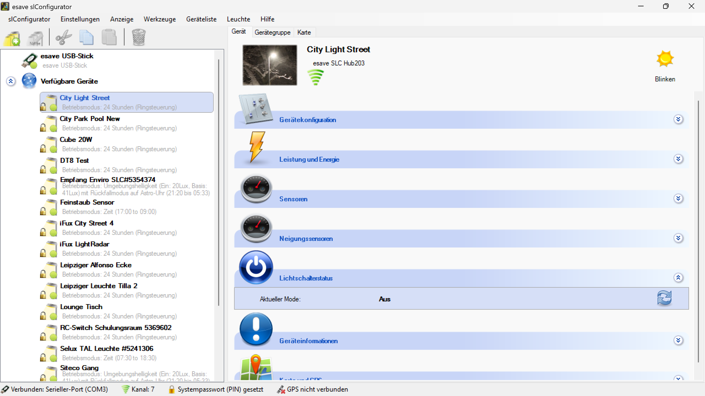

# Lichtschalterstatus

**Lichtschalterstatus**

Überwachen und verwalten Sie den Status aller angeschlossenen Lichtschalter und Eingangssignale für eine umfassende Kontrolle über manuelle Steuerungsinterfaces. Diese Funktion ermöglicht die Integration konventioneller Schalter in intelligente Beleuchtungssysteme und bietet vollständige Transparenz über alle Schalterzustände.

## Hauptbereiche

### 1. Status-Überwachung

- Echtzeitanzeige aller Schalterzustände und Eingangssignale
- Historische Aufzeichnung von Schaltervorgängen
- Überwachung der Schalterfunktionalität und -integrität

### 2. Schalter-Integration

- Konfiguration verschiedener Schaltertypen und -funktionen
- Anpassung der Schaltereingänge an spezifische Anforderungen
- Integration in automatische Beleuchtungssteuerung

## Schaltertypen und -technologien

### Mechanische Schalter

- **Wippschalter**: Standard-Wippenschalter für Ein/Aus-Steuerung
- **Drucktaster**: Tasterschalter für momentane Kontaktgabe
- **Drehschalter**: Rotationsschalter für Mehrstufensteuerung
- **Kippschalter**: Klassische Kippschalter für robuste Anwendungen

### Elektronische Schalter

- **Touchschalter**: Berührungsempfindliche Schalterflächen
- **Kapazitive Schalter**: Kapazitive Sensoren für kontaktlose Bedienung
- **Hall-Effekt-Schalter**: Magnetische Schalter ohne mechanischen Verschleiß
- **Optische Schalter**: Infrarot- oder Lichtsensoren als Schaltereingänge

### Intelligente Schalter

- **Smart Switches**: Programmierbare Schalter mit erweiterten Funktionen
- **Scene Controller**: Szenen-Schalter für komplexe Beleuchtungssteuerung
- **Dimmer-Schalter**: Integrierte Dimmer mit Schalterfunktion
- **Wireless Switches**: Funkbasierte Schalter ohne Verkabelung

## Eingangskonfiguration

### Digitale Eingänge

- **Schaltkontakte**: Konfiguration für NO/NC-Kontakte
- **Spannungseingänge**: 0-10V oder 0-24V Eingangssignale
- **TTL/CMOS**: Digitale Logikpegel für Mikrocontroller-Integration
- **Trockenkontakte**: Potentialfreie Schalterkontakte

### Analoge Eingänge

- **Widerstandseingänge**: Variable Widerstände für stufenlose Steuerung
- **Spannungsteiler**: Potentiometer für Helligkeitssteuerung
- **Stromsignale**: 4-20mA Industriestandard-Eingänge
- **Thermoeingänge**: Temperaturbasierte Schaltereingänge

### Konfigurationsparameter

- **Entprellzeit**: Einstellung der Entprellzeit für stabile Schaltsignale
- **Triggerpegel**: Definition der Schaltpegel für sichere Erkennung
- **Pull-up/Pull-down**: Konfiguration der internen Widerstandsnetzwerke
- **Hysterese**: Schalthysterese zur Vermeidung von Signalflackern

## Status-Überwachung

### Echtzeitanzeige

- **Live-Status**: Sofortige Anzeige aller aktuellen Schalterzustände
- **Zustandsänderungen**: Hervorhebung von Statuswechseln
- **Signalqualität**: Überwachung der Eingangssignalqualität
- **Fehlerindikation**: Anzeige von Schalterstörungen oder -ausfällen

### Historische Aufzeichnung

- **Schaltprotokoll**: Detaillierte Aufzeichnung aller Schaltvorgänge
- **Zeitstempel**: Präzise Zeiterfassung aller Ereignisse
- **Schaltmuster**: Analyse wiederkehrender Schaltmuster
- **Nutzungsstatistiken**: Statistische Auswertung der Schalternutzung

### Alarm- und Benachrichtigungssystem

- **Störungsalarme**: Benachrichtigung bei Schalterdefekten
- **Wartungsalarme**: Erinnerungen für Schalter-Wartung
- **Nutzungsalarme**: Warnung bei ungewöhnlichen Schaltmustern
- **Systemintegration**: Weiterleitung an übergeordnete Managementsysteme

## Schalterfunktionen

### Grundfunktionen

- **Ein/Aus-Schaltung**: Einfache Beleuchtungssteuerung
- **Toggle-Funktion**: Wechselschalter für Zustandsumkehr
- **Momentary-Funktion**: Taster für zeitbasierte Steuerung
- **Latching-Funktion**: Selbsthaltende Schalterfunktion

### Erweiterte Funktionen

- **Dimmer-Steuerung**: Helligkeitsregelung über Schalter
- **Szenen-Aufruf**: Aktivierung vordefinierter Beleuchtungsszenen
- **Sequenz-Steuerung**: Sequenzielle Schaltung mehrerer Leuchtengruppen
- **Timer-Funktionen**: Zeitbasierte Schaltungen mit Verzögerung

### Logische Verknüpfungen

- **UND-Verknüpfung**: Kombination mehrerer Schaltereingänge
- **ODER-Verknüpfung**: Alternative Schaltersteuerung
- **Prioritätsschaltung**: Hierarchische Schalterprioritäten
- **Inverter-Funktion**: Umkehrung der Schaltlogik

## Integration in Beleuchtungssteuerung

### Automatisierung

- **Übersteuerung**: Manuelle Übersteuerung automatischer Funktionen
- **Fallback-Modi**: Notfallsteuerung bei Systemausfall
- **Adaptive Steuerung**: Anpassung an Nutzerverhalten
- **Präsenz-Integration**: Kombination mit Präsenzsensoren

### Szenen-Management

- **Szenen-Recall**: Abruf gespeicherter Beleuchtungsszenen
- **Szenen-Speicherung**: Speicherung aktueller Zustände als Szenen
- **Szenen-Sequenzen**: Automatische Szenenabfolgen
- **Dynamische Szenen**: Zeitabhängige Szenenanpassungen

### Gruppensteuerung

- **Zonensteuerung**: Steuerung definierter Beleuchtungszonen
- **Gruppenbildung**: Dynamische Gruppierung von Leuchten
- **Master-Slave**: Hierarchische Schaltersteuerung
- **Broadcast-Steuerung**: Gleichzeitige Steuerung aller Geräte

## Anwendungsszenarien

### Büroumgebungen

- **Arbeitsplatzschalter**: Individuelle Arbeitsplatzbeleuchtung
- **Zonensteuerung**: Bereichsweise Beleuchtungssteuerung
- **Besprechungsräume**: Szenenbasierte Beleuchtung für Meetings
- **Flurbeleuchtung**: Automatische Steuerung mit manueller Übersteuerung

### Industrielle Anwendungen

- **Maschinenbeleuchtung**: Arbeitsplatzspezifische Beleuchtungssteuerung
- **Sicherheitsbeleuchtung**: Notschalter für Sicherheitsbeleuchtung
- **Lagerbeleuchtung**: Bereichsweise Steuerung in Lagerhallen
- **Produktionsbeleuchtung**: Prozessabhängige Beleuchtungssteuerung

### Öffentliche Gebäude

- **Klassenräume**: Unterrichtsraumspezifische Beleuchtung
- **Veranstaltungsräume**: Flexible Beleuchtungssteuerung für Events
- **Korridore**: Gang- und Flurbeleuchtung mit Überwachung
- **Außenbereiche**: Steuerung der Außenbeleuchtung

### Einzelhandel

- **Verkaufsflächen**: Kundenbereichs-Beleuchtung
- **Schaufenster**: Präsentationsbeleuchtung mit Schaltersteuerung
- **Lagerbereiche**: Mitarbeiter-gesteuerte Lagerbeleuchtung
- **Kassenbereich**: Arbeitsplatzspezifische Beleuchtung

## Wartung und Diagnose

### Vorbeugende Wartung

- **Kontaktprüfung**: Regelmäßige Überprüfung der Schalterkontakte
- **Isolationsmessung**: Prüfung der elektrischen Isolation
- **Mechanikprüfung**: Test der mechanischen Schalterfunktion
- **Reinigung**: Wartung der Schalteroberflächen

### Diagnose-Funktionen

- **Kontaktwiderstand**: Messung des Kontaktwiderstands
- **Schaltzyklen**: Zählung der Schaltzyklen für Verschleißbewertung
- **Isolationswerte**: Überwachung der Isolationswiderstände
- **Temperaturüberwachung**: Überwachung der Schaltertemperatur

### Störungsanalyse

- **Prellanalyse**: Analyse von Kontaktprellungen
- **Ausfalldiagnose**: Systematische Fehlersuche bei Schalterausfällen
- **Verschleißerkennung**: Frühzeitige Erkennung von Kontaktverschleiß
- **Umgebungseinflüsse**: Analyse von Umwelteinflüssen auf Schalter

## Sicherheit und Compliance

### Elektrische Sicherheit

- **Isolationsüberwachung**: Kontinuierliche Überwachung der Isolation
- **Berührungsschutz**: Schutz vor elektrischen Schlägen
- **Kurzschlussschutz**: Absicherung gegen Kurzschlüsse
- **Überlastschutz**: Schutz vor Überlastung der Schalterkontakte

### Normkonformität

- **VDE-Normen**: Einhaltung deutscher Elektrotechnik-Normen
- **IEC-Standards**: Internationale elektrotechnische Standards
- **EN-Normen**: Europäische Normen für Schaltgeräte
- **CE-Kennzeichnung**: Konformitätserklärung für europäischen Markt

### Betriebssicherheit

- **Redundanz**: Redundante Schalterwege für kritische Anwendungen
- **Fail-Safe**: Sichere Zustände bei Schalterausfall
- **Notabschaltung**: Notschalter für Sicherheitsabschaltungen
- **Zugriffskontrollen**: Beschränkung des Schalterzugriffs

## Datenerfassung und -analyse

### Nutzungsdaten

- **Schaltfrequenz**: Häufigkeit der Schaltervorgänge
- **Nutzungsmuster**: Zeitliche Verteilung der Schalteraktivitäten
- **Belastungsanalyse**: Analyse der Schalterbelastung
- **Lebensdauerprognose**: Vorhersage der Schalterlebensdauer

### Energieeffizienz

- **Energieeinsparung**: Bewertung der Energieeinsparung durch manuelle Steuerung
- **Nutzerverhalten**: Analyse des Nutzerverhaltens bei der Beleuchtungssteuerung
- **Optimierungspotentiale**: Identifikation von Verbesserungsmöglichkeiten
- **Kostenanalyse**: Bewertung der Wirtschaftlichkeit der Schaltersteuerung

### Berichterstattung

- **Statusberichte**: Regelmäßige Berichte über Schalterzustände
- **Wartungsberichte**: Dokumentation von Wartungsaktivitäten
- **Nutzungsberichte**: Analyse der Schalternutzung
- **Compliance-Berichte**: Nachweise für Normenkonformität

## Integration und Kommunikation

### Systemintegration

- **Building Management**: Integration in Gebäudemanagementsysteme
- **Lichtsysteme**: Vollständige Integration in Beleuchtungssteuerung
- **Sicherheitssysteme**: Anbindung an Sicherheits- und Alarmanlagen
- **HVAC-Systeme**: Koordination mit Heizung, Lüftung und Klimatisierung

### Kommunikationsprotokolle

- **KNX/EIB**: Integration in KNX-Gebäudeautomation
- **DALI**: Anbindung an DALI-Beleuchtungssysteme
- **Modbus**: Industrielle Kommunikation über Modbus-Protokoll
- **BACnet**: Building Automation Control Network

### Drahtlose Kommunikation

- **ZigBee**: Mesh-Netzwerk für Gebäudeautomation
- **Z-Wave**: Hausautomations-Funkprotokoll
- **WiFi**: WLAN-basierte Schalterintegration
- **Bluetooth**: Nahbereichs-Funkverbindung für mobile Steuerung

## Benutzeroberflächen

### Lokale Bedienung

- **Display-Integration**: Eingebaute Displays für Statusinformationen
- **LED-Anzeigen**: Status-LEDs für schnelle Orientierung
- **Haptisches Feedback**: Taktile Rückmeldung bei Schaltervorgängen
- **Akustische Signale**: Akustische Bestätigung von Schaltvorgängen

### Remote-Bedienung

- **Web-Interface**: Browserbasierte Schaltersteuerung
- **Mobile Apps**: Smartphone-Apps für Schaltersteuerung
- **Desktop-Software**: PC-Software für Schalter-Management
- **Cloud-Services**: Online-Plattformen für Remote-Zugriff

### Visualisierung

- **Schalterpläne**: Grafische Darstellung der Schalteranordnung
- **Statusmaps**: Übersichtskarten mit aktuellen Schalterzuständen
- **Trend-Diagramme**: Grafische Darstellung von Schaltmustern
- **Dashboard-Integration**: Integration in Übersichts-Dashboards

## Vorteile der Lichtschalterstatus-Überwachung

### Betriebsvorteile

- **Vollständige Kontrolle**: Umfassende Übersicht über alle Schalterzustände
- **Proaktive Wartung**: Frühzeitige Erkennung von Wartungsbedarfen
- **Nutzerkomfort**: Verbesserte Benutzerfreundlichkeit durch intelligente Schaltung
- **Flexibilität**: Anpassbare Schalterfunktionen für verschiedene Anforderungen

### Kostenvorteile

- **Wartungsoptimierung**: Optimierte Wartungsplanung durch Zustandsüberwachung
- **Energieeinsparung**: Reduzierter Energieverbrauch durch intelligente Schaltung
- **Ausfallvermeidung**: Vermeidung ungeplanter Ausfälle durch präventive Wartung
- **Lebensdauerverlängerung**: Verlängerte Schalterlebensdauer durch optimale Nutzung

### Sicherheitsvorteile

- **Zuverlässigkeit**: Hohe Systemzuverlässigkeit durch Überwachung
- **Notfallsteuerung**: Sichere Notfallsteuerung bei Systemausfall
- **Manipulationsschutz**: Erkennung unberechtigter Eingriffe
- **Compliance**: Einhaltung aller relevanten Sicherheitsnormen

## Zukunftsperspektiven

### Technologische Entwicklungen

- **IoT-Integration**: Vollständige Integration in Internet-of-Things-Umgebungen
- **KI-Optimierung**: Künstliche Intelligenz für adaptive Schalterfunktionen
- **Predictive Maintenance**: Vorhersagende Wartung basierend auf Nutzungsdaten
- **Edge Computing**: Lokale Intelligenz für schnellere Reaktionszeiten

### Neue Funktionen

- **Gestensteuerung**: Kontaktlose Schalterbedienung durch Gesten
- **Sprachsteuerung**: Integration von Sprachassistenten
- **Biometrische Authentifizierung**: Sicherheitsbasierte Schalterzugriffe
- **Adaptive Interfaces**: Selbstlernende Benutzeroberflächen

### Marktentwicklungen

- **Smart Building Integration**: Vollständige Integration in intelligente Gebäude
- **Standardisierung**: Weiterentwicklung internationaler Standards
- **Miniaturisierung**: Kompaktere und elegantere Schalterlösungen
- **Nachhaltigkeit**: Umweltfreundliche und recycelbare Schaltermaterialien

Die Lichtschalterstatus-Überwachung bietet eine umfassende Lösung für die professionelle Verwaltung und Kontrolle aller Schaltereingänge in modernen Beleuchtungsanlagen und ermöglicht eine optimale Balance zwischen manueller Steuerung, Automatisierung und Systemsicherheit.