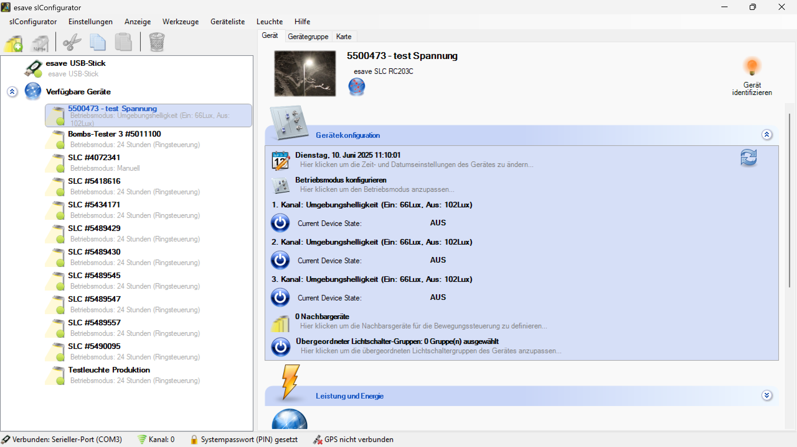

# Uhrzeit und Datum

**Uhrzeit und Datum - esave Lighting Controller Zeitsynchronisation**

Konfigurieren Sie präzise Zeit- und Datumseinstellungen für Ihre esave Lighting Controller mit professionellen Synchronisationswerkzeugen und automatischer PC-Zeit-Übernahme. Diese essentiellen Zeiteinstellungen bilden die Grundlage für alle zeitbasierten Steuerungsfunktionen, Astro-Programme und termingebundene Automatisierungen.

## Hauptbereiche

### 1. Gerätekonfiguration und Zeitzugriff

Die Hauptkonfigurationsoberfläche zeigt den direkten Zugang zur Zeitkonfiguration:
- **Geräteinformationen**: 5500473 - test Spannung (esave SLC RC203C)
- **Aktuelles Datum**: Dienstag, 10. Juni 2025 11:10:01 (Live-Anzeige)
- **Zeitkonfiguration**: Direkter Zugriff über das hervorgehobene Datumsfeld
- **Systemstatus**: Live-Kanal-Status und Betriebsmodus-Informationen

### 2. Gerätekonfigurationsbereiche

Das Interface bietet umfassenden Zugang zu allen Konfigurationsbereichen:
- **Zeit- und Datumskonfiguration**: Präzise Zeiteinstellungen (aktuell fokussiert)
- **Betriebsmodus konfigurieren**: Umfassende Steuerungsmodi und -parameter
- **Kanalinformationen**: Multi-Channel-Status mit Umgebungshelligkeitswerten
- **Nachbargeräte**: Mesh-Netzwerk-Konfiguration für Geräteverbünde
- **Lichtschaltergruppen**: Übergeordnete Gruppenschaltungen

### 3. Zeit- und Datums-Einstellungsdialog

Der spezialisierte Zeit-Konfigurationsdialog bietet präzise Einstellungsmöglichkeiten:
- **PC-Zeit-Synchronisation**: Automatische Übernahme der Computer-Zeit
- **Manuelle Datumseingabe**: Präzise Einstellung von Datum und Uhrzeit
- **Zeitzone-Konfiguration**: Geografische Zeitzone mit Sommerzeit-Unterstützung
- **Validierung und Anwendung**: Sofortige Übernahme der Zeiteinstellungen

## Zeit-Synchronisationsfunktionen

### Automatische PC-Zeit-Übernahme

**"Benutze PC Zeit" Checkbox:** ❌ Deaktiviert (Manuelle Konfiguration aktiv)
- **Funktion**: Automatische Übernahme der aktuellen Computer-Zeit
- **Synchronisation**: Sekunden-genaue Übertragung der PC-Systemzeit
- **Komfort**: Ein-Klick-Synchronisation ohne manuelle Eingabe
- **Genauigkeit**: Eliminierung von Eingabefehlern und Zeitabweichungen

**Vorteile der PC-Zeit-Synchronisation:**
- **Präzision**: Exakte Übernahme der NTP-synchronisierten PC-Zeit
- **Effizienz**: Schnelle Konfiguration ohne manuelle Dateneingabe
- **Konsistenz**: Einheitliche Zeitbasis für alle Geräte
- **Automatisierung**: Reduzierung manueller Konfigurationsfehler

### Manuelle Zeit- und Datumskonfiguration

**Datum-Konfiguration:**
- **Aktuelles Datum**: Dienstag, 10. Juni 2025
- **Datumsformat**: Vollständige deutsche Datumsdarstellung mit Wochentag
- **Kalender-Interface**: Intuitive Datumsauswahl mit Dropdown-Menüs
- **Gültigkeitsprüfung**: Automatische Validierung auf korrekte Datumswerte

**Zeit-Konfiguration:**
- **Aktuelle Zeit**: 11:14:25 (Stunden:Minuten:Sekunden)
- **24-Stunden-Format**: Internationale Zeitdarstellung
- **Sekundengenauigkeit**: Präzise Zeiteinstellung bis zur Sekunde
- **Live-Update**: Kontinuierliche Aktualisierung der Zeitanzeige

### Zeitzone und Lokalisierung

**Zeitzone-Einstellung:**
- **Aktuelle Zeitzone**: (UTC+01:00) Amsterdam, Berlin, Bern, Rome, Stockholm
- **Geographische Zuordnung**: Mitteleuropäische Zeit (MEZ/MESZ)
- **Sommerzeit-Automatik**: Automatische Umstellung zwischen Winter- und Sommerzeit
- **DST-Management**: Daylight Saving Time Integration

**Unterstützte Zeitzonen:**
- **Mitteleuropäische Zeit**: UTC+1 (Standardzeit) / UTC+2 (Sommerzeit)
- **Westeuropäische Zeit**: UTC+0 (Greenwich Mean Time)
- **Osteuropäische Zeit**: UTC+2 / UTC+3
- **Weitere Zeitzonen**: Vollständige globale Zeitzonenunterstützung

## Erweiterte Zeitfunktionen

### Astro-Uhr-Integration

**Astronomische Berechnungen:**
- **Sonnenaufgang**: Automatische Berechnung basierend auf Datum und Standort
- **Sonnenuntergang**: Präzise Dämmerungszeiten für Astro-Programme
- **Jahreszeiten-Anpassung**: Kontinuierliche Anpassung an Tageslängen-Veränderungen
- **Geografische Präzision**: Standortspezifische astronomische Berechnungen

**Dämmerungsmodi:**
- **Bürgerliche Dämmerung**: Standard-Dämmerung für Allgemeinbeleuchtung
- **Nautische Dämmerung**: Erweiterte Dämmerungszeiten für spezielle Anwendungen
- **Astronomische Dämmerung**: Maximale Dämmerungserfassung für wissenschaftliche Genauigkeit
- **Horizont-Korrektur**: Anpassung an lokale Gegebenheiten (Berge, Gebäude)

### Zeitbasierte Steuerungsfunktionen

**Zeit-Dimmprofil-Integration:**
- **Programmzeiten**: Basis für alle zeitbasierten Schaltungen
- **Wochenprogramme**: Unterschiedliche Zeiten für Werktage/Wochenende
- **Feiertage**: Integration von Feiertagskalendern
- **Saisonale Programme**: Anpassung an jahreszeitliche Anforderungen

**Kalender-Integration:**
- **Ereignisbasierte Steuerung**: Spezielle Beleuchtung für Termine und Events
- **Wiederkehrende Termine**: Regelmäßige Sonderprogramme
- **Ausnahmen**: Abweichende Programme für besondere Anlässe
- **Multi-Jahres-Planung**: Langfristige Terminplanung

## Synchronisationsstrategien

### Netzwerk-Zeitsynchronisation

**NTP-Integration:**
- **Network Time Protocol**: Automatische Synchronisation mit Internet-Zeitservern
- **Zeitserver-Hierarchie**: Redundante Zeitquellen für höchste Zuverlässigkeit
- **Drift-Korrektur**: Kontinuierliche Korrektur der internen Uhrenabweichung
- **Genauigkeitsgarantie**: Millisekunden-genaue Zeitsynchronisation

**Lokale Zeitserver:**
- **Master-Controller**: Ein Controller als Zeitreferenz für alle anderen
- **Mesh-Synchronisation**: Verteilte Zeitsynchronisation im Gerätenetzwerk
- **Fallback-Mechanismen**: Automatischer Wechsel bei Zeitserver-Ausfall
- **Offline-Betrieb**: Autonome Zeitführung bei Netzwerkausfall

### Zeitsynchronisation für Gerätegruppen

**Batch-Konfiguration:**
- **Gruppen-Zeitsync**: Simultane Zeitkonfiguration für mehrere Geräte
- **Konsistente Zeitbasis**: Einheitliche Zeit für alle Gruppenmitglieder
- **Zentrale Verwaltung**: Ein-Punkt-Konfiguration für komplexe Installationen
- **Automatische Verteilung**: Propagierung von Zeitänderungen an alle Geräte

## Anwendungsszenarien

### Büro- und Gewerbeanwendungen

**Arbeitsplatz-Beleuchtung:**
- **Arbeitszeiten-Synchronisation**: Präzise Schaltung nach Bürozeiten
- **Pause- und Meetingzeiten**: Spezielle Beleuchtung für verschiedene Aktivitäten
- **Wochenend-Programme**: Reduzierte Beleuchtung außerhalb der Arbeitszeiten
- **Feiertags-Integration**: Automatische Anpassung an arbeitsfreie Tage

### Straßen- und Verkehrsbeleuchtung

**Öffentliche Beleuchtung:**
- **Astro-Synchronisation**: Präzise Ein-/Ausschaltung basierend auf Dämmerung
- **Saisonale Anpassung**: Automatische Anpassung an jahreszeitliche Veränderungen
- **Zeitzone-Korrektheit**: Exakte lokale Zeit für geografisch verteilte Installationen
- **Wartungsfenster**: Definierte Zeiten für Wartung und Service

### Event- und Veranstaltungsbeleuchtung

**Ereignisbasierte Steuerung:**
- **Veranstaltungskalender**: Integration von Event-Terminen
- **Spezial-Beleuchtung**: Besondere Lichtszenarien für Events
- **Automatische Aktivierung**: Rechtzeitige Vorbereitung für Veranstaltungen
- **Nach-Event-Programme**: Spezielle Beleuchtung nach Veranstaltungsende

### Industrielle Zeitsteuerung

**Produktions- und Schichtbetrieb:**
- **Schichtplan-Integration**: Beleuchtung entsprechend Arbeitsschichten
- **Produktions-Zyklen**: Synchronisation mit Fertigungsprozessen
- **Sicherheits-Zeitfenster**: Spezielle Beleuchtung für Sicherheitsphasen
- **Wartungs-Scheduling**: Koordinierte Beleuchtung für Wartungsarbeiten

## Technische Spezifikationen

### Zeitgenauigkeit und Performance

- **Interne Uhrengenauigkeit**: ±2 Sekunden pro Tag (ohne Synchronisation)
- **NTP-Synchronisationsgenauigkeit**: ±10 Millisekunden bei Netzwerkverbindung
- **Drift-Kompensation**: Automatische Korrektur der Uhrenabweichung
- **Backup-Zeitführung**: Batterie-gepufferte RTC für Stromausfälle

### Zeitzonen und Standardkonformität

- **Unterstützte Zeitzonen**: Alle globalen Zeitzonen mit DST-Support
- **Sommerzeit-Automatik**: Automatische Umstellung nach lokalen Regeln
- **Schaltjahr-Unterstützung**: Korrekte Datumsberechnung für alle Jahre
- **ISO 8601 Konformität**: Internationale Datum- und Zeitstandards

### System-Integration

- **SNTP-Client**: Simple Network Time Protocol für Zeitabgleich
- **Real-Time Clock**: Hardware-RTC mit Batterie-Backup
- **Calendar-APIs**: Schnittstellen für externe Kalender-Integration
- **Time-Synchronization**: Mesh-weite Zeitsynchronisation

## Vorteile der Zeit- und Datumskonfiguration

### Präzision und Zuverlässigkeit

- **Exakte Zeitführung**: Millisekunden-genaue Synchronisation für kritische Anwendungen
- **Ausfallsicherheit**: Redundante Zeitquellen und Backup-Mechanismen
- **Automatische Wartung**: Selbstkorrigierende Zeitsynchronisation
- **Langzeit-Stabilität**: Kontinuierliche Genauigkeit über Jahre

### Benutzerfreundlichkeit

- **Ein-Klick-Synchronisation**: Automatische PC-Zeit-Übernahme
- **Intuitive Bedienung**: Einfache Datum- und Zeiteingabe
- **Visuelle Validierung**: Sofortige Anzeige der konfigurierten Zeit
- **Fehlerminimierung**: Automatische Gültigkeitsprüfung aller Eingaben

### Professionelle Systemintegration

- **Standard-Kompatibilität**: Unterstützung aller relevanten Zeitstandards
- **Netzwerk-Integration**: Nahtlose Integration in IT-Infrastrukturen
- **Skalierbare Verwaltung**: Effiziente Konfiguration von Einzelgeräten bis Großinstallationen
- **Compliance-Unterstützung**: Erfüllung von Audit- und Dokumentationsanforderungen

Diese Zeit- und Datumskonfiguration bietet eine professionelle und zuverlässige Grundlage für alle zeitbasierten Funktionen von esave Lighting Controllern mit höchster Präzision und umfassender Integration in moderne Zeitverwaltungssysteme.
