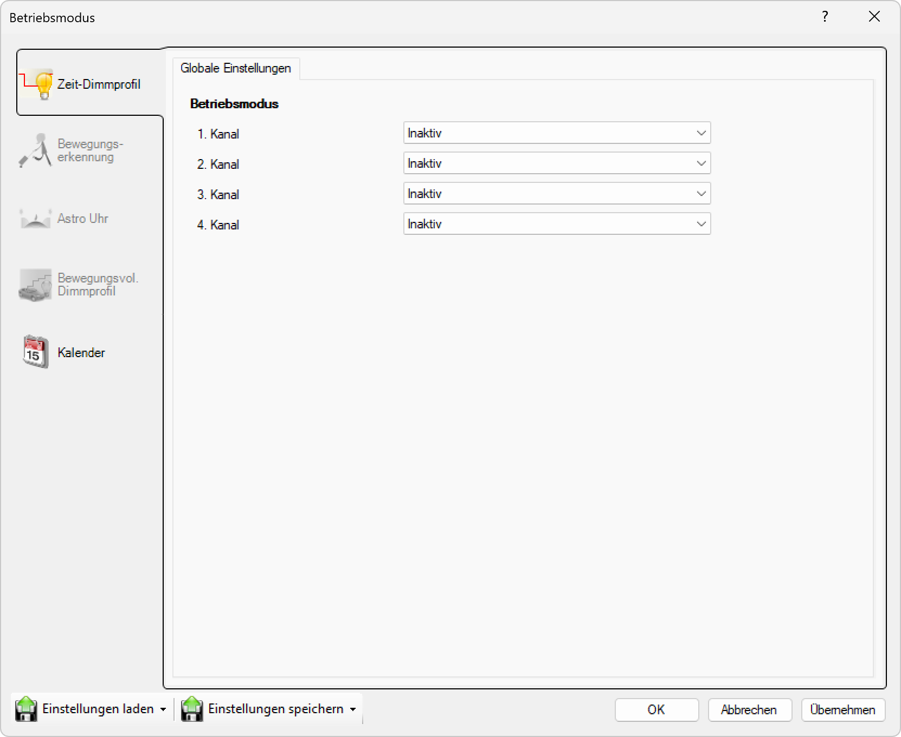

# Inaktiv

*Kanal deaktiviert.*

Dieses Fenster ermöglicht die Konfiguration der Betriebsmodi für bis zu vier Kanäle innerhalb eines Beleuchtungs- oder Automatisierungssteuerungssystems. Hier ist eine Aufschlüsselung aller auswählbaren Optionen und Steuerelemente, die in diesem Einstellungsbereich verfügbar sind:

## Hauptbereiche

### 1. Zeit-Dimmprofil

- Dieser Bereich ist aktuell aktiv, wie durch das hervorgehobene Symbol auf der linken Seite angezeigt
- Wird verwendet, um zeitbasierte Dimmprofile für jeden Kanal einzurichten

### 2. Globale Einstellungen

- Der Hauptbereich zeigt globale Betriebsmodus-Einstellungen für alle Kanäle an

## Betriebsmodus-Optionen

Für jeden der vier Kanäle (1. Kanal, 2. Kanal, 3. Kanal, 4. Kanal) können Sie einen Betriebsmodus aus einem Dropdown-Menü auswählen. Die verfügbaren Einstellungen sind:

- **Inaktiv**: Der Kanal ist inaktiv (ausgeschaltet oder nicht in Gebrauch)
- *(Andere Optionen können im Dropdown verfügbar sein, aber im bereitgestellten Screenshot sind alle Kanäle auf "Inaktiv" eingestellt. Typischerweise könnten andere Optionen "Aktiv", "Automatik" oder spezifische Dimm- oder Steuerungsprofile umfassen, je nach System.)*

## Seitennavigation

- **Zeit-Dimmprofil**: Zeitbasiertes Dimmprofil (aktiv)
- **Bewegungserkennung**: Bewegungserkennungseinstellungen (ausgegraut/inaktiv)
- **Astro Uhr**: Astronomische Uhreneinstellungen (ausgegraut/inaktiv)
- **Bewegungsvoll. Dimmprofil**: Bewegungsgesteuertes Dimmprofil (ausgegraut/inaktiv)
- **Kalender**: Kalenderbasierte Zeitplanung

## Untere Bedienelemente

- **Einstellungen laden**: Einstellungen aus einer Datei oder einem Profil laden
- **Einstellungen speichern**: Aktuelle Einstellungen in einer Datei oder einem Profil speichern
- **OK**: Alle Änderungen bestätigen und anwenden
- **Abbrechen**: Abbrechen und Fenster ohne Speichern der Änderungen schließen
- **Übernehmen**: Änderungen anwenden ohne das Fenster zu schließen