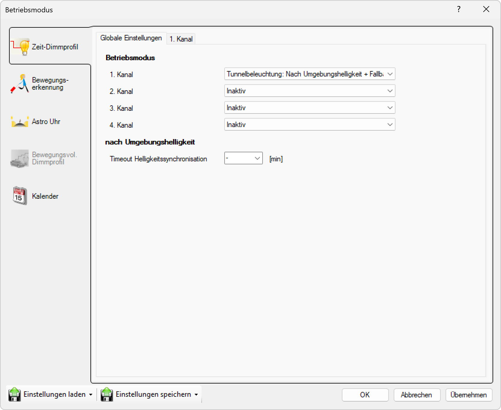

# Tunnelbeleuchtung nach Umgebungshelligkeit mit Fallback auf Astro-Uhr

**Tunnelbeleuchtung nach Umgebungshelligkeit mit Fallback auf Astro-Uhr**

Wählen Sie diesen Modus für spezialisierte Tunnelbeleuchtung, die primär auf Umgebungshelligkeit reagiert, aber bei Ausfall des Lichtsensors automatisch auf astronomische Zeiten zurückgreift. Diese Konfiguration kombiniert die Sicherheitsvorteile der Tunnelbeleuchtung mit maximaler Ausfallsicherheit und niemals vollständiger Abschaltung.

## Hauptbereiche

### 1. Zeit-Dimmprofil

- Dieser Bereich ist aktuell aktiv, wie durch das hervorgehobene Symbol auf der linken Seite angezeigt
- Wird verwendet, um zeitbasierte Dimmprofile für jeden Kanal einzurichten

### 2. Globale Einstellungen

- Der Hauptbereich zeigt globale Betriebsmodus-Einstellungen für alle Kanäle an

## Betriebsmodus-Optionen

Für jeden der vier Kanäle (1. Kanal, 2. Kanal, 3. Kanal, 4. Kanal) können Sie einen Betriebsmodus aus einem Dropdown-Menü auswählen. Die verfügbaren Einstellungen sind:

- **Tunnelbeleuchtung nach Umgebungshelligkeit mit Fallback auf Astro-Uhr**: Der Kanal nutzt primär Helligkeitssensor mit Astro-Uhr als Backup, niemals vollständig ausgeschaltet
- **Inaktiv**: Der Kanal ist ausgeschaltet oder nicht in Gebrauch

In diesem Fenster:
- **1. Kanal**: Auf "Tunnelbeleuchtung nach Umgebungshelligkeit mit Fallback auf Astro-Uhr" eingestellt
- **2.–4. Kanal**: Auf "Inaktiv" eingestellt

## Tunnelbeleuchtung-Fallback-Einstellungen (Umgebungshelligkeit mit Astro-Uhr)

Für Kanäle, die auf den Tunnelbeleuchtung-Fallback-Modus eingestellt sind, können Sie folgende Parameter konfigurieren:

### Primäre Helligkeitssteuerung
- **Basishelligkeit**: Minimales Dimmlevel, das immer aufrechterhalten wird (niemals 0%)
- **Vollhelligkeit**: Maximales Dimmlevel bei niedrigster Umgebungshelligkeit
- **Helligkeitsschwelle**: Lichtwert, bei dem zwischen Basis- und Vollhelligkeit umgeschaltet wird
- **Timeout Helligkeitssynchronisation**: Zeitintervall für die Helligkeitssynchronisation
- **Sensor-Timeout**: Zeitspanne, nach der bei Sensorausfall auf Astro-Uhr umgeschaltet wird

### Fallback Astro-Uhr
- **Geografische Position**: Längen- und Breitengrad für die Berechnung der Sonnenzeiten
- **Zeitversatz Einschalten**: Offset zur berechneten Sonnenuntergangszeit (z.B. +30 Minuten)
- **Zeitversatz Ausschalten**: Offset zur berechneten Sonnenaufgangszeit (z.B. -15 Minuten)
- **Sommer-/Winterzeitumstellung**: Automatische Berücksichtigung der Zeitumstellung

Diese Konfiguration gewährleistet maximale Sicherheit für Tunnelbeleuchtung, die bei optimaler Funktion auf aktuelle Lichtverhältnisse reagiert, aber bei Sensorproblemen nahtlos auf berechenbare astronomische Zeiten umschaltet, ohne jemals die Grundbeleuchtung zu verlieren.

## Seitennavigation

- **Zeit-Dimmprofil**: Zeitbasiertes Dimmprofil (aktiv)
- **Bewegungserkennung**: Bewegungserkennungseinstellungen (ausgegraut/inaktiv)
- **Astro Uhr**: Astronomische Uhreneinstellungen (ausgegraut/inaktiv)
- **Bewegungsvoll. Dimmprofil**: Bewegungsgesteuertes Dimmprofil (ausgegraut/inaktiv)
- **Kalender**: Kalenderbasierte Zeitplanung

## Untere Bedienelemente

- **Einstellungen laden**: Einstellungen aus einer Datei oder einem Profil laden
- **Einstellungen speichern**: Aktuelle Einstellungen in einer Datei oder einem Profil speichern
- **OK**: Alle Änderungen bestätigen und anwenden
- **Abbrechen**: Abbrechen und Fenster ohne Speichern der Änderungen schließen
- **Übernehmen**: Änderungen anwenden ohne das Fenster zu schließen