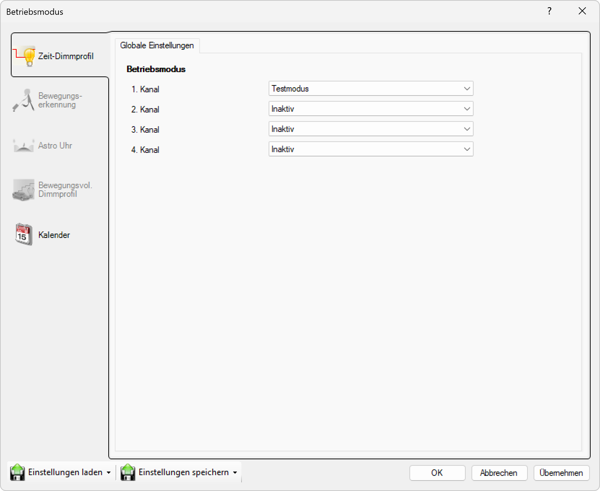

# Testmodus

> # ⚠  
> Testmodus

  
*Wählen Sie das Gerät zum Testen in der Liste aus.*

**Testmodus**

Im Testmodus kann die Helligkeit der Leuchte manuell eingestellt werden, indem der Schieberegler bewegt wird. Alle anderen Funktionen (Dimmprofil / Bewegungsmelder) sind in diesem Modus deaktiviert.

> # ⚠  
> Die eingestellte Helligkeit wird im Testmodus nicht gespeichert und geht bei einem Neustart der Steuerung verloren!  