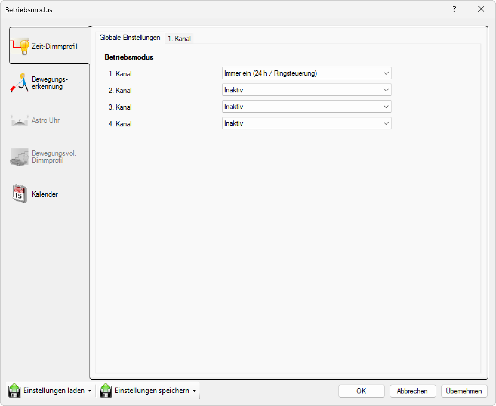

# Immer Ein (24h / Ringsteuerung)
  

**Immer ein (24 Stunden)**  

Die Leuchte ist immer betriebsbereit und **leuchtet**, wenn Sie an eine Stromversorgung angeschlossen ist. Viele Gemeinden oder Städte schalten die Leuchten zentral über ein Signal oder Ringsteuerung ein und aus. In diesem Fall sollte die Betriebsart "Immer ein" verwendet werden. Dies ist der gängigste Modus, der in Mittel- und Westeuropa verwendet wird.  

  
*Wählen Sie Testmodus. Dieser Modus ist in erster Linie dazu gedacht, die Helligkeit einer Leuchte bei verschiedenen Dimmwerten zu testen und sollte nicht im täglichen Betrieb verwendet werden.*  

  
*Nun können Sie in Gerärekonfiguration mit dem Schieberegler die Helligkeit einstellen. (1.Kanal Manuell)*