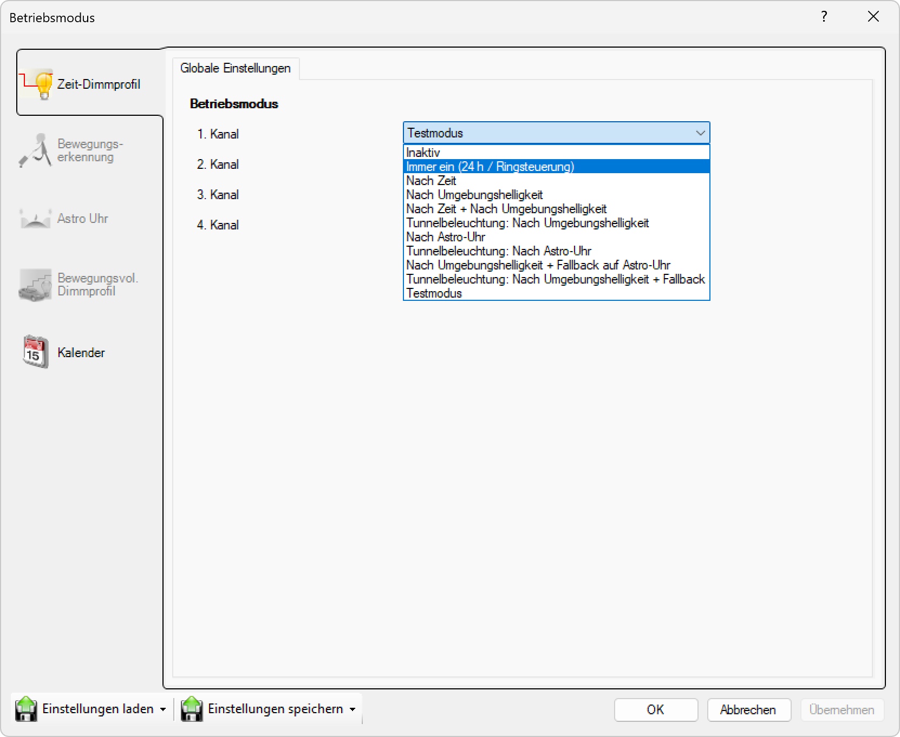
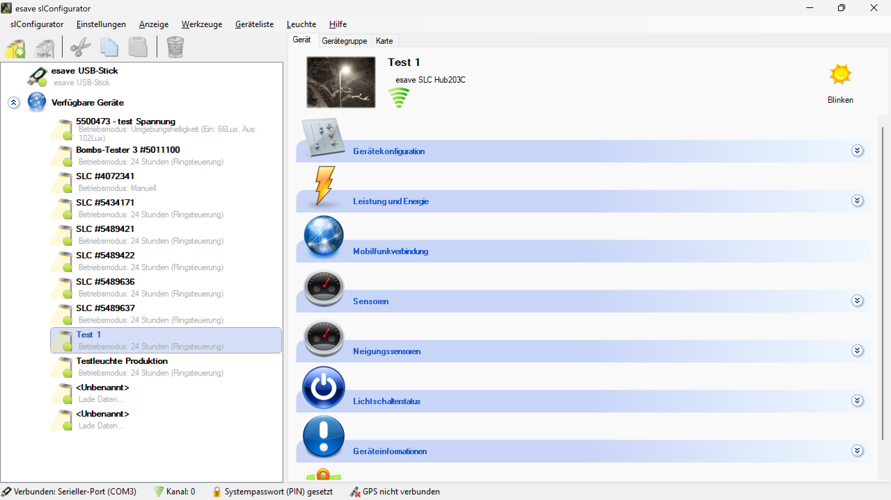
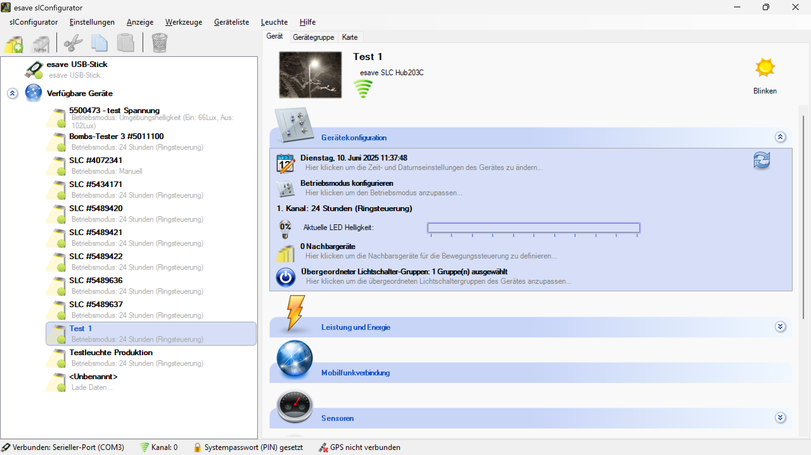
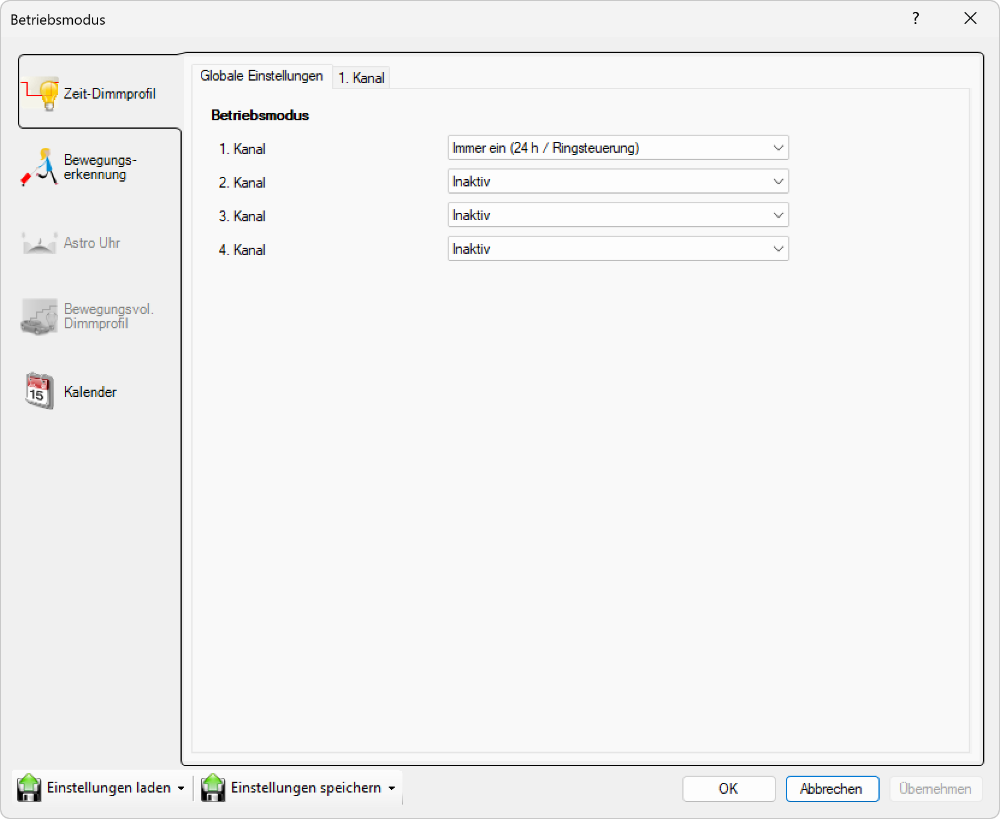
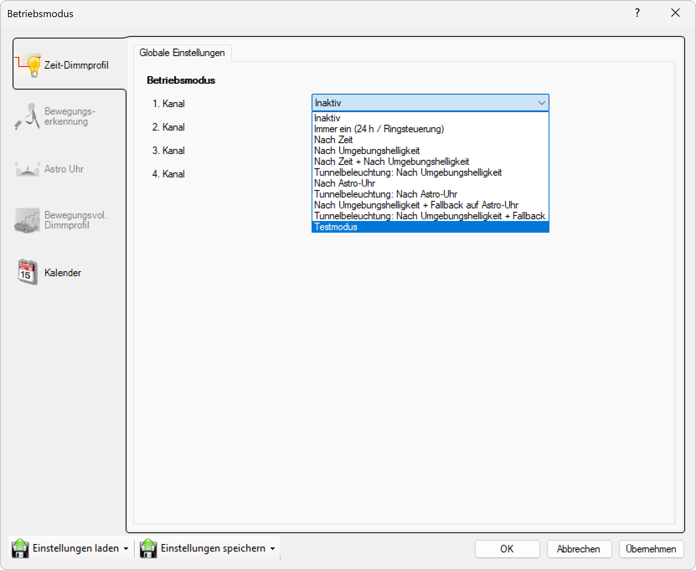
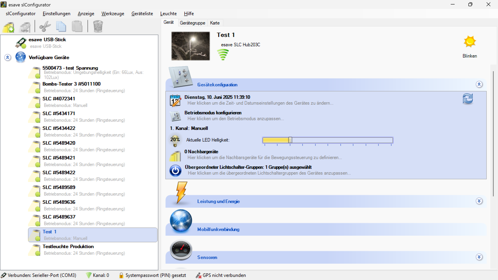

# Immer Ein
  

**Immer ein (24 Stunden)**  

Die Leuchte ist immer betriebsbereit und **leuchtet**, wenn Sie an eine Stromversorgung angeschlossen ist. Viele Gemeinden oder Städte schalten die Leuchten zentral über ein Signal oder Ringsteuerung ein und aus. In diesem Fall sollte die Betriebsart "Immer ein" verwendet werden. Dies ist der gängigste Modus, der in Mittel- und Westeuropa verwendet wird.  

**Nach Zeit**  

Wählen Sie diesen Modus, um die Leuchte zu einer bestimmten Zeit ein- und auszuschalten.

---

**Nach Umgebungshelligkeit**  

Wählen Sie diesen Modus, um die Leuchte je nach Umgebungshelligkeit (Lichtsensor) ein- und auszuschalten. Dieser Modus kann mit dem Zeitmodus kombiniert werden.  

---

**Nach Zeit + Umgebungshelligkeit**  

---

**Tunnelbeleuchtung - Nach Umgebungshelligkeit**  

Im Tunnelmodus wird das Dimmlevel auf den Wert der Basishelligkeit zurückgestellt, wenn die Helligkeit zum Einschalten nicht erreicht ist. Dies im Gegensatz zum Normalverhalten bei dem in diesem Fall ausgeschalten wird.  

---

**Nach Asto-Uhr**  

---

**Tunnelbeleuchtung: Nach Astro-Uhr**  

---

**Nach Umgebungshelligkeit + Fallback auf Astro-Uhr**  

---

**Tunnelbeleuchtung: Nach Umgebungshelligkeit + Fallback auf Astro-Uhr**

---

**Testmodus**

Im Testmodus kann die Helligkeit der Leuchte manuell eingestellt werden, indem der Schieberegler bewegt wird. Alle anderen Funktionen (Dimmprofil / Bewegungsmelder) sind in diesem Modus deaktiviert.

> # ⚠  
> Die eingestellte Helligkeit wird im Testmodus nicht gespeichert und geht bei einem Neustart der Steuerung verloren!  

  
*Wählen Sie das Gerät zum Testen in der Liste aus.*  

  
*In Gerätekonfiguration wählen sie Betriebsmodus konfigurieren.*  

  
*in Zeit/Dimmprofil, Globale Einstellungen können die Betriebsmodi ausgesucht werden, auf bis zu Vier Kanälen.*  

  
*Wählen Sie Testmodus. Dieser Modus ist in erster Linie dazu gedacht, die Helligkeit einer Leuchte bei verschiedenen Dimmwerten zu testen und sollte nicht im täglichen Betrieb verwendet werden.*  

  
*Nun können Sie in Gerärekonfiguration mit dem Schieberegler die Helligkeit einstellen. (1.Kanal Manuell)*