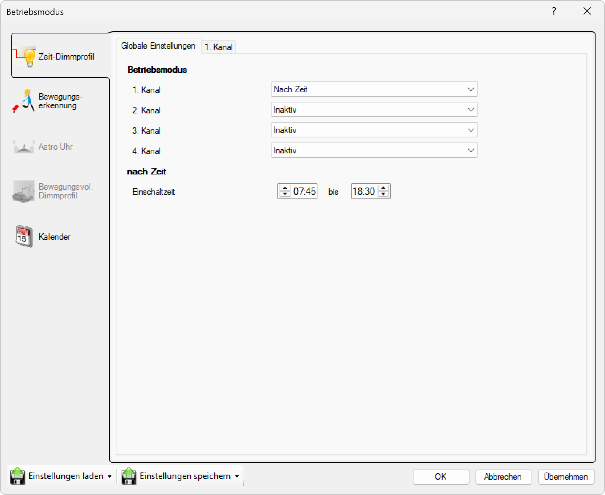

# Nach Zeit

**Nach Zeit**

Wählen Sie diesen Modus, um die Leuchte zu einer bestimmten Zeit ein- und auszuschalten.

## Hauptbereiche

1. **Zeit-Dimmprofil**
   - Aktiver Bereich: Dieser Bereich ist aktuell ausgewählt und ermöglicht die Konfiguration der Beleuchtung oder Geräte nach einem Zeitplan.

2. **Tab-Navigation**
   - Globale Einstellungen: Allgemeine Einstellungen für alle Kanäle.
   - 1. Kanal: Spezifische Einstellungen für den ersten Kanal werden angezeigt.

## Betriebsmodus-Optionen

Für jeden der vier Kanäle können Sie einen Betriebsmodus aus einem Dropdown-Menü auswählen:

- **Nach Zeit**: Aktiviert den Kanal basierend auf einem bestimmten Zeitplan.
- **Inaktiv**: Der Kanal ist ausgeschaltet oder nicht in Gebrauch.

In diesem Fenster:
- **1. Kanal**: Auf "Nach Zeit" eingestellt.
- **2.–4. Kanal**: Auf "Inaktiv" eingestellt.

## Zeitbasierte Einstellungen (nach Zeit)

Für den ersten Kanal können Sie den genauen Zeitbereich festlegen, in dem er aktiv sein soll:

- **Einschaltzeit**: Bestimmt, wann der Kanal eingeschaltet wird (z.B. 07:45).
- **bis**: Bestimmt, wann der Kanal ausgeschaltet wird (z.B. 18:30).

Dies ermöglicht eine präzise Zeitplanung für die Automatisierung, wie z.B. das Einschalten von Lichtern am Morgen und das Ausschalten am Abend.

## Seitennavigation

- **Zeit-Dimmprofil**: Zeitbasiertes Dimmprofil (aktuell aktiv).
- **Bewegungserkennung**: Bewegungserkennungseinstellungen.
- **Astro Uhr**: Astronomische Uhreneinstellungen (inaktiv).
- **Bewegungsvoll. Dimmprofil**: Bewegungsgesteuertes Dimmprofil (inaktiv).
- **Kalender**: Kalenderbasierte Zeitplanung.

## Untere Bedienelemente

- **Einstellungen laden**: Konfiguration aus einer Datei oder einem Profil laden.
- **Einstellungen speichern**: Aktuelle Konfiguration speichern.
- **OK**: Alle Änderungen bestätigen und anwenden.
- **Abbrechen**: Abbrechen und Fenster ohne Speichern schließen.
- **Übernehmen**: Änderungen anwenden ohne das Fenster zu schließen.