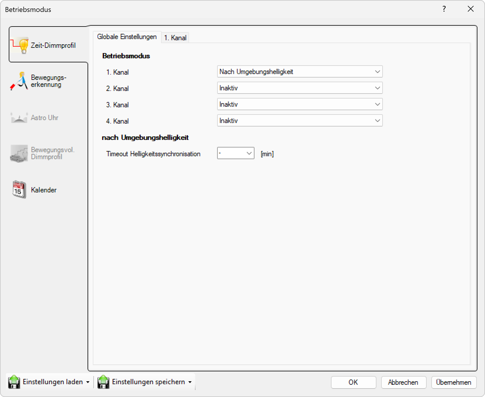

# Nach Umgebungshelligkeit

> # ⚠  
> Modus Nach Umgebungshelligkeit

  
*Wählen Sie das Gerät zum Testen in der Liste aus.*

**Nach Umgebungshelligkeit**  

Wählen Sie diesen Modus, um die Leuchte je nach Umgebungshelligkeit (Lichtsensor) ein- und auszuschalten. Dieser Modus kann mit dem Zeitmodus kombiniert werden.  