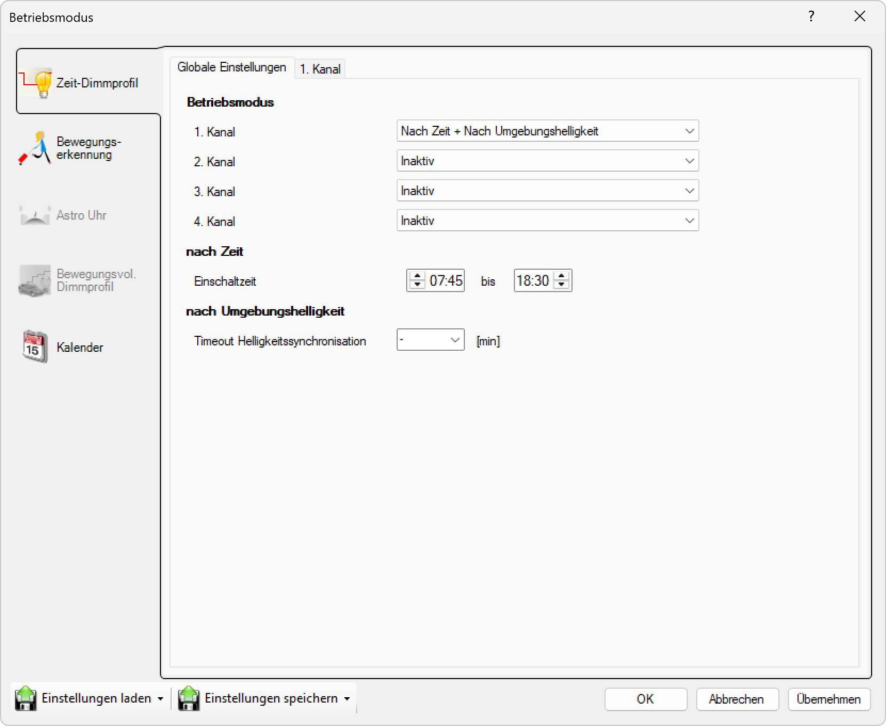

# Nach Zeit und Umgebungshelligkeit

**Nach Zeit und Umgebungshelligkeit**

Wählen Sie diesen Modus, um die Leuchte basierend auf einer Kombination aus Zeitplan und Umgebungshelligkeit (Lichtsensor) zu steuern. Diese Kombination bietet optimale Flexibilität und Energieeffizienz.

## Hauptbereiche

### 1. Zeit-Dimmprofil

- Dieser Bereich ist aktuell aktiv, wie durch das hervorgehobene Symbol auf der linken Seite angezeigt
- Wird verwendet, um zeitbasierte Dimmprofile für jeden Kanal einzurichten

### 2. Globale Einstellungen

- Der Hauptbereich zeigt globale Betriebsmodus-Einstellungen für alle Kanäle an

## Betriebsmodus-Optionen

Für jeden der vier Kanäle (1. Kanal, 2. Kanal, 3. Kanal, 4. Kanal) können Sie einen Betriebsmodus aus einem Dropdown-Menü auswählen. Die verfügbaren Einstellungen sind:

- **Nach Zeit und Umgebungshelligkeit**: Der Kanal wird basierend auf einer Kombination aus Zeitplan und gemessener Umgebungslichtstärke aktiviert
- **Inaktiv**: Der Kanal ist ausgeschaltet oder nicht in Gebrauch

In diesem Fenster:
- **1. Kanal**: Auf "Nach Zeit und Umgebungshelligkeit" eingestellt
- **2.–4. Kanal**: Auf "Inaktiv" eingestellt

## Kombinierte Einstellungen (nach Zeit und Umgebungshelligkeit)

Für Kanäle, die auf den kombinierten Modus eingestellt sind, können Sie sowohl zeitbasierte als auch helligkeitsbasierte Parameter konfigurieren:

- **Einschaltzeit**: Bestimmt, wann der Kanal frühestens eingeschaltet werden kann (z.B. 18:00)
- **Ausschaltzeit**: Bestimmt, wann der Kanal spätestens ausgeschaltet wird (z.B. 06:00)
- **Helligkeitsschwelle**: Definiert den Lichtwert, bei dem der Kanal aktiviert wird
- **Timeout Helligkeitssynchronisation**: Bestimmt das Zeitintervall für die Helligkeitssynchronisation

Diese Kombination ermöglicht es, dass die Beleuchtung nur zu bestimmten Zeiten und bei entsprechend niedriger Umgebungshelligkeit aktiviert wird, was eine optimale Balance zwischen Komfort und Energieeffizienz bietet.

## Seitennavigation

- **Zeit-Dimmprofil**: Zeitbasiertes Dimmprofil (aktiv)
- **Bewegungserkennung**: Bewegungserkennungseinstellungen (ausgegraut/inaktiv)
- **Astro Uhr**: Astronomische Uhreneinstellungen (ausgegraut/inaktiv)
- **Bewegungsvoll. Dimmprofil**: Bewegungsgesteuertes Dimmprofil (ausgegraut/inaktiv)
- **Kalender**: Kalenderbasierte Zeitplanung

## Untere Bedienelemente

- **Einstellungen laden**: Einstellungen aus einer Datei oder einem Profil laden
- **Einstellungen speichern**: Aktuelle Einstellungen in einer Datei oder einem Profil speichern
- **OK**: Alle Änderungen bestätigen und anwenden
- **Abbrechen**: Abbrechen und Fenster ohne Speichern der Änderungen schließen
- **Übernehmen**: Änderungen anwenden ohne das Fenster zu schließen