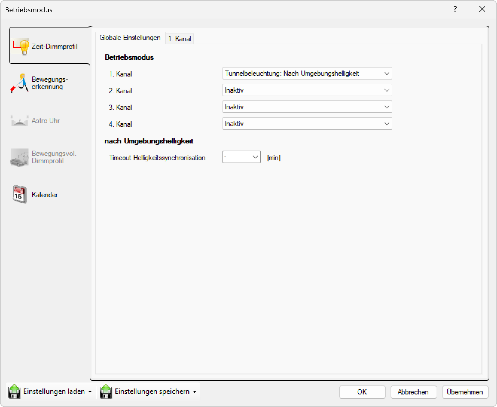

# Tunnelbeleuchtung nach Umgebungshelligkeit

> # ⚠  
> Modus Tunnelbeleuchtung nach Umgebungshelligkeit

  
*Wählen Sie das Gerät zum Testen in der Liste aus.*

**Tunnelbeleuchtung - Nach Umgebungshelligkeit**  

Im Tunnelmodus wird das Dimmlevel auf den Wert der Basishelligkeit zurückgestellt, wenn die Helligkeit zum Einschalten nicht erreicht ist. Dies im Gegensatz zum Normalverhalten bei dem in diesem Fall ausgeschalten wird.  