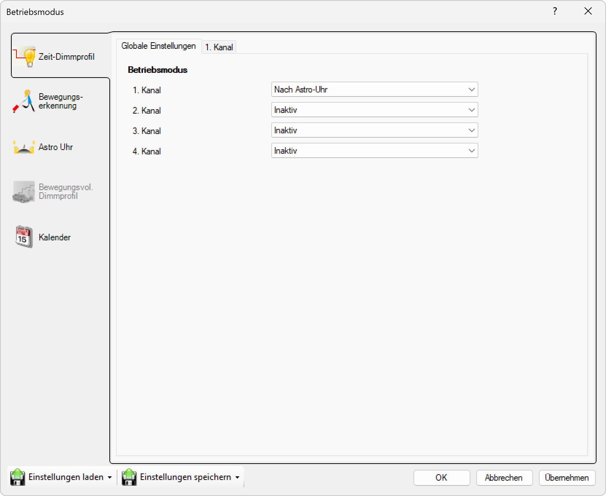

# Nach Astro-Uhr

**Nach Astro-Uhr**

Wählen Sie diesen Modus, um die Leuchte basierend auf astronomischen Zeiten zu steuern. Die Astro-Uhr berechnet automatisch Sonnenaufgang und Sonnenuntergang basierend auf der geografischen Position und schaltet die Beleuchtung entsprechend ein und aus.

## Hauptbereiche

### 1. Zeit-Dimmprofil

- Dieser Bereich ist aktuell aktiv, wie durch das hervorgehobene Symbol auf der linken Seite angezeigt
- Wird verwendet, um zeitbasierte Dimmprofile für jeden Kanal einzurichten

### 2. Globale Einstellungen

- Der Hauptbereich zeigt globale Betriebsmodus-Einstellungen für alle Kanäle an

## Betriebsmodus-Optionen

Für jeden der vier Kanäle (1. Kanal, 2. Kanal, 3. Kanal, 4. Kanal) können Sie einen Betriebsmodus aus einem Dropdown-Menü auswählen. Die verfügbaren Einstellungen sind:

- **Nach Astro-Uhr**: Der Kanal wird basierend auf astronomischen Zeiten (Sonnenaufgang/Sonnenuntergang) aktiviert
- **Inaktiv**: Der Kanal ist ausgeschaltet oder nicht in Gebrauch

In diesem Fenster:
- **1. Kanal**: Auf "Nach Astro-Uhr" eingestellt
- **2.–4. Kanal**: Auf "Inaktiv" eingestellt

## Astro-Uhr-Einstellungen (nach Astro-Uhr)

Für Kanäle, die auf den Astro-Uhr-Modus eingestellt sind, können Sie folgende Parameter konfigurieren:

- **Geografische Position**: Längen- und Breitengrad für die Berechnung der Sonnenzeiten
- **Zeitversatz Einschalten**: Offset zur berechneten Sonnenuntergangszeit (z.B. +30 Minuten)
- **Zeitversatz Ausschalten**: Offset zur berechneten Sonnenaufgangszeit (z.B. -15 Minuten)
- **Sommer-/Winterzeitumstellung**: Automatische Berücksichtigung der Zeitumstellung

Diese Konfiguration ermöglicht eine natürliche Beleuchtungssteuerung, die sich automatisch an die jahreszeitlichen Veränderungen der Tageslänge anpasst und keine manuelle Anpassung der Schaltzeiten erfordert.

## Seitennavigation

- **Zeit-Dimmprofil**: Zeitbasiertes Dimmprofil (aktiv)
- **Bewegungserkennung**: Bewegungserkennungseinstellungen (ausgegraut/inaktiv)
- **Astro Uhr**: Astronomische Uhreneinstellungen (ausgegraut/inaktiv)
- **Bewegungsvoll. Dimmprofil**: Bewegungsgesteuertes Dimmprofil (ausgegraut/inaktiv)
- **Kalender**: Kalenderbasierte Zeitplanung

## Untere Bedienelemente

- **Einstellungen laden**: Einstellungen aus einer Datei oder einem Profil laden
- **Einstellungen speichern**: Aktuelle Einstellungen in einer Datei oder einem Profil speichern
- **OK**: Alle Änderungen bestätigen und anwenden
- **Abbrechen**: Abbrechen und Fenster ohne Speichern der Änderungen schließen
- **Übernehmen**: Änderungen anwenden ohne das Fenster zu schließen