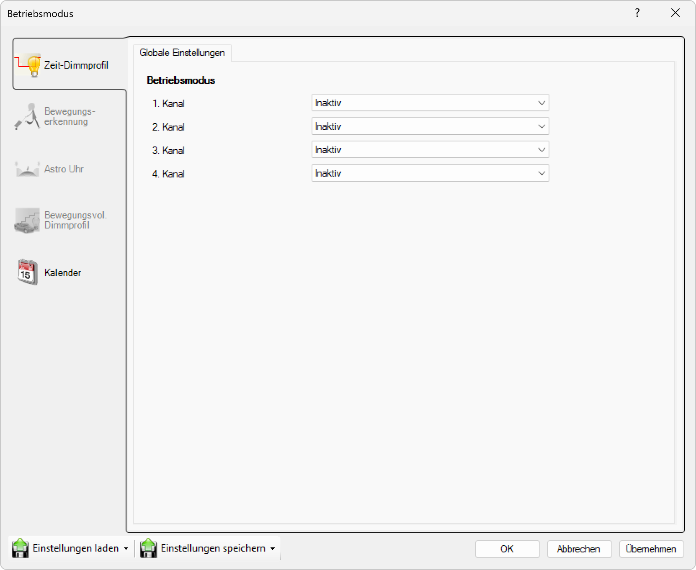

# Globale Einstellungen

**Globale Einstellungen - Zeit-Dimmprofil Betriebsmodus-Konfiguration**

Konfigurieren Sie die grundlegenden Betriebsmodusparameter für bis zu 4 unabhängige Dimmkanäle Ihres esave Lighting Controllers. Diese globalen Einstellungen definieren die Anzahl und Art der aktiven Steuerungskanäle für differenzierte Beleuchtungssteuerung mit Multi-Channel-Support.

## Hauptbereiche

### 1. Betriebsmodus-Navigation

Die linke Navigationsleiste bietet Zugang zu allen Betriebsmodus-Bereichen:
- **Zeit-Dimmprofil**: Zeitbasierte Dimmprofile mit globalen Einstellungen (aktuell aktiv)
- **Bewegungserkennung**: Sensor-basierte Aktivierungssteuerung
- **Astro Uhr**: Astronomiebasierte Tag/Nacht-Zyklen
- **Bewegungsvolles Dimmprofil**: Adaptive Dimmung mit Bewegungsintegration
- **Kalender**: Terminbasierte Sonderprogramme und Ereignissteuerung

### 2. Kanal-Konfiguration

Das Hauptfenster zeigt die 4-Kanal-Betriebsmodus-Matrix:
- **Kanal-Auswahl**: 1. bis 4. Kanal für unabhängige Steuerung
- **Betriebsmodus-Dropdown**: Individuelle Modusauswahl pro Kanal
- **Hierarchische Steuerung**: Übergeordnete Einstellungen für alle Kanäle
- **Flexible Konfiguration**: Beliebige Kombination verschiedener Betriebsmodi

## Multi-Channel-Architektur

### 4-Kanal-System

**1. Kanal:** Inaktiv (Dropdown-Auswahl)
- **Status**: Aktuell deaktiviert, verfügbar für Konfiguration
- **Flexibilität**: Beliebiger Betriebsmodus aus vollständiger Auswahlliste
- **Anwendung**: Primärkanal für Hauptbeleuchtung oder spezielle Funktionen
- **Konfiguration**: Vollständig anpassbar über Dropdown-Menü

**2. Kanal:** Inaktiv (Dropdown-Auswahl)
- **Status**: Sekundärkanal bereit für unabhängige Konfiguration
- **Einsatz**: Akzentbeleuchtung, Sicherheitsbeleuchtung oder Notlicht
- **Steuerung**: Parallel zum 1. Kanal mit eigenständigen Parametern
- **Integration**: Koordinierte oder unabhängige Steuerung möglich

**3. Kanal:** Inaktiv (Dropdown-Auswahl)
- **Status**: Tertiärkanal für erweiterte Beleuchtungsszenarien
- **Anwendung**: RGB-Farbsteuerung, Effektbeleuchtung oder Zonierung
- **Flexibilität**: Völlig unabhängige Betriebsparameter
- **Skalierung**: Optional aktivierbar bei Bedarf

**4. Kanal:** Inaktiv (Dropdown-Auswahl)
- **Status**: Quaternärkanal für komplexe Installationen
- **Spezialfunktionen**: Externe Steuerung, Protokoll-Bridging oder Backup
- **Maximalausbau**: Vollständige 4-Kanal-Kapazität des Controllers
- **Reservekanal**: Verfügbar für zukünftige Erweiterungen

### Verfügbare Betriebsmodi

**Dropdown-Optionen für jeden Kanal:**

**Inaktiv**
- **Standard-Zustand**: Kanal ist deaktiviert und verbraucht keine Ressourcen
- **Energieeffizienz**: Minimaler Stromverbrauch bei ungenutzten Kanälen
- **Flexibilität**: Jederzeit aktivierbar für neue Anforderungen

**Immer Ein**
- **Dauerbetrieb**: Kontinuierliche Beleuchtung ohne Zeitsteuerung
- **Anwendung**: Sicherheitsbeleuchtung, Notbeleuchtung, Dauerarbeitsplätze
- **Energieverbrauch**: Konstanter Stromverbrauch, keine automatische Abschaltung

**Nach Zeit**
- **Zeitprogramm**: Schaltung basierend auf festen Uhrzeiten
- **Wochenprogramm**: Verschiedene Programme für Wochentage und Wochenende
- **Saisonale Anpassung**: Automatische Anpassung an Sommer-/Winterzeit

**Nach Umgebungshelligkeit**
- **Lichtsensor-Steuerung**: Automatische Aktivierung basierend auf Umgebungslicht
- **Schwellenwerte**: Konfigurierbare Lux-Werte für Ein-/Ausschaltung
- **Wetteranpassung**: Adaptives Verhalten bei wechselnden Lichtverhältnissen

**Nach Zeit und Umgebungshelligkeit**
- **Kombinierte Steuerung**: Zeit- und lichtbasierte Aktivierung
- **Intelligente Logik**: UND/ODER-Verknüpfung der Aktivierungsbedingungen
- **Optimierte Effizienz**: Berücksichtigung beider Faktoren für optimale Beleuchtung

**Tunnelbeleuchtung nach Umgebungshelligkeit**
- **Spezialanwendung**: Optimiert für Tunnel- und Unterführungsbeleuchtung
- **Sicherheitsstandards**: Erfüllung von Tunnelbeleuchtungs-Normen
- **Adaptive Helligkeit**: Stufenlose Anpassung an Außenlichtbedingungen

**Nach Astro-Uhr**
- **Astronomische Berechnung**: Sonnenauf-/untergangszeiten basierte Steuerung
- **GPS-Integration**: Automatische Berechnung für Standortkoordinaten
- **Saisonale Anpassung**: Automatische Anpassung an jahreszeitliche Veränderungen

**Tunnelbeleuchtung nach Astro-Uhr**
- **Tunnel-spezifische Astro-Steuerung**: Kombiniert astronomische Zeiten mit Tunnelspezifikationen
- **Übergangszeiten**: Sanfte Übergänge zwischen Tag- und Nachtbeleuchtung
- **Sicherheitskonformität**: Erfüllung von Tunnelsicherheitsstandards

**Nach Umgebungshelligkeit mit Fallback auf Astro-Uhr**
- **Redundante Steuerung**: Primär lichtbasiert, sekundär zeitbasiert
- **Ausfallsicherheit**: Automatisches Fallback bei Sensorfehlfunktionen
- **Robuste Funktion**: Garantierte Beleuchtungssteuerung auch bei Defekten

**Tunnelbeleuchtung nach Umgebungshelligkeit mit Fallback auf Astro-Uhr**
- **Tunnel-Redundanz**: Höchste Zuverlässigkeit für kritische Tunnel-Infrastruktur
- **Doppelte Sicherheit**: Kombination aus Licht- und Zeitsensoren
- **Normenkonformität**: Erfüllung höchster Sicherheitsstandards

**Testmodus**
- **Diagnose-Funktion**: Spezielle Modi für Wartung und Funktionsprüfung
- **Manuelle Steuerung**: Vollständige manuelle Kontrolle für Tests
- **Validierung**: Überprüfung aller Systemfunktionen

## Kanal-Strategien und Anwendungen

### Single-Channel-Betrieb

**Minimalkonfiguration (1 Kanal aktiv):**
- **Anwendung**: Einfache Ein-/Aus-Steuerung für Standard-Beleuchtung
- **Ressourceneffizienz**: Minimaler Verbrauch von Controller-Ressourcen
- **Einfachheit**: Unkomplizierte Konfiguration und Wartung
- **Kosteneffizienz**: Reduzierte Komplexität für einfache Installationen

### Dual-Channel-Betrieb

**Zwei-Kanal-Konfiguration:**
- **Anwendung**: Haupt- und Akzentbeleuchtung mit unabhängiger Steuerung
- **Beispiel**: Kanal 1 = Arbeitsplatzbeleuchtung, Kanal 2 = Sicherheitsbeleuchtung
- **Flexibilität**: Verschiedene Betriebsmodi pro Kanal möglich
- **Energieoptimierung**: Separate Optimierung für verschiedene Beleuchtungstypen

### Tri-Channel-Betrieb

**Drei-Kanal-System:**
- **RGB-Steuerung**: Separate Kanäle für Rot, Grün, Blau bei Farbbeleuchtung
- **Zonierung**: Verschiedene Bereiche mit unabhängigen Steuerungsprogrammen
- **Hierarchische Beleuchtung**: Grund-, Arbeits- und Akzentbeleuchtung
- **Szenario-Management**: Drei verschiedene Beleuchtungsszenarien

### Quad-Channel-Betrieb

**Vollausbau (4 Kanäle):**
- **RGBW-Steuerung**: Vollspektrum-Farbsteuerung mit separatem Weißkanal
- **Komplexe Zonierung**: Vier unabhängige Beleuchtungszonen
- **Multi-Protokoll**: Verschiedene Kommunikationsprotokolle pro Kanal
- **Maximale Flexibilität**: Höchste Anpassungsfähigkeit für komplexe Anforderungen

## Konfigurationsstrategien

### Homogene Konfiguration

**Alle Kanäle gleicher Modus:**
- **Redundanz**: Erhöhte Ausfallsicherheit durch parallele Kanäle
- **Load-Balancing**: Verteilung der Last auf mehrere Kanäle
- **Skalierung**: Höhere Gesamtleistung durch Parallel-Betrieb
- **Vereinfachung**: Einheitliche Konfiguration für alle Kanäle

### Heterogene Konfiguration

**Verschiedene Modi pro Kanal:**
- **Spezialisierung**: Optimierte Modi für verschiedene Beleuchtungstypen
- **Funktionale Trennung**: Klare Aufgabenteilung zwischen Kanälen
- **Adaptive Steuerung**: Verschiedene Reaktionsmuster für unterschiedliche Anforderungen
- **Maximale Flexibilität**: Optimale Anpassung an komplexe Beleuchtungsszenarien

### Fallback-Strategien

**Backup-Konfiguration:**
- **Primär-/Sekundärkanäle**: Automatisches Fallback bei Kanalausfall
- **Redundante Modi**: Verschiedene Steuerungsarten als Backup
- **Graceful Degradation**: Schrittweise Reduktion bei Komponentenausfällen
- **Mission-Critical**: Ausfallsichere Konfiguration für kritische Anwendungen

## Technische Spezifikationen

### Kanal-Parameter

- **Maximale Kanäle**: 4 unabhängige Steuerungskanäle
- **Auflösung**: 16-Bit Dimmung pro Kanal (65.536 Dimmstufen)
- **Schaltfrequenz**: 1000 Hz PWM für flimmerfreie Dimmung
- **Reaktionszeit**: <1ms zwischen Kanälen für synchrone Steuerung

### Ressourcenverbrauch

- **CPU-Last**: 5-20% je nach Anzahl aktiver Kanäle und Komplexität
- **Speicherbedarf**: 2-8KB RAM pro aktivem Kanal für Profildaten
- **Netzwerk-Traffic**: 10-50 Bytes/s pro Kanal bei MQTT-Kommunikation
- **Energieverbrauch**: 50-200mW Grundverbrauch pro aktivem Kanal

### Kompatibilität

- **DALI-2 Standard**: Vollständige Konformität mit DALI-2 Multi-Channel-Spezifikation
- **Hardware-Support**: Alle esave Controller mit Multi-Channel-Capability
- **Firmware-Mindestversion**: v2.0+ für 4-Kanal-Support
- **Protokoll-Kompatibilität**: MQTT, HTTP, DALI-2, propriäre esave-Protokolle

## Vorteile der Globalen Einstellungen

### Flexibilität und Skalierbarkeit

- **Bedarfsgerechte Konfiguration**: 1-4 Kanäle je nach Anforderung aktivierbar
- **Zukunftssicherheit**: Erweiterbar für komplexere Anforderungen
- **Modulare Architektur**: Unabhängige Kanäle für maximale Flexibilität
- **Anpassbare Komplexität**: Von einfach bis hochkomplex konfigurierbar

### Professionelle Beleuchtungssteuerung

- **Multi-Zone-Management**: Separate Steuerung verschiedener Beleuchtungsbereiche
- **Szenario-Unterstützung**: Verschiedene Beleuchtungsszenarien pro Kanal
- **Energieoptimierung**: Kanalspezifische Optimierung für maximale Effizienz
- **Wartungsfreundlichkeit**: Einfache Diagnose und Wartung pro Kanal

### Integration und Kompatibilität

- **Standard-Konformität**: Erfüllung aller relevanten Beleuchtungsstandards
- **Systemintegration**: Nahtlose Integration in bestehende Beleuchtungsinfrastrukturen
- **Protokoll-Flexibilität**: Unterstützung verschiedener Kommunikationsprotokolle
- **Zukunftssicherheit**: Vorbereitet für kommende Beleuchtungstechnologien

Diese globalen Einstellungen bieten eine professionelle und flexible Grundlage für die Multi-Channel-Steuerung von esave Lighting Controllern mit skalierbarer Komplexität und maximaler Anpassungsfähigkeit an verschiedenste Beleuchtungsanforderungen.