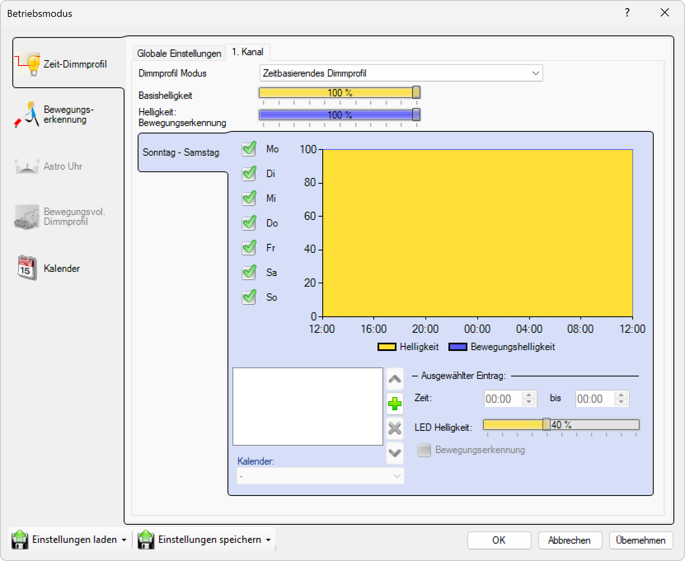

# Zeitbasierendes Dimmprofil

**Zeitbasierendes Dimmprofil**

Konfigurieren Sie individuelle zeitbasierte Dimmprofile für jeden Kanal. Diese Funktion ermöglicht es, spezifische Helligkeitswerte für verschiedene Tageszeiten festzulegen und dadurch eine optimierte Beleuchtungssteuerung zu erreichen.

> ℹ️ **Information**  
> 3 zusätzliche Kanäle verfügbar

## Hauptbereiche

### 1. Zeit-Dimmprofil

- Dieser Bereich ist aktuell aktiv, wie durch das hervorgehobene Symbol auf der linken Seite angezeigt
- Wird verwendet, um zeitbasierte Dimmprofile für jeden Kanal einzurichten

### 2. Per-Kanal-Konfiguration

- Ermöglicht die individuelle Konfiguration jedes Kanals mit spezifischen Dimmprofilen
- Zeigt verfügbare Kanäle und deren aktuelle Einstellungen an

## Kanal-Optionen

Für jeden der vier Kanäle (1. Kanal, 2. Kanal, 3. Kanal, 4. Kanal) können Sie individuelle Dimmprofile konfigurieren:

### Verfügbare Kanaleinstellungen
- **Kanal 1**: Hauptkanal mit vollständigen Dimmprofil-Optionen
- **Kanal 2**: Zusätzlicher Kanal mit individuellen Einstellungen
- **Kanal 3**: Zusätzlicher Kanal mit individuellen Einstellungen
- **Kanal 4**: Zusätzlicher Kanal mit individuellen Einstellungen

## Zeitbasierte Dimmprofil-Einstellungen

Für jeden Kanal können Sie folgende Parameter konfigurieren:

### Zeitpunkte und Helligkeitswerte
- **Startzeit**: Definiert den Beginn eines Dimmzeitraums (z.B. 18:00)
- **Endzeit**: Definiert das Ende eines Dimmzeitraums (z.B. 06:00)
- **Helligkeitswert**: Prozentualer Wert der Lichtstärke für den definierten Zeitraum (0-100%)
- **Übergangsdauer**: Zeit für sanfte Helligkeitsübergänge zwischen verschiedenen Stufen

### Erweiterte Optionen
- **Mehrere Zeitfenster**: Möglichkeit, verschiedene Helligkeitsstufen für unterschiedliche Tageszeiten zu definieren
- **Wochentage**: Separate Profile für verschiedene Wochentage
- **Feiertage**: Spezielle Einstellungen für Feiertage und Wochenenden

Diese Konfiguration ermöglicht eine präzise Steuerung der Beleuchtung entsprechend den täglichen Anforderungen und trägt zur Energieeffizienz bei.

## Seitennavigation

- **Zeit-Dimmprofil**: Zeitbasiertes Dimmprofil (aktiv)
- **Bewegungserkennung**: Bewegungserkennungseinstellungen (ausgegraut/inaktiv)
- **Astro Uhr**: Astronomische Uhreneinstellungen (ausgegraut/inaktiv)
- **Bewegungsvoll. Dimmprofil**: Bewegungsgesteuertes Dimmprofil (ausgegraut/inaktiv)
- **Kalender**: Kalenderbasierte Zeitplanung

## Untere Bedienelemente

- **Einstellungen laden**: Einstellungen aus einer Datei oder einem Profil laden
- **Einstellungen speichern**: Aktuelle Einstellungen in einer Datei oder einem Profil speichern
- **OK**: Alle Änderungen bestätigen und anwenden
- **Abbrechen**: Abbrechen und Fenster ohne Speichern der Änderungen schließen
- **Übernehmen**: Änderungen anwenden ohne das Fenster zu schließen