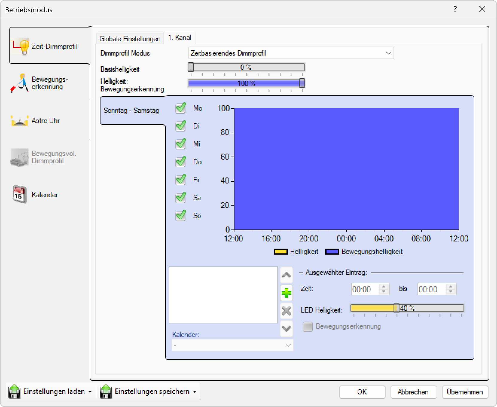

# Zeit Dimmprofil

  
*Auf der Registerkarte Zeit- Dimmprofil können die Helligkeit und die Betriebsdauer der Leuchte eingestellt werden. Eine grafische Darstellung veranschaulicht die Einstellungen und ermöglicht eine einfachere Bearbeitung der Konfiguration.*

**Zeit-Dimmprofil Konfiguration**

Zeitbasierte Helligkeitssteuerung mit flexiblen Dimmstufen für optimierte Beleuchtungsszenarien und energieeffiziente Betriebsmodi.

## Hauptbereiche

### 1. Basishelligkeit
- Grundhelligkeitsdefinition für inaktive Dimmstufen
- Globale Helligkeitsreferenz für alle Zeitprofile
- Oberer Scrollbalken für intuitive Einstellung

### 2. Dimmstufen-Konfiguration
- Zeitabhängige Helligkeitsprofile mit grafischer Darstellung
- Flexible Dimmlevel für verschiedene Tageszeiten
- Bewegungserkennungsintegration für adaptive Beleuchtung

### 3. Wochentags-Gruppierung
- Individuelle Profile für verschiedene Wochentage
- Flexible Gruppierung (Werktage, Wochenende, individuelle Tage)
- Automatische Gruppenbildung bei Deaktivierung

### 4. Grafische Visualisierung
- 24-Stunden-Zeitachse mit visueller Helligkeitsdarstellung
- Farbcodierte Differenzierung (gelb: Standardhelligkeit, blau: Bewegungshelligkeit)
- Interaktive Bearbeitung direkt im Diagramm

## Dimmprofil-Modus

### Zeitbasierendes Dimmprofil
- **Dropdown-Auswahl**: "Zeitbasierendes Dimmprofil" als Hauptmodus
- **Globale Einstellungen**: Systemweite Konfiguration für alle Zeitprofile
- **Kanal-spezifisch**: Konfiguration für "1. Kanal" mit individuellen Einstellungen
- **Modus-Integration**: Nahtlose Integration in bestehende Betriebsmodi

### Basishelligkeit-Konfiguration
- **Primärer Scrollbalken**: Graue Leiste mit 0% Standardwert
- **Sekundärer Scrollbalken**: Blaue Leiste mit 100% Bewegungserkennung
- **Referenzwerte**: Grundlage für alle Dimmstufen-Berechnungen
- **Dynamische Anpassung**: Sofortige Auswirkung auf alle Zeitprofile

## Dimmstufen-Management

### Dimmstufen-Erstellung
- **Hinzufügen**: Grüne "+" Schaltfläche für neue Dimmstufen
- **Zeitraum-Definition**: Flexible Start- und Endzeiten
- **Helligkeits-Einstellung**: Individuelle LED-Helligkeit pro Stufe
- **Bewegungs-Integration**: Optionale Bewegungserkennung pro Stufe

### Dimmstufen-Konfiguration
- **Zeiteinstellung**: "00:00" bis "00:00" für 24-Stunden-Abdeckung
- **LED Helligkeit**: Gelber Scrollbalken mit 40% Standardhelligkeit
- **Bewegungserkennung**: Checkbox für Aktivierung/Deaktivierung
- **Bewegungshelligkeit**: Automatische Helligkeit bei Bewegungserkennung

### Grafische Darstellung
- **Zeitachse**: 12:00 - 16:00 - 20:00 - 00:00 - 04:00 - 08:00 - 12:00
- **Helligkeitsachse**: 0% - 100% vertikale Skala
- **Farbcodierung**: Gelb für Standardhelligkeit, Blau für Bewegungshelligkeit
- **Interaktive Bearbeitung**: Direkte Manipulation der Dimmstufen

## Wochentags-Konfiguration

### Wochentags-Gruppierung
- **Standard-Gruppe**: "Sonntag - Samstag" mit allen Wochentagen
- **Checkbox-Auswahl**: Mo, Di, Mi, Do, Fr, Sa, So individuell aktivierbar
- **Gruppen-Automatik**: Automatische Gruppenbildung bei Deaktivierung
- **Exklusive Zuordnung**: Jeder Wochentag nur in einer Gruppe

### Gruppen-Management
- **Erste Gruppe**: Alle aktivierten Wochentage
- **Neue Gruppen**: Automatische Erstellung bei Deaktivierung
- **Gruppenlogik**: Beispiel "Montag-Freitag" durch Deaktivierung von Sa/So
- **Flexible Konfiguration**: Beliebige Wochentags-Kombinationen

### Profil-Zuordnung
- **Gruppen-spezifisch**: Jede Wochentagsgruppe mit individuellen Dimmstufen
- **Übertragung**: Kopieren von Profilen zwischen Gruppen
- **Validierung**: Sicherstellung konsistenter Konfiguration
- **Synchronisation**: Automatische Anpassung bei Gruppen-Änderungen

## Zeitsteuerung

### Zeitraum-Definition
- **Start-Zeit**: "00:00" Eingabefeld mit Zeitauswahl
- **End-Zeit**: "00:00" Eingabefeld mit "bis" Kennzeichnung
- **24-Stunden-Format**: Vollständige Tagesabdeckung
- **Überlappungs-Prüfung**: Validierung konfliktfreier Zeiträume

### Zeitachsen-Visualisierung
- **Horizontale Achse**: 24-Stunden-Darstellung von 12:00 zu 12:00
- **Zeitmarken**: 4-Stunden-Intervalle (12:00, 16:00, 20:00, 00:00, 04:00, 08:00)
- **Kontinuierliche Anzeige**: Nahtlose Darstellung über Mitternacht
- **Zonenaufteilung**: Klare Abgrenzung verschiedener Dimmstufen

## Helligkeits-Konfiguration

### LED-Helligkeit
- **Grundhelligkeit**: Gelber Scrollbalken mit 40% Standardwert
- **Bewegungshelligkeit**: Automatische Aktivierung bei Bewegungserkennung
- **Prozentuale Angabe**: 0% bis 100% Helligkeitsbereich
- **Sofortige Anwendung**: Direkte Auswirkung auf Beleuchtungsverhalten

### Bewegungserkennung
- **Aktivierung**: Checkbox "Bewegungserkennung" für Ein/Aus
- **Automatische Helligkeit**: Erhöhte Helligkeit bei Bewegung
- **Zeitbasiert**: Bewegungserkennung nur während aktiver Dimmstufen
- **Energieoptimierung**: Reduzierte Helligkeit bei Inaktivität

### Helligkeits-Visualisierung
- **Gelbe Bereiche**: Standardhelligkeit ohne Bewegung
- **Blaue Bereiche**: Erhöhte Helligkeit bei Bewegungserkennung
- **Grafische Darstellung**: Intuitive Visualisierung der Helligkeitsverläufe
- **Echtzeit-Preview**: Sofortige Anzeige von Konfigurationsänderungen

## Kalender-Integration

### Kalender-Auswahl
- **Dropdown-Menü**: "Kalender:" mit Auswahlmöglichkeiten
- **Kalender-Integration**: Verbindung mit externen Kalendersystemen
- **Ereignis-basierte Steuerung**: Automatische Anpassung basierend auf Kalenderereignissen
- **Flexible Zuordnung**: Verschiedene Kalender für verschiedene Profile

### Ereignis-Steuerung
- **Automatische Anpassung**: Profil-Änderungen basierend auf Kalenderereignissen
- **Prioritäts-System**: Kalender-Ereignisse überschreiben Standard-Profile
- **Temporäre Änderungen**: Automatische Rückkehr zu Standard-Profilen
- **Ereignis-Validierung**: Überprüfung der Kalender-Kompatibilität

## Erweiterte Funktionen

### Profil-Bearbeitung
- **Ausgewählter Eintrag**: Blaue Hervorhebung der aktuellen Dimmstufe
- **Inline-Bearbeitung**: Direkte Änderung der Werte im Diagramm
- **Parameter-Panel**: Detaillierte Einstellungen rechts vom Diagramm
- **Validierung**: Automatische Überprüfung der Eingaben

### Kopieren und Übertragen
- **Profil-Kopie**: Übertragung zwischen Wochentags-Gruppen
- **Batch-Bearbeitung**: Gleichzeitige Änderung mehrerer Dimmstufen
- **Template-System**: Wiederverwendbare Konfigurationsvorlagen
- **Export/Import**: Sicherung und Wiederherstellung von Profilen

### Optimierungstools
- **Automatische Optimierung**: Intelligente Vorschläge für Energieeffizienz
- **Konflikt-Erkennung**: Identifikation überlappender Zeiträume
- **Konsistenz-Prüfung**: Validierung der Gesamtkonfiguration
- **Performance-Analyse**: Bewertung der Beleuchtungseffizienz

## Anwendungsszenarien

### Bürogebäude
- **Arbeitszeiten**: Volle Helligkeit während Bürozeiten
- **Pausenzeiten**: Reduzierte Helligkeit für Entspannung
- **Nachtmodus**: Minimale Beleuchtung für Sicherheit
- **Wochenend-Profil**: Energiesparende Grundbeleuchtung

### Einzelhandel
- **Öffnungszeiten**: Optimale Produktpräsentation
- **Schaufenster**: Attraktive Beleuchtung außerhalb der Öffnungszeiten
- **Lager-Bereiche**: Bedarfsgerechte Arbeitsbeleuchtung
- **Sicherheitsbeleuchtung**: Minimale Beleuchtung nach Geschäftsschluss

### Industrieanlagen
- **Schichtbetrieb**: Anpassung an verschiedene Arbeitsschichten
- **Wartungszeiten**: Erhöhte Helligkeit für Wartungsarbeiten
- **Produktionszeiten**: Optimale Beleuchtung für Arbeitsprozesse
- **Sicherheitsrelevant**: Kontinuierliche Mindestbeleuchtung

### Öffentliche Bereiche
- **Tagesrhythmus**: Anpassung an natürliche Lichtverhältnisse
- **Sicherheitsaspekte**: Ausreichende Beleuchtung für Sicherheit
- **Energieeffizienz**: Reduzierte Helligkeit bei geringem Bedarf
- **Veranstaltungen**: Flexible Anpassung an besondere Ereignisse

## Vorteile der Zeit-Dimmprofil-Konfiguration

### Energieeffizienz
- **Bedarfsgerechte Beleuchtung**: Helligkeit nur bei Bedarf
- **Automatische Reduzierung**: Energieeinsparung durch intelligente Steuerung
- **Bewegungsoptimierung**: Vollbeleuchtung nur bei Aktivität
- **Zeitbasierte Steuerung**: Anpassung an Nutzungszeiten

### Benutzerkomfort
- **Intuitive Bedienung**: Grafische Konfiguration ohne komplexe Einstellungen
- **Flexible Anpassung**: Individuelle Profile für verschiedene Szenarien
- **Sofortige Rückmeldung**: Visuelle Darstellung der Konfiguration
- **Einfache Wartung**: Übersichtliche Verwaltung aller Einstellungen

### Systemintegration
- **Kalender-Anbindung**: Automatische Anpassung an Terminpläne
- **Bewegungserkennung**: Intelligente Reaktion auf Aktivitäten
- **Wochentags-Flexibilität**: Unterschiedliche Profile für verschiedene Tage
- **Zentrale Steuerung**: Einheitliche Konfiguration für alle Geräte

> ## ℹ️ Zeit-Dimmprofil Konfiguration
>
> **Zeitbasierte Helligkeitssteuerung mit grafischer Darstellung**
>
> Auf der Registerkarte Zeit-Dimmprofil können die Helligkeit und die Betriebsdauer der Leuchte eingestellt werden. Eine grafische Darstellung veranschaulicht die Einstellungen und ermöglicht eine einfachere Bearbeitung der Konfiguration.
>
> ### Konfigurationsbereiche:
> - **Basishelligkeit**: Grundhelligkeit für inaktive Dimmstufen
> - **Dimmstufen**: Zeitabhängige Helligkeitsprofile mit Bewegungserkennung
> - **Wochentage**: Flexible Gruppierung für verschiedene Tage
> - **Grafische Bearbeitung**: Intuitive Konfiguration über Zeitachsen-Diagramm
> - **Kalender-Integration**: Automatische Anpassung an Kalenderereignisse

*Das Zeit-Dimmprofil ermöglicht eine präzise, benutzerfreundliche und energieeffiziente Konfiguration zeitbasierter Beleuchtungsszenarien mit grafischer Darstellung und flexibler Anpassung an verschiedene Nutzungsanforderungen.*