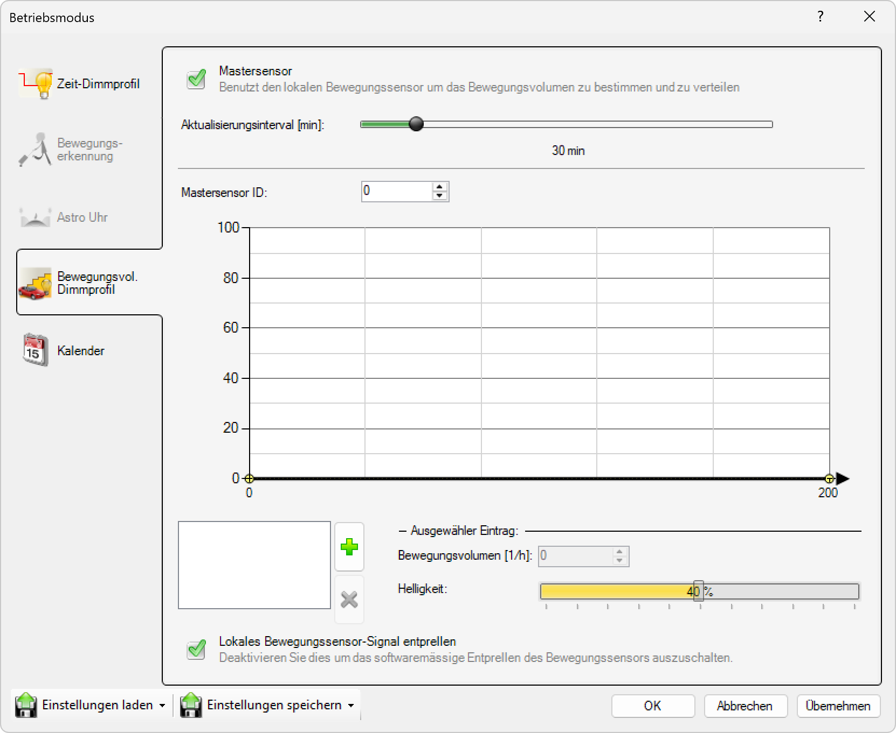

# Bewegungsvolumen-Dimmprofil
  

Ein bewegungsvolumenbasierendes Dimmprofil wird in der Regel auf Straßenabschnitten eingesetzt, auf denen der Verkehr nahezu kontinuierlich ist und es daher nicht sinnvoll ist, auf einzelne Bewegungen zu reagieren.  

Dazu wird eine Stelle definiert, an der das Verkehrsaufkommen (Anzahl der Fahrzeuge pro Stunde) gezählt und an alle Leuchten des betreffenden Abschnitts weitergegeben wird (Mastersensor).  
Die Dimmung ist rein abhängig von der Menge der gezählten Verkehrsbewegungen.  

Folgende Einstellungen sind konfigurierbar:
Mastersensor:
Ist dieses Kästchen angekreuzt, wird das Verkehrsaufkommen an genau dieser Leuchte ermittelt und die Werte im entsprechenden Beleuchtungsabschnitt verteilt.
Aktualisierungsintervall [min]:
Hier wird das Zeitintervall (in Minuten) konfiguriert, in dem das Verkehrsaufkommen ausgewertet werden soll.  

Mastersensor ID:
Die Mastersensor ID definiert die Gruppe von Leuchten, die einem bestimmten Master zugeordnet werden sollen. Die ID muss innerhalb der Beleuchtungsanlage eindeutig sein, eine bestimmte ID kann nur einmal pro Netzwerk verwendet werden.
Der Master sendet das Verkehrsaufkommen und seine ID als Broadcast an das Mesh- Netzwerk. Jede Leuchte mit der gleichen ID erkennt dies und nutzt diesen Wert.  

Basishelligkeit:
Die Basishelligkeit definiert die Helligkeit der Leuchte bei 0 Fahrzeugen pro Stunde bis zum nächsten Schwellenwert.  

Dimmstufen:
Die aktuell eingestellten Dimmstufen werden in der Box links unterhalb der Grafik angezeigt.
Mit einem Klick auf das grüne "+"- Symbol wird eine neue Dimmstufe hinzugefügt.
Der Wert Bewegungsvolumen [1/h] definiert immer die untere Grenze der aktuell ausgewählten Dimmstufe.

># ℹ  
>Wiggle Wiggle.