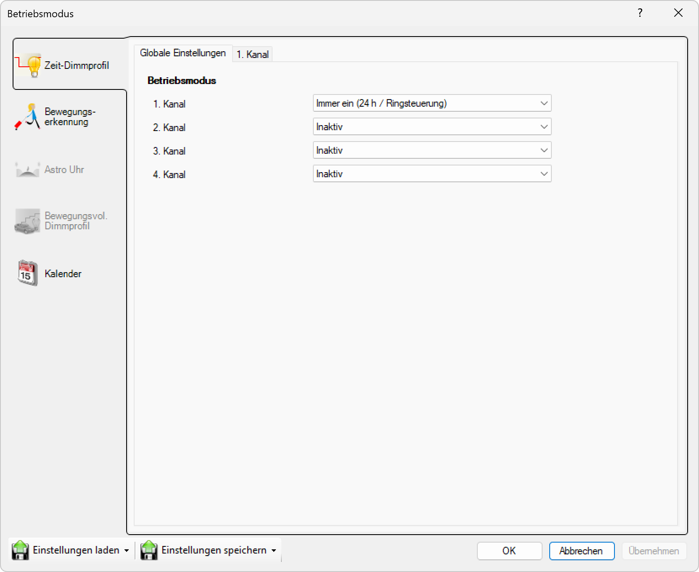

# Einstellungen laden/speichern
  

># ℹ  
>

Benutzerdefinierte Einstellungen können gespeichert und jederzeit importiert werden. Am unteren linken Rand des Fensters befinden sich zwei Menüs für Einstellungen laden und Einstellungen speichern.
Es sind mehrere Optionen verfügbar:
Aus Datei laden / In Datei speichern:
Ermöglicht das Laden oder Speichern der vollständigen Betriebsmodus- Konfiguration von/zu einer Datei auf Ihrem Computer.
Laden/Speichern im lokalen Speicher:
Ermöglicht das Laden oder Speichern der Betriebsmodus- Konfiguration aus dem/im lokalen Speicher. Der lokale Speicher ist ein geschütztes Verzeichnis im Benutzerprofil des angemeldeten Benutzers.
Dieser lokale Speicher kann zum schnellen Speichern oder Importieren von Einstellungen verwendet werden, um die eigene Konfiguration möglichst schnell zu speichern oder zu importieren, ohne sich um den genauen Speicherort/Verzeichnisse von Dateien kümmern zu müssen.
Unter dem Menüpunkt Verfügbare Leuchten können jederzeit die Einstellungen einer anderen Leuchte in Reichweite auf die ausgewählte Leuchte geladen werden.