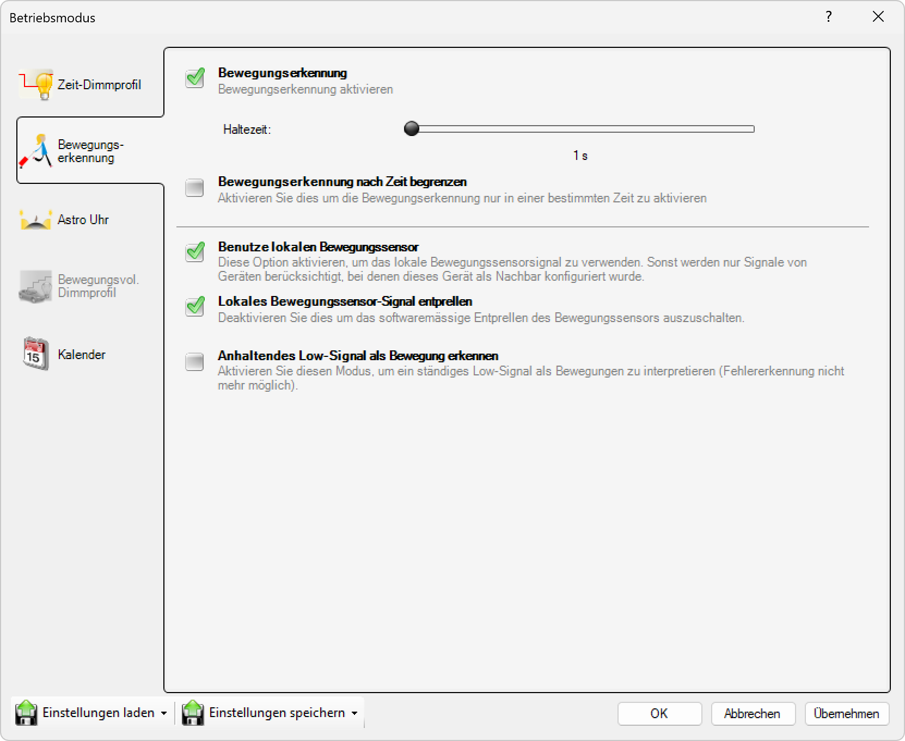

# Bewegungserkennung

**Bewegungserkennung**

Wählen Sie diesen Modus, um die Beleuchtung basierend auf erkannten Bewegungen zu steuern. Die Leuchten werden automatisch eingeschaltet, wenn eine Bewegung erkannt wird, und nach einer vordefinierten Nachlaufzeit wieder ausgeschaltet.

## Hauptbereiche

### 1. Bewegungserkennung

- Dieser Bereich ist aktuell aktiv, wie durch das hervorgehobene Symbol auf der linken Seite angezeigt
- Wird verwendet, um bewegungsbasierte Beleuchtungssteuerung zu konfigurieren

### 2. Globale Einstellungen

- Der Hauptbereich zeigt globale Bewegungserkennungseinstellungen für alle Kanäle an

## Betriebsmodus-Optionen

Für jeden der vier Kanäle (1. Kanal, 2. Kanal, 3. Kanal, 4. Kanal) können Sie einen Betriebsmodus aus einem Dropdown-Menü auswählen. Die verfügbaren Einstellungen sind:

- **Nach Bewegung**: Der Kanal wird basierend auf erkannten Bewegungen aktiviert
- **Inaktiv**: Der Kanal ist ausgeschaltet oder nicht in Gebrauch

In diesem Fenster:
- **1. Kanal**: Auf "Nach Bewegung" eingestellt
- **2.–4. Kanal**: Auf "Inaktiv" eingestellt

## Bewegungserkennungs-Einstellungen (nach Bewegung)

Für Kanäle, die auf den Bewegungserkennungsmodus eingestellt sind, können Sie folgende Parameter konfigurieren:

### Grundeinstellungen
- **Empfindlichkeit**: Einstellung der Bewegungserkennungsempfindlichkeit (niedrig, mittel, hoch)
- **Nachlaufzeit**: Zeitdauer, nach der die Beleuchtung nach der letzten Bewegung ausgeschaltet wird (30s bis 15min)
- **Aktivierungshelligkeit**: Helligkeitswert bei erkannter Bewegung (0-100%)
- **Erfassungsbereich**: Definition des Bereichs, in dem Bewegungen erkannt werden

### Erweiterte Einstellungen
- **Tageslichtabhängigkeit**: Bewegungsaktivierung nur bei niedriger Umgebungshelligkeit
- **Zeitfenster**: Bewegungserkennung nur zu bestimmten Zeiten aktiv
- **Zoneneinstellungen**: Verschiedene Bereiche mit unterschiedlichen Einstellungen
- **Gruppierung**: Mehrere Leuchten reagieren koordiniert auf Bewegungen

## Hauptfunktionen

### Bewegungsaktivierung
- Die Beleuchtung wird automatisch eingeschaltet, wenn der Bewegungsmelder eine Bewegung erkennt
- Sofortige Reaktion auf erkannte Bewegungen für maximale Sicherheit
- Einstellbare Empfindlichkeit des Bewegungsmelders

### Nachlaufzeit
- Nach der letzten erkannten Bewegung bleibt die Beleuchtung für eine konfigurierbare Zeit eingeschaltet
- Verhindert häufiges Ein- und Ausschalten bei kurzen Bewegungspausen
- Typische Einstellungen: 30 Sekunden bis 15 Minuten

### Energieeffizienz
- Beleuchtung wird nur bei tatsächlicher Nutzung aktiviert
- Automatische Abschaltung nach der Nachlaufzeit
- Reduziert Energieverbrauch erheblich im Vergleich zu dauerhaft eingeschalteter Beleuchtung

## Anwendungsbereiche

- **Flure und Gänge**: Automatische Beleuchtung beim Betreten
- **Treppenhäuser**: Sicherheitsbeleuchtung bei Bewegung
- **Parkbereiche**: Beleuchtung nur bei Anwesenheit von Personen oder Fahrzeugen
- **Außenbereiche**: Sicherheitsbeleuchtung und Abschreckung
- **Lagerbereiche**: Arbeitsplatzbeleuchtung nur bei Bedarf

Diese Konfiguration bietet eine intelligente und energieeffiziente Beleuchtungssteuerung, die sich automatisch an die Nutzung anpasst und gleichzeitig Sicherheit und Komfort gewährleistet.

## Seitennavigation

- **Zeit-Dimmprofil**: Zeitbasiertes Dimmprofil (ausgegraut/inaktiv)
- **Bewegungserkennung**: Bewegungserkennungseinstellungen (aktuell aktiv)
- **Astro Uhr**: Astronomische Uhreneinstellungen (ausgegraut/inaktiv)
- **Bewegungsvoll. Dimmprofil**: Bewegungsgesteuertes Dimmprofil (ausgegraut/inaktiv)
- **Kalender**: Kalenderbasierte Zeitplanung

## Untere Bedienelemente

- **Einstellungen laden**: Einstellungen aus einer Datei oder einem Profil laden
- **Einstellungen speichern**: Aktuelle Einstellungen in einer Datei oder einem Profil speichern
- **OK**: Alle Änderungen bestätigen und anwenden
- **Abbrechen**: Abbrechen und Fenster ohne Speichern der Änderungen schließen
- **Übernehmen**: Änderungen anwenden ohne das Fenster zu schließen