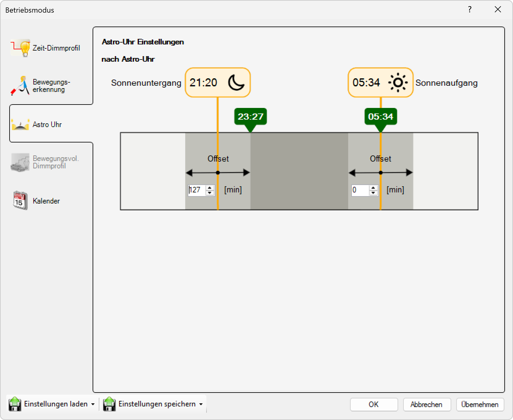

# Astro-Uhr

**Astro-Uhr**

Wählen Sie diesen Modus, um die Beleuchtung abhängig von der Sonnenposition zu steuern. Die Astro-Uhr berechnet automatisch die Zeiten für Sonnenaufgang und Sonnenuntergang basierend auf der geografischen Position und schaltet die Beleuchtung entsprechend ein und aus.

## Hauptbereiche

### 1. Astro-Uhr

- Dieser Bereich ist aktuell aktiv, wie durch das hervorgehobene Symbol auf der linken Seite angezeigt
- Wird verwendet, um astronomische Beleuchtungssteuerung zu konfigurieren

### 2. Globale Einstellungen

- Der Hauptbereich zeigt globale Astro-Uhr-Einstellungen für alle Kanäle an

## Betriebsmodus-Optionen

Für jeden der vier Kanäle (1. Kanal, 2. Kanal, 3. Kanal, 4. Kanal) können Sie einen Betriebsmodus aus einem Dropdown-Menü auswählen. Die verfügbaren Einstellungen sind:

- **Nach Astro-Uhr**: Der Kanal wird basierend auf astronomischen Zeiten (Sonnenaufgang/Sonnenuntergang) aktiviert
- **Inaktiv**: Der Kanal ist ausgeschaltet oder nicht in Gebrauch

In diesem Fenster:
- **1. Kanal**: Auf "Nach Astro-Uhr" eingestellt
- **2.–4. Kanal**: Auf "Inaktiv" eingestellt

## Astro-Uhr-Einstellungen (nach Astro-Uhr)

Für Kanäle, die auf den Astro-Uhr-Modus eingestellt sind, können Sie folgende Parameter konfigurieren:

### Grundeinstellungen
- **Koordinaten**: Geben Sie die geografische Position (Breitengrad und Längengrad) ein, für die die Sonnenzeiten berechnet werden sollen
- **Versatz Einschalten**: Stellen Sie einen Zeitversatz in Minuten für das Einschalten ein (z.B. +30 Minuten nach Sonnenuntergang)
- **Versatz Ausschalten**: Stellen Sie einen Zeitversatz in Minuten für das Ausschalten ein (z.B. -15 Minuten vor Sonnenaufgang)
- **Zeitzone**: Wählen Sie die entsprechende Zeitzone aus, um die korrekte Berechnung der Sonnenzeiten zu gewährleisten

### Erweiterte Einstellungen
- **Sommer-/Winterzeitumstellung**: Automatische Berücksichtigung der Zeitumstellung
- **Minimale Einschaltdauer**: Mindestzeit, die die Beleuchtung eingeschaltet bleiben muss
- **Maximale Einschaltdauer**: Begrenzung der maximalen Betriebszeit pro Tag
- **Dämmerungsoffset**: Zusätzlicher Versatz für bürgerliche, nautische oder astronomische Dämmerung

## Funktionsweise

### Astronomische Berechnungen
- Die Astro-Uhr verwendet die geografischen Koordinaten, um die exakten Zeiten für Sonnenaufgang und Sonnenuntergang zu berechnen
- Diese Zeiten ändern sich täglich und passen sich automatisch an die jahreszeitlichen Veränderungen an
- Berücksichtigung der Erdrotation und der elliptischen Umlaufbahn

### Automatische Anpassung
- Keine manuelle Zeitumstellung erforderlich
- Automatische Anpassung an die Jahreszeiten
- Präzise Berechnung basierend auf astronomischen Daten

## Vorteile

- **Automatische Anpassung**: Keine manuelle Zeitumstellung erforderlich
- **Energieeffizienz**: Beleuchtung nur bei tatsächlicher Dunkelheit
- **Präzision**: Exakte Berechnung basierend auf astronomischen Daten
- **Natürliche Steuerung**: Folgt den natürlichen Lichtverhältnissen

## Anwendungsbereiche

- **Straßenbeleuchtung**: Automatische Aktivierung bei Dunkelheit
- **Gartenbeleuchtung**: Natürliche Beleuchtungssteuerung für Außenbereiche
- **Sicherheitsbeleuchtung**: Zuverlässige Beleuchtung zu den richtigen Zeiten
- **Architekturbeleuchtung**: Ästhetische Beleuchtung von Gebäuden
- **Außenbeleuchtung**: Effiziente Beleuchtung von Gebäudebereichen

Diese Konfiguration bietet eine natürliche und energieeffiziente Beleuchtungssteuerung, die sich automatisch an die jahreszeitlichen Veränderungen anpasst und keine manuelle Anpassung der Schaltzeiten erfordert.

## Seitennavigation

- **Zeit-Dimmprofil**: Zeitbasiertes Dimmprofil (ausgegraut/inaktiv)
- **Bewegungserkennung**: Bewegungserkennungseinstellungen (ausgegraut/inaktiv)
- **Astro Uhr**: Astronomische Uhreneinstellungen (aktuell aktiv)
- **Bewegungsvoll. Dimmprofil**: Bewegungsgesteuertes Dimmprofil (ausgegraut/inaktiv)
- **Kalender**: Kalenderbasierte Zeitplanung

## Untere Bedienelemente

- **Einstellungen laden**: Einstellungen aus einer Datei oder einem Profil laden
- **Einstellungen speichern**: Aktuelle Einstellungen in einer Datei oder einem Profil speichern
- **OK**: Alle Änderungen bestätigen und anwenden
- **Abbrechen**: Abbrechen und Fenster ohne Speichern der Änderungen schließen
- **Übernehmen**: Änderungen anwenden ohne das Fenster zu schließen